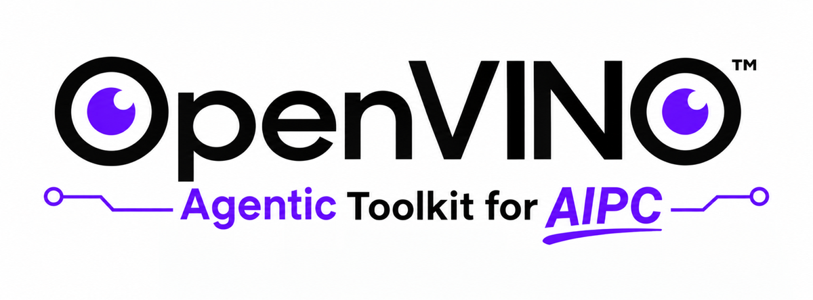
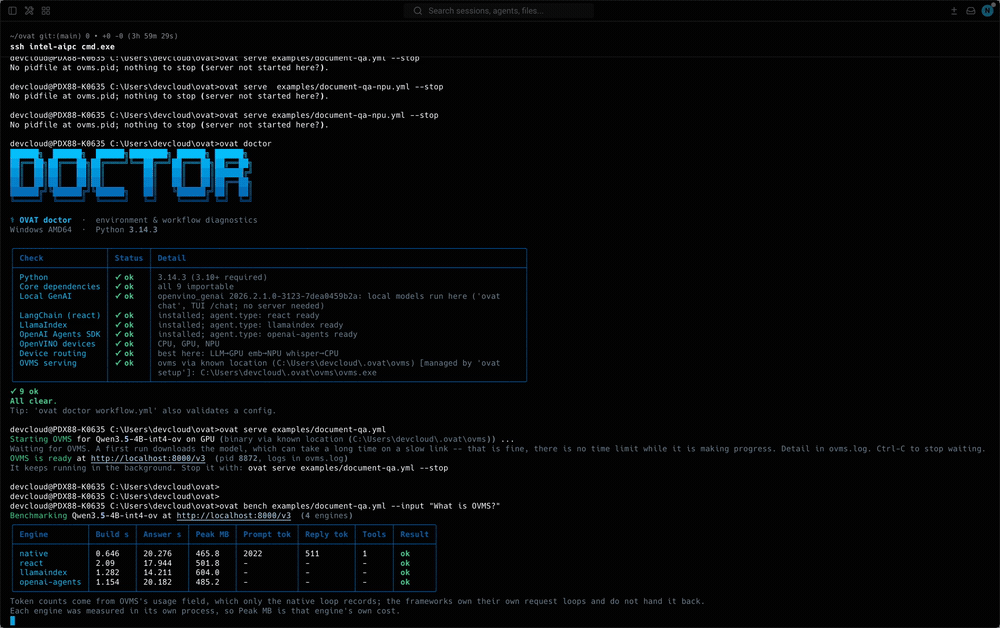
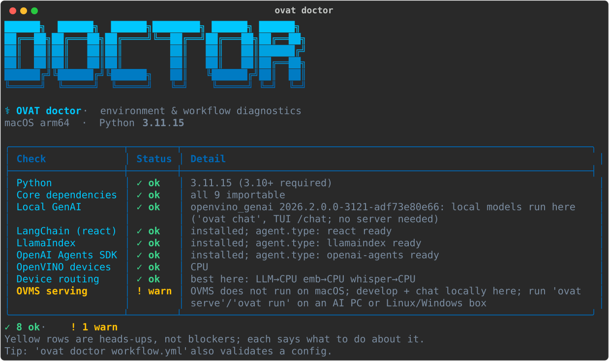
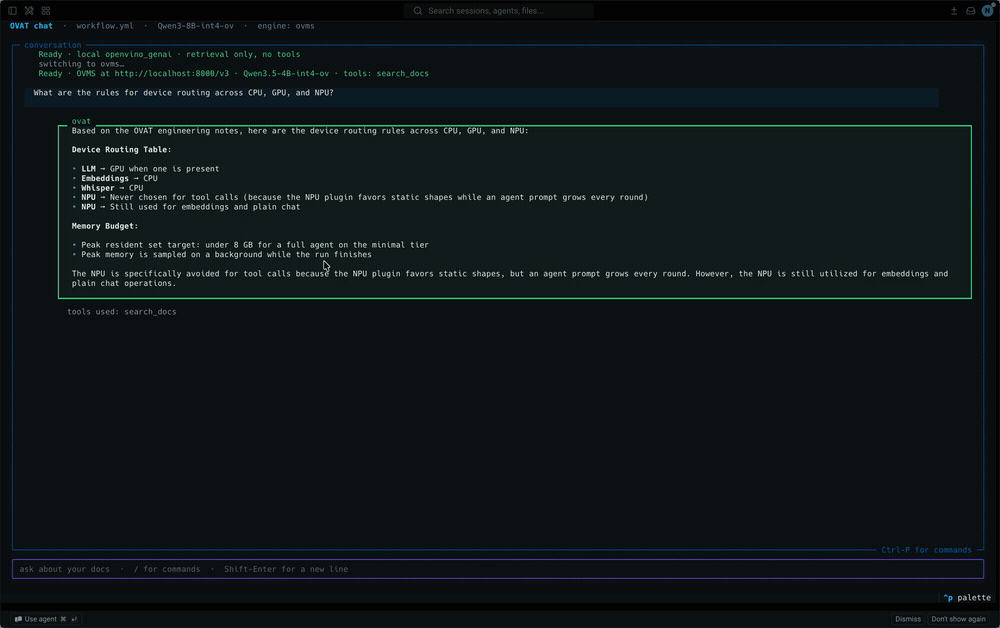

<div align="center">


<h3 align="center">
Build a tool-calling AI agent on an Intel AI PC from one YAML file and one command.
</h3>

<p align="center">
 <a href="#quickstart"><b>Quickstart</b></a> • <a href="examples/"><b>Examples</b></a> • <a href="docs/workflow_yaml_reference.md"><b>Reference</b></a> • <a href="docs/ARCHITECTURE.md"><b>Architecture</b></a> • <a href="docs/BLOG.md"><b>Walkthrough</b></a> • <a href="#platform-support"><b>Platforms</b></a>
</p>

[](https://pypi.org/project/ovat/)
[](https://pypi.org/project/ovat/)
[](LICENSE)

</div>

```bash
pip install ovat
ovat setup                                    # install the model server, once
ovat init workflow.yml
ovat serve workflow.yml                       # start it
ovat run workflow.yml --input "what do my notes say about Q3?"
```

Everything runs locally on your own hardware, through
[OpenVINO Model Server](https://docs.openvino.ai/2026/model-server/ovms_what_is_openvino_model_server.html).
No API keys, no cloud, nothing leaving the machine.

> **GSoC 2026 · OpenVINO Project #18.** Full agent on Windows and Linux with an
> Intel CPU/GPU/NPU; macOS is supported for development. See
> [Platform support](#platform-support).

---

## One config, four agent frameworks

`agent.type` picks the loop. Nothing else in your file changes -- not the tools,
not the prompt, not a line of Python. `ovat bench` runs the same question
through every engine against the same server:

<div align="center">

</div>

Recorded on an Intel AI PC (LunarLake, Arc 140V GPU) serving Qwen3.5-4B-int4-ov.
The dashes are deliberate: only the native loop gets token counts back from
OVMS, and an unknown value stays a dash rather than becoming a misleading `0`.

---

## Why OVAT

A tool-calling agent against OVMS is ~50 lines of boilerplate every project
rewrites: build the client, hand-write each tool's JSON schema, call, check
`finish_reason`, dispatch the tool, append the result, loop, guard the iteration
count, manage history.

OVAT makes that a config file:

```yaml
model:
  name: Qwen3.5-4B-int4-ov
  device: GPU
  tool_parser: qwen3coder
tools:
  - name: search_docs
    type: builtin
agent:
  type: native
  max_iterations: 10
```

The loop, schemas, history and error handling are the toolkit's job now. Moving
from a 16 GB GPU box to an 8 GB CPU laptop is a three-line edit: compare
[`examples/workflow.yml`](examples/workflow.yml) with
[`examples/minimal.yml`](examples/minimal.yml).

Every field, with its type, default and constraints, is in
[`docs/workflow_yaml_reference.md`](docs/workflow_yaml_reference.md), which is
generated from the schema. The reasoning behind the design is in
[`docs/ARCHITECTURE.md`](docs/ARCHITECTURE.md).

---

## Install

| | Needs | Notes |
| --- | --- | --- |
| **Python** | 3.10 – 3.14 | `python3 --version` |
| **OS (full agent)** | Windows 11, Ubuntu 22.04/24.04, RHEL 9 | OVMS is x86-64 only |
| **OS (development)** | + macOS | everything except serving |
| **RAM** | 8 GB min, 16 GB comfortable | the default model wants ~5 GB |
| **Disk** | ~8 GB, or ~15 GB with RAG | RAG pulls torch via the `convert` extra |

```bash
pip install ovat
```

Extras, so you install only what you need:

| Extra | Gives you |
| --- | --- |
| *(none)* | native engine, all built-in tools, MCP, RAG, telemetry |
| `langchain` · `llamaindex` · `openai-agents` | the matching `agent.type` |
| `tui` | the full-screen launcher (`ovat` with no arguments) |
| `convert` | `optimum-cli`, to convert HuggingFace models to OpenVINO IR |
| `dev` | every framework above, plus pytest |

```bash
pip install "ovat[langchain,llamaindex,openai-agents,tui]"
```

Then install the model server, once per machine:

```bash
ovat setup
```

That picks the right archive for your OS (and, on Linux, your distro), checks
its SHA-256, and unpacks it into `~/.ovat/ovms`. **Nothing is added to `PATH`
and no environment variable is needed.** On macOS it prints why there is nothing
to install and what to use instead.

> **Linux needs two system packages first.** A minimal image ships with no
> Python at all, and OVMS needs `libxml2`:
> ```bash
> sudo apt update && sudo apt install -y python3 python3-venv python3-pip libxml2 curl   # Ubuntu 22.04 / 24.04
> sudo dnf install -y python3 python3-pip libxml2 curl                                   # RHEL 9 / Rocky / Alma
> ```
> Ubuntu 26.04+ is not supported yet: there is no OVMS build for it. `ovat setup`
> warns before downloading.

> **Using GPU or NPU?** Update the driver first -- an old driver usually shows up
> as the device simply being *absent* from `ovat doctor`, not as an error.
> [GPU (Windows)](https://www.intel.com/content/www/us/en/download/785597/intel-arc-iris-xe-graphics-windows.html) ·
> [NPU (Windows)](https://www.intel.com/content/www/us/en/download/794734/intel-npu-driver-windows.html) ·
> [GPU (Linux)](https://docs.openvino.ai/2026/get-started/install-openvino/configurations/configurations-intel-gpu.html) ·
> [NPU (Linux)](https://docs.openvino.ai/2026/get-started/install-openvino/configurations/configurations-intel-npu.html).
> On Windows also install the
> [Visual C++ Redistributable](https://aka.ms/vs/17/release/VC_redist.x64.exe),
> which OVMS needs in order to start at all.

[Installing OVMS by hand](docs/ARCHITECTURE.md#installing-it-by-hand-air-gapped-machines-or-a-build-you-already-have)
is documented for air-gapped machines. **The NPU needs a specific export** -- a
channel-wise symmetric INT4 build, not the stock `-int4-ov` -- and that, with the
measurements behind it, is in
[ARCHITECTURE.md § Layer 9](docs/ARCHITECTURE.md#layer-9-openvino-runtime-and-hardware).

---

## Get a model

`ovat serve` downloads one for you on the first run. To fetch it yourself
(the only option on macOS):

```bash
hf download OpenVINO/Qwen3.5-4B-int4-ov --local-dir models/OpenVINO/Qwen3.5-4B-int4-ov
```

These are pre-converted OpenVINO IR, no conversion needed.

| Model | Download | RAM | Use it when |
| --- | --- | --- | --- |
| [`Qwen3.5-4B-int4-ov`](https://huggingface.co/OpenVINO/Qwen3.5-4B-int4-ov) | **3.5 GB** | 4.3 GB steady, **6.5 GB peak** | **Default.** Text + vision + tools in one model |
| [`Qwen3.5-0.8B-int4-ov`](https://huggingface.co/OpenVINO/Qwen3.5-0.8B-int4-ov) | **0.9 GB** | ~2 GB | 8 GB machine, or a fast first run |
| [`Qwen3-8B-int4-ov`](https://huggingface.co/OpenVINO/Qwen3-8B-int4-ov) | 4.9 GB | ~6-7 GB | strongest text answers; no vision |
| [`whisper-base-int8-ov`](https://huggingface.co/OpenVINO/whisper-base-int8-ov) | 0.08 GB | small | the `transcribe` tool |

Only the Qwen3.5-4B row is **measured** (on an Intel AI PC, read from the OVMS
process -- the model's memory lives there, not in OVAT). Every figure written
with `~` is an estimate from parameter count and precision. Measure your own with
`ovat run --telemetry`. The peak sits 2.2 GB above steady state, and the load
spike is what decides whether a model fits, so 8 GB machines should prefer the
0.8B tier. [Where the memory actually goes](docs/ARCHITECTURE.md#measured-on-this-hardware-2026-08-12).

RAG also needs an embedder, the one thing that has to be converted:

```bash
pip install "ovat[convert]"
optimum-cli export openvino --model BAAI/bge-small-en-v1.5 \
    --task feature-extraction models/bge-small-en-v1.5
```

---

## Quickstart

```bash
ovat setup                                    # 1. install OVMS (once per machine)
ovat init workflow.yml                        # 2. write a starter config
ovat doctor workflow.yml                      # 3. check machine + config
ovat run workflow.yml -i "hi" --dry-run       # 4. no server, no model needed
ovat serve workflow.yml                       # 5. start OVMS
ovat run workflow.yml -i "summarise my notes" # 6. ask something
ovat serve workflow.yml --stop                # 7. shut it down
```

`ovat doctor` is the fastest diagnosis for anything that goes wrong. It checks
the machine and the config together, and every yellow row says what to do:

<div align="center">

</div>

**Step 5 takes a while the first time** -- it downloads the model. That is
expected: `serve` shows elapsed time and only gives up after five minutes of *no
progress at all*, so a slow link is fine. Skipping step 1 is fine too; `ovat
serve` offers to install OVMS when it finds none.

On **macOS** there is no OVMS. Use the local path instead -- `ovat chat` answers
from an index and needs no server:

```bash
git clone https://github.com/Lagmator22/ovat.git && cd ovat   # for the examples
hf download OpenVINO/Qwen3.5-0.8B-int4-ov --local-dir models/Qwen3.5-0.8B-int4-ov

pip install "ovat[convert]"                                   # for the embedder
optimum-cli export openvino --model BAAI/bge-small-en-v1.5 \
    --task feature-extraction models/bge-small-en-v1.5

ovat index ./examples/rag/docs examples/rag/workflow.yml
ovat chat examples/rag/workflow.yml -i "What is OVAT's memory budget?"
```

---

## Examples

| Use case | Folder | Shows |
| --- | --- | --- |
| **RAG** | [`examples/rag/`](examples/rag/) | Answers from your own documents, with citations |
| **ReAct** | [`examples/react/`](examples/react/) | The same agent through LangChain; all four engines compared |
| **Audio + vision** | [`examples/audio-multimodal/`](examples/audio-multimodal/) | Transcribe a `.wav`, describe an image |
| **OpenTelemetry** | [`examples/plano/`](examples/plano/) | Traces through the plano AI gateway |

Each folder has its own README with the exact commands.

> The examples are **not** in the pip package, since they are project files
> rather than library code. Clone the repo to run them. Everything else in this
> README works from `pip install ovat` alone.

---

## Engines, tools and MCP

Four engines, selectable per run without editing the file:

```bash
ovat run workflow.yml -i "..." --react              # or --langchain
ovat run workflow.yml -i "..." --llamaindex
ovat run workflow.yml -i "..." --openai-sdk         # or --openai-agents
ovat bench workflow.yml -i "..." --out report.json  # all four, side by side
```

`native` is OVAT's own loop: zero extra dependencies, and the only engine that
records per-turn token counts. The other three are LangChain, LlamaIndex and the
OpenAI Agents SDK, each pointed at OVMS.

Three built-in tools -- **`search_docs`** (semantic search returning source
paths), **`transcribe`** (speech to text) and **`describe_image`** (vision).
All three are also standalone [MCP](https://modelcontextprotocol.io) servers,
and OVAT is an MCP **client**, so it can use anyone else's:

```yaml
tools:
  - name: anything_else
    type: mcp_stdio
    command: ["npx", "-y", "@modelcontextprotocol/server-filesystem", "/docs"]
```

---

## The terminal UI

`pip install "ovat[tui]"`, then run `ovat` with no arguments. Streaming answers,
foldable reasoning, sessions on disk, and `/engine` to swap between the local
model and OVMS-with-tools mid-conversation:

<div align="center">

</div>

The CLI never needs it. `textual` and `pyfiglet` live in the `[tui]` extra only,
and a test enforces that a base install imports neither -- along with none of
langchain, llama_index or agents.

---

## Telemetry

```bash
ovat run workflow.yml -i "..." --trace trace.json      # one run's trace
ovat run workflow.yml -i "..." --telemetry live.jsonl  # sampled alongside
ovat telemetry                                         # live table, no run
```

Two rules the numbers follow: **unknown stays unknown** (a missing token count is
`null`, never `0`), and **an unavailable source says why** instead of reporting
zeros. `--trace` peak RSS measures the *OVAT* process -- with OVMS serving, the
model lives in `ovms.exe`, so measure that instead.
[Why, and what that cost to learn](docs/ARCHITECTURE.md#layer-7-observability).

---

## Platform support

| | macOS | Windows 11 | Linux |
| --- | --- | --- | --- |
| `init` `doctor` `index` `setup` `telemetry` | ✅ | ✅ | ✅ |
| `chat` (local model, no server) + TUI | ✅ | ✅ | ✅ |
| `serve` `models` `run` `bench` | ❌ | ✅ | ✅ |
| GPU / NPU | ❌ CPU only | ✅ verified | ⚠️ untested |

✅ means run on that platform. Linux GPU/NPU is marked **untested** because the
Linux verification was done in WSL2, which exposes no `/dev/dri` -- the CPU path
is proven there and the accelerator path is not. It is expected to work with
current drivers; it has not been demonstrated here.

---

## Troubleshooting

| Symptom | Likely cause |
| --- | --- |
| Agent answers fluently but **never calls a tool** | Wrong `tool_parser`. Qwen3.5 needs `qwen3coder`, Qwen3 needs `hermes3`. OVAT warns rather than hiding this |
| `OVMS exited without becoming ready`, empty log | The `python_off` build, or a missing VC++ Redistributable |
| `ovat doctor` finds no OVMS | Set `OVAT_OVMS` to the unpacked folder |
| No GPU/NPU listed in `doctor` | Driver out of date. See [Install](#install) |
| `search_docs` returns `[stub]` | No `rag:` section, or no `--config` on the MCP command |
| `serve` looks stuck | The first run downloads the model. Watch `ovms.log` |

`ovat doctor <config>` diagnoses anything else.

---

## Documentation

| | |
| --- | --- |
| [`docs/ARCHITECTURE.md`](docs/ARCHITECTURE.md) | The nine layers, all four engines, both serving paths, and the design decisions behind them |
| [`docs/workflow_yaml_reference.md`](docs/workflow_yaml_reference.md) | Every `workflow.yml` field. Generated from the schema |
| [`docs/BLOG.md`](docs/BLOG.md) | A walkthrough: what OVAT is and how to use it |
| [`examples/`](examples/) | Four runnable use cases |
| [`AGENTS.md`](AGENTS.md) | Contributor notes: hard rules and landmines |

---

## Development

```bash
git clone https://github.com/Lagmator22/ovat.git && cd ovat
python -m venv .venv && source .venv/bin/activate     # Windows: .venv\Scripts\activate.bat
pip install -e ".[dev]"
pytest -q                    # 706 passed, 8 skipped, no server needed
pytest -m live               # against a running OVMS (AI PC only)
```

`live` needs OVMS; `rag` needs bge-small on disk. Both auto-skip, so a fresh
clone runs green.

Licensed under [Apache 2.0](LICENSE).
