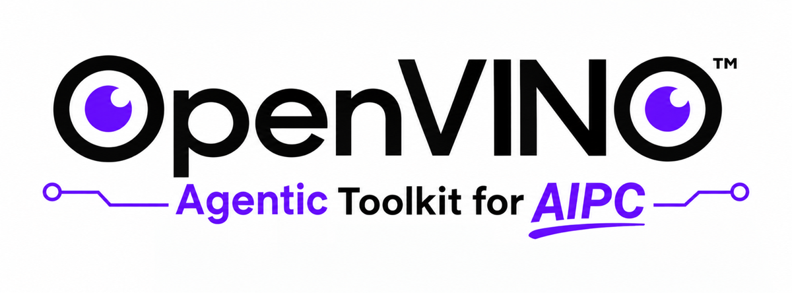
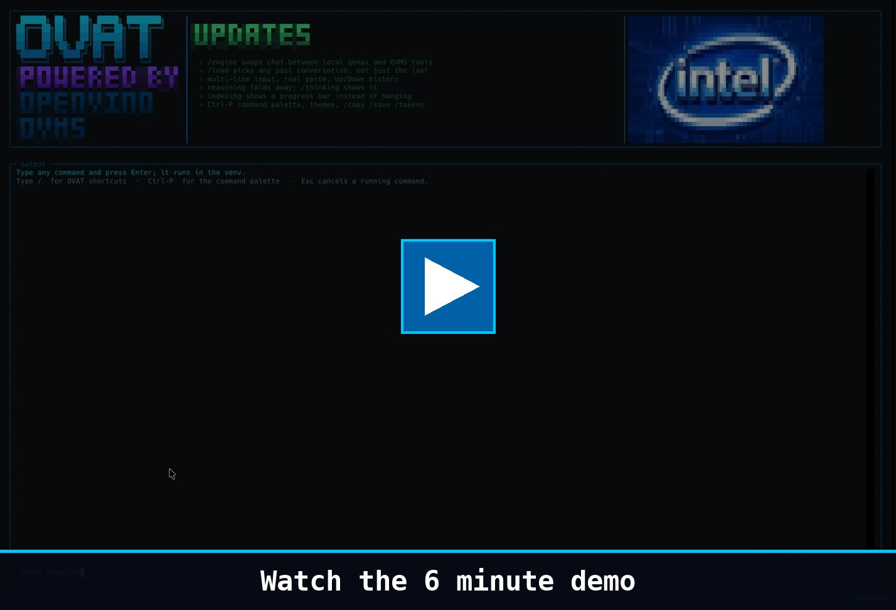
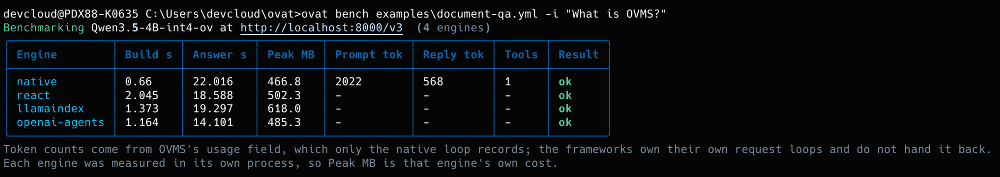
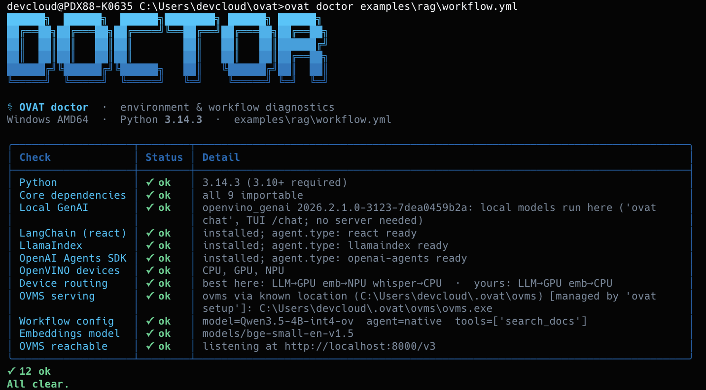
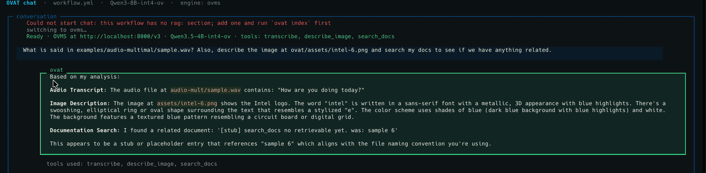
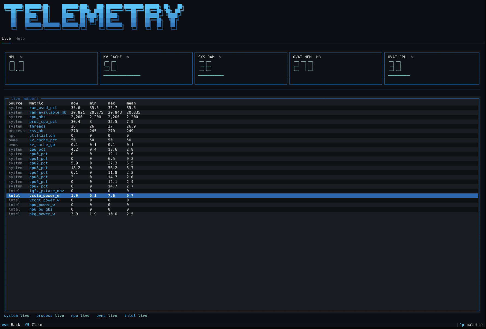

<div align="center">


<h3 align="center">
Build a tool-calling AI agent on an Intel AI PC from one YAML file and one command.
</h3>

<p align="center">
 <a href="https://lagmator22.github.io/ovat-navigate/"><b>Docs site</b></a> • <a href="#quickstart"><b>Quickstart</b></a> • <a href="examples/"><b>Examples</b></a> • <a href="docs/workflow_yaml_reference.md"><b>Reference</b></a> • <a href="docs/ARCHITECTURE.md"><b>Architecture</b></a> • <a href="docs/BLOG.md"><b>Walkthrough</b></a> • <a href="#platform-support"><b>Platforms</b></a>
</p>

[](https://pypi.org/project/ovat/)
[](https://pypi.org/project/ovat/)
[](LICENSE)

<a href="https://lagmator22.github.io/ovat-navigate/#demo"></a>

</div>

```bash
pip install ovat
ovat setup                                    # install the model server, once
ovat init workflow.yml                        # write a starter config
ovat serve workflow.yml                       # start the model server
ovat run workflow.yml --input "what do my notes say about Q3?"
```

An **agent** is a language model that can call your functions ("tools"):
search your files, transcribe a recording, describe an image. OVAT builds
that agent from a config file and runs it on your own machine, through
[OpenVINO Model Server](https://docs.openvino.ai/2026/model-server/ovms_what_is_openvino_model_server.html)
(OVMS). No API keys, no cloud, nothing leaves the machine.

> **New here?** The [OVAT docs site](https://lagmator22.github.io/ovat-navigate/)
> walks through the project and the codebase step by step.

> **GSoC 2026, OpenVINO project #18.** The full agent runs on Windows and
> Linux with an Intel CPU, GPU or NPU. macOS works for development and for
> local chat. See [Platform support](#platform-support).

---

## How it works

You write `workflow.yml`. OVAT checks it, wires up the model, the tools and
document search, and hands them to an **engine**: the loop that talks to the
model. The model runs on an OVMS server (Windows, Linux) or, for local chat,
inside the OVAT process itself.

<picture>
  <source media="(prefers-color-scheme: dark)" srcset="docs/assets/diagrams/core-flow-dark.svg">
  
</picture>

The engine runs a simple loop. It sends your question to the model. If the
reply asks for a tool, OVAT runs the tool and sends the result back. When a
reply asks for nothing, that reply is the answer.

<picture>
  <source media="(prefers-color-scheme: dark)" srcset="docs/assets/diagrams/agent-loop-dark.svg">
  
</picture>

---

## Why OVAT

A tool-calling agent against OVMS is about 50 lines of code that every project
writes again: build the client, write each tool's JSON schema by hand, call the
model, check whether it asked for a tool, run the tool, add the result, loop,
cap the number of rounds, keep the history.

OVAT turns that into a config file:

```yaml
model:
  name: Qwen3.5-4B-int4-ov
  device: GPU
tools:
  - name: search_docs
    type: builtin
agent:
  type: native
  max_iterations: 10
```

The loop, the schemas, the history and the error handling are OVAT's job.
Moving from a 16 GB GPU machine to an 8 GB CPU laptop is a three-line edit:
compare [`examples/workflow.yml`](examples/workflow.yml) with
[`examples/minimal.yml`](examples/minimal.yml).

Every field, with its type, default and limits, is in
[`docs/workflow_yaml_reference.md`](docs/workflow_yaml_reference.md). That file
is generated from the code, so it cannot go out of date. A misspelt key is an
error, not something silently ignored.

---

## One config, four agent frameworks

`agent.type` picks the engine. Nothing else in the file changes: not the tools,
not the prompt, not a line of Python.

<picture>
  <source media="(prefers-color-scheme: dark)" srcset="docs/assets/diagrams/engines-dark.svg">
  
</picture>

`ovat bench` sends the same question through every engine against the same
server and prints the results side by side:

<div align="center">

</div>

Recorded on an Intel AI PC (LunarLake, Arc 140V GPU) serving Qwen3.5-4B-int4-ov.
The dashes are on purpose. Only the native loop gets token counts back, and a
number OVAT does not know stays a dash instead of turning into a misleading `0`.

---

## Install

| | Needs | Notes |
| --- | --- | --- |
| **Python** | 3.10 to 3.14 | `python3 --version` |
| **OS (full agent)** | Windows 11, Ubuntu 22.04 or 24.04, RHEL 9 | OVMS is x86-64 only |
| **OS (development)** | the above, plus macOS | everything except serving |
| **RAM** | 8 GB minimum, 16 GB comfortable | the default model wants about 5 GB |
| **Disk** | about 8 GB, or about 15 GB with RAG | RAG pulls in torch through the `convert` extra |

```bash
pip install ovat
```

Extras, so you install only what you need:

| Extra | Gives you |
| --- | --- |
| *(none)* | the native engine, all built-in tools, MCP, RAG, telemetry |
| `langchain`, `llamaindex`, `openai-agents` | the matching `agent.type` |
| `tui` | the full-screen terminal app (`ovat` with no arguments) |
| `convert` | `optimum-cli`, to convert Hugging Face models to OpenVINO format |
| `dev` | every framework above, plus pytest |

```bash
pip install "ovat[langchain,llamaindex,openai-agents,tui]"
```

Then install the model server, once per machine:

```bash
ovat setup
```

It picks the right OVMS download for your OS (and, on Linux, your distro),
checks its SHA-256, and unpacks it into `~/.ovat/ovms`. **Nothing is added to
`PATH` and no environment variable is needed.** OVAT is tested against
**OVMS 2026.4.1**. If you already have an older OVMS, `ovat setup` and
`ovat doctor` say so, and `ovat setup --force` replaces it. On macOS, `ovat
setup` explains why there is nothing to install and what to use instead.

Why the pin matters: on the same 15 questions through all four engines, OVMS
2026.4.1 answered 56 of 60 correctly and 2026.2.1 answered 42 of 60. The
newer server also gave the same answer on every repeat, and its peak memory
was 4.9 GB against 17.3 GB. Measured on Windows on a LunarLake AI PC; not
yet repeated on Linux.

> **Linux needs a few system packages first.** A minimal image ships with no
> Python, and OVMS needs `libxml2`:
> ```bash
> sudo apt update && sudo apt install -y python3 python3-venv python3-pip libxml2 curl   # Ubuntu 22.04 / 24.04
> sudo dnf install -y python3 python3-pip libxml2 curl                                   # RHEL 9 / Rocky / Alma
> ```
> Ubuntu 26.04 is not supported yet, because there is no OVMS build for it.
> `ovat setup` warns before downloading.

> **Using a GPU or NPU?** Update the driver first. An old driver usually shows
> up as the device simply missing from `ovat doctor`, not as an error.
> [GPU (Windows)](https://www.intel.com/content/www/us/en/download/785597/intel-arc-iris-xe-graphics-windows.html),
> [NPU (Windows)](https://www.intel.com/content/www/us/en/download/794734/intel-npu-driver-windows.html),
> [GPU (Linux)](https://docs.openvino.ai/2026/get-started/install-openvino/configurations/configurations-intel-gpu.html),
> [NPU (Linux)](https://docs.openvino.ai/2026/get-started/install-openvino/configurations/configurations-intel-npu.html).
> On Windows also install the
> [Visual C++ Redistributable](https://aka.ms/vs/17/release/VC_redist.x64.exe);
> OVMS will not start without it.

[Installing OVMS by hand](docs/ARCHITECTURE.md#installing-it-by-hand-air-gapped-machines-or-a-build-you-already-have)
is documented for machines with no internet access.

---

## Get a model

`ovat serve` downloads the model on its first run. To fetch it yourself (the
only option on macOS):

```bash
hf download OpenVINO/Qwen3.5-4B-int4-ov --local-dir models/OpenVINO/Qwen3.5-4B-int4-ov
```

These are already converted to OpenVINO format. Nothing else to do.

| Model | Download | RAM | Use it when |
| --- | --- | --- | --- |
| [`Qwen3.5-4B-int4-ov`](https://huggingface.co/OpenVINO/Qwen3.5-4B-int4-ov) | **3.5 GB** | 4.3 GB steady, **6.5 GB peak** | **Default.** Text, vision and tools in one model |
| [`Qwen3.5-0.8B-int4-ov`](https://huggingface.co/OpenVINO/Qwen3.5-0.8B-int4-ov) | **0.9 GB** | about 2 GB | an 8 GB machine, or a fast first try |
| [`Qwen3-8B-int4-ov`](https://huggingface.co/OpenVINO/Qwen3-8B-int4-ov) | 4.9 GB | about 6 to 7 GB | the strongest text answers; no vision |
| [`whisper-base-int8-ov`](https://huggingface.co/OpenVINO/whisper-base-int8-ov) | 0.08 GB | small | the `transcribe` tool |

Only the Qwen3.5-4B row is **measured**, on an Intel AI PC, read from the OVMS
process (the model's memory lives there, not in OVAT). Rows that say "about"
are estimates from the model's size. Measure your own with
`ovat run --telemetry`. Loading needs 2.2 GB more than running does, and that
peak decides whether a model fits, so 8 GB machines should start with the 0.8B
model. [Where the memory actually goes](docs/ARCHITECTURE.md#measured-on-this-hardware-2026-08-12).

RAG (answering from your own documents) also needs an **embedder**, a small
model that turns text into numbers. It is the one model you convert yourself:

```bash
pip install "ovat[convert]"
optimum-cli export openvino --model BAAI/bge-small-en-v1.5 \
    --task feature-extraction models/bge-small-en-v1.5
```

---

## Quickstart

```bash
ovat setup                                    # 1. install OVMS (once per machine)
ovat init workflow.yml                        # 2. write a starter config
ovat doctor workflow.yml                      # 3. check the machine and the config
ovat run workflow.yml --dry-run               # 4. build the agent, no server needed
ovat serve workflow.yml                       # 5. start OVMS
ovat run workflow.yml -i "summarise my notes" # 6. ask something
ovat serve workflow.yml --stop                # 7. shut it down
```

`ovat doctor` is the fastest way to find out what is wrong. It checks the
machine and the config together, and every yellow row says what to do. Here
it is on an Intel AI PC, all green:

<div align="center">

</div>

**Step 5 takes a while the first time**, because it downloads the model.
`serve` shows the elapsed time and only gives up after five minutes with *no
progress at all*, so a slow connection is fine. If you skipped step 1,
`ovat serve` offers to install OVMS for you.

On **macOS** there is no OVMS. Use the local path instead. `ovat chat` answers
from your indexed documents and needs no server:

```bash
git clone https://github.com/Lagmator22/ovat.git && cd ovat   # for the examples
hf download OpenVINO/Qwen3.5-0.8B-int4-ov --local-dir models/Qwen3.5-0.8B-int4-ov

pip install "ovat[convert]"                                   # for the embedder
optimum-cli export openvino --model BAAI/bge-small-en-v1.5 \
    --task feature-extraction models/bge-small-en-v1.5

ovat index ./examples/rag/docs examples/rag/workflow.yml
ovat chat examples/rag/workflow.yml -i "What is OVAT's memory budget?"
```

`ovat chat` finds a local model by itself (or take one with `--model-path`).
It has no answer length cap by default: the answer streams until the model
stops, and Ctrl-C stops it early. `--max-tokens N` sets a cap.

---

## Every command

| Command | What it does |
| --- | --- |
| `ovat setup` | Install OVMS for this machine. Once, no `PATH` edits |
| `ovat init [path]` | Write a starter `workflow.yml`, with the device detected on this machine |
| `ovat doctor [config]` | Check Python, dependencies, devices, OVMS and a config |
| `ovat serve <config>` | Start OVMS in the background. `--stop` shuts it down |
| `ovat run <config> -i "..."` | Ask the agent a question. `--trace`, `--telemetry`, `--dry-run`, engine flags |
| `ovat chat <config> -i "..."` | Answer from your documents with a local model. No server, no tools |
| `ovat index <folder> <config>` | Read a folder of `.md` and `.txt` files into the search index |
| `ovat models [list\|pull]` | List or download OVMS models |
| `ovat bench <config> -i "..."` | One question through several engines, side by side. `--repeat N` |
| `ovat telemetry` | Live CPU, memory and Intel hardware numbers. `--once` for one snapshot |
| `ovat tui` | The full-screen terminal app, same as `ovat` with no arguments |

`ovat <command> --help` lists every option.

---

## Examples

| Use case | Folder | Shows |
| --- | --- | --- |
| **RAG** | [`examples/rag/`](examples/rag/) | Answers from your own documents, naming the file each answer came from |
| **ReAct** | [`examples/react/`](examples/react/) | The same agent through LangChain, and all four engines compared |
| **Audio + vision** | [`examples/audio-multimodal/`](examples/audio-multimodal/) | Transcribe a `.wav`, describe an image |
| **OpenTelemetry** | [`examples/plano/`](examples/plano/) | Request traces through the plano AI gateway |

Each folder has its own README with the exact commands.

> The examples are **not** in the pip package; clone the repo to run them.
> Everything else in this README works from `pip install ovat` alone.

---

## Search your documents (RAG)

RAG means "retrieval-augmented generation": find the right passages in your
documents first, then let the model answer from them. `ovat index` does the
first half once. Every question then searches that index.

<picture>
  <source media="(prefers-color-scheme: dark)" srcset="docs/assets/diagrams/rag-dark.svg">
  
</picture>

OVAT prints the `sources:` line itself, from what the search returned, rather
than hoping the model remembers to cite. If you edit a document after
indexing, `ovat run` and `ovat chat` tell you which files changed, so you know
to run `ovat index` again.

---

## Engines, tools and MCP

Pick an engine for one run without editing the file:

```bash
ovat run workflow.yml -i "..." --react              # or --langchain
ovat run workflow.yml -i "..." --llamaindex
ovat run workflow.yml -i "..." --openai-sdk         # or --openai-agents
ovat bench workflow.yml -i "..." --out report.json  # all four, side by side
```

`native` is OVAT's own loop. It needs nothing extra and is the only engine
that records token counts per turn. The other three are LangChain, LlamaIndex
and the OpenAI Agents SDK, each pointed at your local OVMS.

Three tools are built in:

- **`search_docs`** searches your indexed documents and returns the source paths.
- **`transcribe`** turns speech in an audio file into text.
- **`describe_image`** describes an image or answers a question about it.

Models misspell file names. If a tool is asked for a file that does not exist,
it looks nearby for a very similar name, uses that, and says so in its result,
so you can always see which file was really used.

Any [MCP](https://modelcontextprotocol.io) server (MCP is a standard way to
plug tools into an agent) works as a tool too. The built-in tools are also MCP
servers themselves, so other agents can use them.

```yaml
tools:
  - name: filesystem
    type: mcp_stdio
    command: ["npx", "-y", "@modelcontextprotocol/server-filesystem", "/docs"]
    env:                         # optional: variables this server needs
      API_TOKEN: ${MY_TOKEN}     # ${VAR} is read from your shell
```

An MCP server starts with only a few of your environment variables (such as
`HOME` and `PATH`), so a stranger's server cannot read every secret in your
shell. `env:` passes on the ones it needs.

---

## Which device runs what

OVAT asks OpenVINO which devices this machine has, and suggests where each
model should run. `ovat init` writes the agent model's device into
`workflow.yml`, and anything you set there wins.

<picture>
  <source media="(prefers-color-scheme: dark)" srcset="docs/assets/diagrams/devices-dark.svg">
  
</picture>

**The NPU can run the agent too, tool calls included**, but it needs a
model built for it: a channel-wise INT4 export (the `-int4-cw-ov` models), not
the usual `-int4-ov`. [`examples/document-qa-npu.yml`](examples/document-qa-npu.yml)
is a measured tool-calling run with `Qwen3-8B-int4-cw-ov` on a LunarLake NPU.
The details are in
[ARCHITECTURE.md, Layer 9](docs/ARCHITECTURE.md#layer-9-openvino-runtime-and-hardware).

---

## The terminal UI

`pip install "ovat[tui]"`, then run `ovat` with no arguments. Answers stream
in, reasoning folds away, conversations are saved to disk, and `/engine`
switches between the local model and OVMS-with-tools in the middle of a
conversation:

<div align="center">

</div>

One question, three tools. The workflow had no `rag:` block, so the chat
switched itself to OVMS, and `search_docs` answered with a `[stub]` result
(that is what it does without an index).

The CLI never needs it. `textual` and `pyfiglet` come only with the `[tui]`
extra, and a test makes sure a plain install imports neither of them, nor
LangChain, LlamaIndex or the Agents SDK.

---

## Telemetry

```bash
ovat run workflow.yml -i "..." --trace trace.json      # one run's trace
ovat run workflow.yml -i "..." --telemetry live.jsonl  # numbers sampled during the run
ovat telemetry                                         # live table for the machine
ovat telemetry --once                                  # one snapshot
```

In the TUI, `/telemetry` opens a page with two tabs. **Live** shows the
numbers and a status line for every source (live, silent, or not available
here, with the reason). **Help** explains what each number means.

<div align="center">

</div>

Two rules the numbers follow. **Unknown stays unknown**: a missing token count
is `null`, never `0`. **A missing source says why**: on a Mac you see "Intel
Unified Telemetry does not run on macOS", not a row of zeros. Note that
`--trace` measures the *OVAT* process. With OVMS serving, the model lives in
the OVMS process, so measure that one instead.
[Why, and what that cost to learn](docs/ARCHITECTURE.md#layer-7-observability).

---

## Platform support

| | macOS | Windows 11 | Linux |
| --- | --- | --- | --- |
| `init` `doctor` `index` `telemetry` | ✅ | ✅ | ✅ |
| `chat` (local model, no server) and the TUI | ✅ | ✅ | ✅ |
| `setup` `serve` `models` `run` `bench` | ❌ no OVMS for macOS | ✅ | ✅ |
| GPU / NPU | ❌ CPU only | ✅ verified | ⚠️ not verified |

✅ means it was run on that platform. Linux GPU and NPU are **not verified**:
the Linux testing was done in WSL2, which has no access to the GPU or NPU
(no `/dev/dri`). The CPU path is proven there; the accelerators are not. They
are expected to work with current drivers, but nobody has shown it yet.

OVMS also has no build for Apple Silicon. Its x86 Docker image runs under
Rosetta, which is fine for small test models and slow for real ones.

---

## Troubleshooting

| Symptom | Likely cause |
| --- | --- |
| The agent answers fluently but **never calls a tool** | Wrong `tool_parser`. Leave it out and OVAT picks it from the model name (`qwen3coder` for Qwen3.5, `hermes3` for Qwen3) |
| `OVMS exited without becoming ready`, empty log | The `python_off` build of OVMS, or a missing Visual C++ Redistributable |
| `ovat doctor` finds no OVMS | Run `ovat setup`, or set `OVAT_OVMS` to the folder you unpacked |
| `doctor` says your OVMS is older than 2026.4.1 | `ovat setup --force` |
| No GPU or NPU listed in `doctor` | The driver is out of date. See [Install](#install) |
| `search_docs` returns `[stub]` | No `rag:` section, or no `--config` on the MCP command |
| A warning that indexed documents changed | Run `ovat index` on that folder again |
| `serve` looks stuck | The first run downloads the model. Watch `ovms.log` |

`ovat doctor <config>` diagnoses most other problems.

---

## Documentation

| | |
| --- | --- |
| [Docs site](https://lagmator22.github.io/ovat-navigate/) | A guided tour of the project and the codebase |
| [`docs/ARCHITECTURE.md`](docs/ARCHITECTURE.md) | How OVAT is built: the nine layers, four engines, both ways to run a model, and why |
| [`docs/workflow_yaml_reference.md`](docs/workflow_yaml_reference.md) | Every `workflow.yml` field. Generated from the code |
| [`docs/BLOG.md`](docs/BLOG.md) | A walkthrough: what OVAT is and how to use it |
| [`examples/`](examples/) | Four runnable use cases |
| [`AGENTS.md`](AGENTS.md) | Contributor notes: hard rules and known traps |

---

## Development

```bash
git clone https://github.com/Lagmator22/ovat.git && cd ovat
python -m venv .venv && source .venv/bin/activate     # Windows: .venv\Scripts\activate.bat
pip install -e ".[dev]"
pytest -q                    # about 800 tests, no server needed
pytest -m live               # against a running OVMS (AI PC only)
```

Tests marked `live` need OVMS and tests marked `rag` need bge-small on disk.
Both skip themselves when those are missing, so a fresh clone passes.

Licensed under [Apache 2.0](LICENSE).
