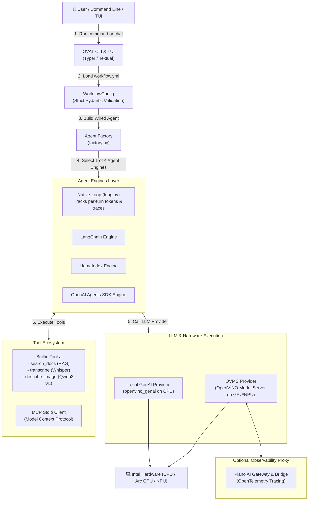
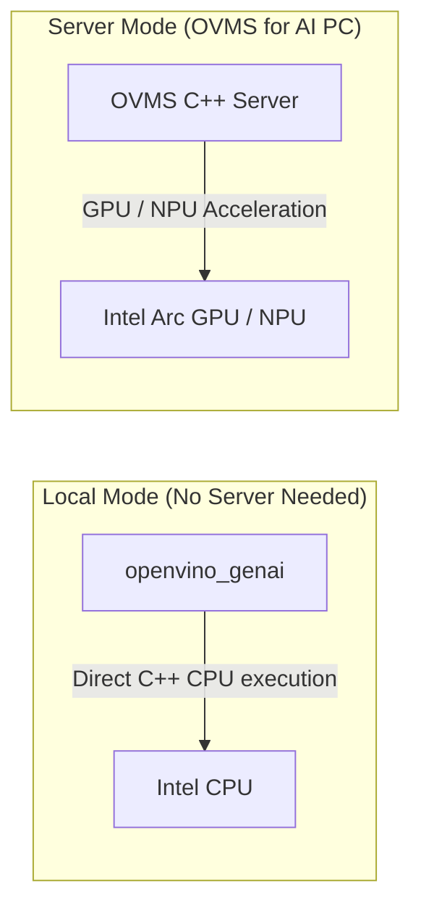
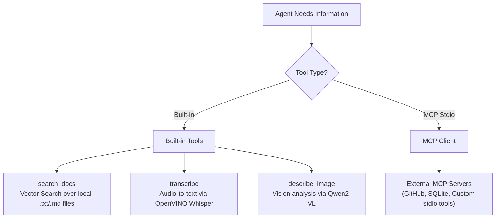
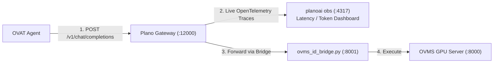

# OpenVINO Agentic Toolkit (OVAT) - Complete Architecture & Design Guide

> **Welcome!** If you are new to OVAT or AI frameworks, this document is written for you. It explains everything in simple language, with real-world analogies and clear diagrams.

---

## 🚗 What is OVAT? (The 30-Second Summary)

**OVAT = OpenVINO Agentic Toolkit.**

Imagine you want to build an AI assistant (an "Agent") that can search your personal documents, listen to audio files, and analyze images on your laptop. 
- Normally, setting this up requires writing hundreds of lines of complex Python code, configuring servers, and manually connecting tools.
- **OVAT's Mission**: "One YAML file + One Command." 

With OVAT, you write one simple configuration file (`workflow.yml`) and run:
```bash
ovat run workflow.yml --input "what tools do you have available?"
```
OVAT handles model loading, tool execution, hardware acceleration on Intel chips (CPU/GPU/NPU), and conversation history automatically.

---

## 🏛️ The Complete System Architecture (Diagram)

Here is how all the pieces of OVAT fit together from your command line down to the Intel hardware:



---

## 🧩 Key Components Explained Simply

### 1. The Core Config (`workflow.yml`)
- **What it is**: The blueprint of your AI agent.
- **What it contains**: Model name, hardware device choice (CPU/GPU/NPU), active tools, and prompt instructions.
- **Design Rule**: OVAT uses **Strict Pydantic Validation**. If there is a typo in your YAML file, OVAT stops immediately and tells you the exact line number instead of crashing halfway through.

---

### 2. The 4 Execution Engines
OVAT allows you to run your workflow through any of 4 popular agent frameworks with zero code changes:

| Engine | What it does | When to use it |
| :--- | :--- | :--- |
| **Native Loop (`loop.py`)** | OVAT's built-in tool-calling loop. | **Default & Best**: Records exact per-turn token counts, memory usage, and execution traces. |
| **LangChain** | Uses LangChain's ReAct agent implementation. | For existing LangChain ecosystem compatibility. |
| **LlamaIndex** | Uses LlamaIndex's `FunctionAgent`. | For LlamaIndex RAG workflows. |
| **OpenAI Agents SDK** | Uses OpenAI's official Agents SDK. | For OpenAI Agents SDK compatibility. |

---

### 3. The 2 Model Serving Paths

OVAT supports two ways to run OpenVINO models:



1. **Local GenAI Mode (`llm_genai.py`)**: Runs directly inside Python on CPU using `openvino_genai`. Great for dev laptops without installing external servers.
2. **OVMS Mode (`llm_ovms.py`)**: Connects to OpenVINO Model Server over HTTP on port `8000`. Harnesses maximum GPU and NPU hardware acceleration on Intel AI PCs.

---

### 4. Built-in Tools & MCP (Model Context Protocol)

OVAT agents get work done using tools. Every tool defines its schema in one single source of truth:



---

## 🔭 Why Use Plano? (The AI Gateway Layer)

### What is Plano?
**Plano** (formerly **ArchGW**) is an AI Proxy Gateway built on C++ Envoy and Rust WASM. 

### Why did we integrate Plano with OVMS?
In enterprise AI deployments, you need **Observability** (tracking token costs, latency, and errors across all requests).



- **Without Plano**: Adding OpenTelemetry tracing to OVAT would require adding thousands of lines of complex Python tracing code and heavy dependencies.
- **With Plano**: Plano sits in front of OVMS as a proxy. Every request automatically generates real-time OpenTelemetry trace spans in `planoai obs` **with zero code changes in OVAT**.

---

## 🛠️ Step-by-Step Operating Guide

### Running an Agent Workflow
```bash
ovat run examples/workflow.yml --input "summarize my documents"
```

### Running side-by-side Benchmarks across all 4 Engines
```bash
ovat bench examples/workflow.yml --input "what tools do you have?"
```
*(Prints a comparison table showing execution time, peak memory RSS, and token counts across Native, LangChain, LlamaIndex, and OpenAI Agents)*

### Serving OVMS on Windows Host
```cmd
ovat serve examples\plano\workflow.yml
```

### Starting Plano Gateway with OpenTelemetry in WSL2
```bash
planoai up examples/plano/plano-config.yaml
planoai obs   # Open live OpenTelemetry dashboard
```

---

## 🎯 Summary Matrix

| Module | Location | Primary Purpose |
| :--- | :--- | :--- |
| **Config Schema** | `ovat/config/workflow.py` | Strict Pydantic model for `workflow.yml`. |
| **Native Loop** | `ovat/agent/loop.py` | Core tool loop with per-turn token tracking. |
| **Agent Factory** | `ovat/agent/factory.py` | Wires LLM providers, tools, and RAG into 1 of 4 engines. |
| **OVMS LLM** | `ovat/providers/llm_ovms.py` | OpenAI SDK client talking to OVMS `/v3`. |
| **Local GenAI** | `ovat/providers/llm_genai.py` | Direct C++ OpenVINO LLM execution. |
| **ID Bridge** | `examples/plano/ovms_id_bridge.py` | Bridge for Plano chunked encoding and schema matching. |
| **TUI Application** | `ovat/cli/tui.py` | Claude-Code-style terminal user interface. |
