# OVAT Architecture

How the toolkit is built, layer by layer, and why each decision was made the way
it was. If you only want to *use* OVAT, the [README](../README.md) is the shorter
path; this document is for contributors and for anyone evaluating the design.

---

## Contents

**Orientation**
- [1. What OVAT is, in one screen](#1-what-ovat-is-in-one-screen)
- [2. The whole system, one diagram](#2-the-whole-system-one-diagram)
- [3. Layering rules that must not be broken](#3-layering-rules-that-must-not-be-broken)

**The nine layers**
- [Layer 1: CLI and configuration](#layer-1-cli-and-configuration)
- [Layer 2: Framework integration](#layer-2-framework-integration)
- [Layer 3: Agent core](#layer-3-agent-core)
- [Layer 4: Provider abstraction](#layer-4-provider-abstraction)
- [Layer 5: Tools and MCP](#layer-5-tools-and-mcp)
- [Layer 6: Orchestration (A2A)](#layer-6-orchestration-a2a)
- [Layer 7: Observability](#layer-7-observability)
- [Layer 8: Deployment and serving](#layer-8-deployment-and-serving)
- [Layer 9: OpenVINO runtime and hardware](#layer-9-openvino-runtime-and-hardware)

**Cross-cutting**
- [Model selection, and why "unified" is its own kind](#model-selection-and-why-unified-is-its-own-kind)
- [Tool-parser selection](#tool-parser-selection)
- [Failure design: three ways a tool call goes wrong](#failure-design-three-ways-a-tool-call-goes-wrong)
- [Concurrency and process boundaries](#concurrency-and-process-boundaries)
- [The plano gateway](#the-plano-gateway)
- [Testing strategy](#testing-strategy)
- [Layer status matrix](#layer-status-matrix)
- [File map](#file-map)

---

## 1. What OVAT is, in one screen

OVAT sits between a developer and
[OpenVINO Model Server](https://docs.openvino.ai/2026/model-server/ovms_what_is_openvino_model_server.html).
OVMS handles inference, tool-call decoding, batching and device targeting. It
deliberately does not decide *which* model, *which* device, *which* parser,
*which* tools, or when to start and stop, and that gap is a couple of hundred
lines of boilerplate that every project rewrites.

OVAT turns that gap into a config file, the way `kubectl` wraps the Kubernetes
API rather than replacing it. One `workflow.yml` in, one wired agent out.

The scope boundary matters and is worth stating plainly:

| OVAT does | OVAT does not |
| --- | --- |
| Config → wired agent | Inference (OVMS / openvino_genai) |
| Run the tool-calling loop | Model conversion (optimum-cli) |
| Manage the OVMS process | Serve other people's traffic |
| Route models to CPU/GPU/NPU | Provide auth (it is a local dev tool) |
| Register tools, local and MCP | Host anything |

---

## 2. The whole system, one diagram

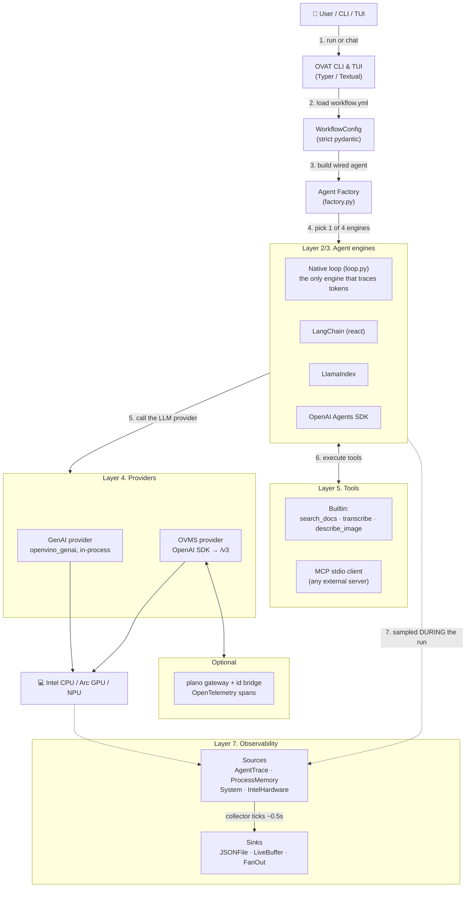

---

## 3. Four design rules, and what each protects

If you extend OVAT, these are the constraints to work within. Each one exists
because breaking it produced a bug that reached a user.

**Optional dependencies stay optional.** `textual` and `pyfiglet` live in the
`[tui]` extra only. Module-level `import textual` is permitted in exactly six
files (`tui.py`, `chat_screen.py`, `doctor_screen.py`, `widgets.py`, `theme.py`,
`commands.py`) and `tests/test_tui_isolation.py` enforces it. The same applies to
the framework engines: importing the CLI must pull in none of langchain,
llama_index or agents.

**The agent core does not depend on presentation.** The loop is not allowed to
depend on presentation. When both layers needed the same text helpers, the answer
was a neutral `ovat/text.py`, not an upward import.

**Each concept is defined in exactly one place.** Colours live in `ui.PALETTE`. Tool contracts
live in the co-located `SCHEMA` dicts, and every engine derives arguments from
them via `arg_models.py`. Config validity lives in `workflow.py`. Config
*loading* happens only in `main._load_config`. A second copy is how two copies
drift.

**Failures are written for the person reading them.** A tool or agent failure becomes a readable string the
model or the human can act on, never a bare traceback on the CLI or TUI path.

---

## Layer 1: CLI and configuration

**Files:** `ovat/cli/main.py`, `ovat/config/workflow.py`, `ovat/cli/ui.py`

Typer turns each function into a subcommand from its type hints. Ten commands:
`run`, `chat`, `serve`, `index`, `init`, `doctor`, `models`, `bench`,
`telemetry`, and a bare `ovat` that opens the TUI.

**Configuration is strict.** `WorkflowConfig` derives from a `StrictModel` base
with `extra="forbid"`, so an unknown key is an *error*, not a silent default.
A typo like `max_iteration` for `max_iterations` fails immediately and by name,
rather than quietly leaving the default in charge.

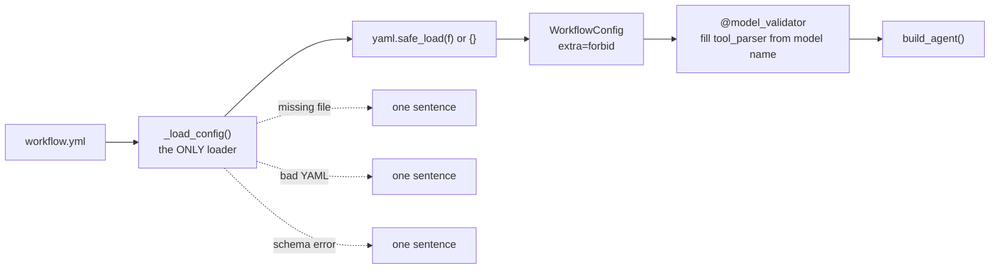

`_load_config` is the only place allowed to call `load_workflow`, because it
converts three distinct failures, file absent, YAML unparseable, schema
mismatch, into three distinct sentences. Every command reads a workflow, so this
is the single busiest place the "errors are for users" rule applies.

Two details that came from real failures:

- `yaml.safe_load(f) or {}`, an empty or comments-only file yields `None`, and
  `WorkflowConfig(**None)` produced `argument after ** must be a mapping`, which
  is Python internals where the user needed "your config has no model section".
- Every value that reaches the console goes through `esc()`. rich reads `[...]`
  as markup, so a model answer containing `[/INST]` once crashed `run` with a
  `MarkupError`. Model output, exception text and file paths are *data*.

---

## Layer 2: Framework integration

**Files:** `langchain_agent.py`, `llamaindex_agent.py`, `openai_agents_agent.py`,
`arg_models.py`, `providers/backend.py`

Four engines, selected by `agent.type`, all exposing the same `.run(text) -> str`:

| `agent.type` | Library | Notes |
| --- | --- | --- |
| `native` | none | OVAT's own loop; the only one that traces tokens |
| `react` | LangChain | `create_agent` + `ChatOpenAI` |
| `llamaindex` | LlamaIndex | `FunctionAgent` + `OpenAILike` |
| `openai-agents` | OpenAI Agents SDK | `OpenAIChatCompletionsModel` |

**Every engine derives its tool arguments from the same `SCHEMA`.** That is what
`arg_models.py` is for. A hand-kept second registry was tried once, and the
result was a tool that worked on the native path and crashed on LangChain until
someone remembered to update the other list.

Three things stop the OpenAI Agents SDK phoning OpenAI instead of OVMS, and all
three are load-bearing: an explicit `AsyncOpenAI` client on the `/v3` base URL,
`OpenAIChatCompletionsModel` rather than the default Responses model, and
`set_tracing_disabled(True)`.

`LLMBackend.from_config` is one shared description of the connection, so the four
engines cannot drift on it. They did once: `temperature` was set in two engines
and omitted in the other two for a whole release, which meant cross-engine
timings were comparing determinism against sampling rather than framework against
framework.

**The framework engines own their event loop and refuse to nest.** `asyncio.run`
cannot be re-entered, so they check for a running loop and raise a readable error
rather than deadlocking. This is deliberate; do not "fix" it. It works in the TUI
only because the chat screen runs the agent on a worker thread, where no loop is
running.

---

## Layer 3: Agent core

**Files:** `ovat/agent/loop.py`, `ovat/agent/session.py`

The native loop is four beats:

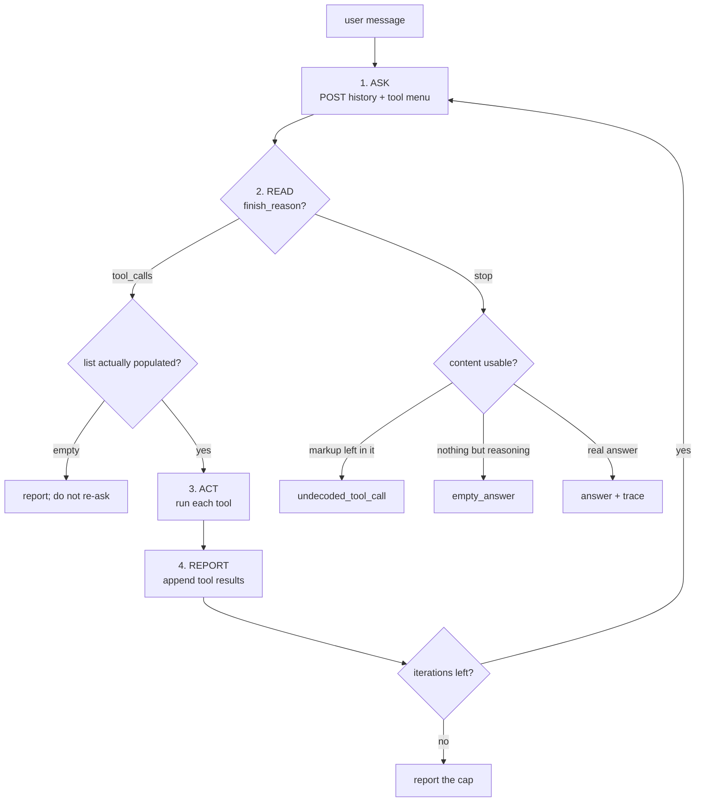

Exit on `finish_reason: stop`; `max_iterations` guarantees termination. Every
exit path goes through one `_finish` so the trace totals are always populated.

Design points worth knowing:

- **Tool calls are serialised back into plain dicts** before being stored in
  history. OVMS hands over SDK objects, but expects JSON dicts on the next
  request; skipping that step makes the follow-up request malformed.
- **Broken JSON is reported to the model, not swallowed.** A tool argument that
  will not parse used to become `{}`, so the tool ran with missing arguments and
  the model never learned why. Now it comes back as the tool *result*, which the
  model reads and can correct on its next turn.
- **Markdown fences are unwrapped first.** Small models wrap arguments in
  ```` ```json ```` because that is what JSON looks like in their training data.
  That is invalid packaging, not invalid intent; rejecting it cost a whole round
  trip. `strip_code_fence` lives in `ovat/text.py` and is shared with the OpenAI
  SDK engine, which is the only other engine that parses arguments itself.
- **`Session` is thread-safe.** The TUI streams an answer on a worker thread and
  saves from there, while the main thread can `/load` or `/clear`. `json.dump`
  iterating a list another thread is appending to writes a truncated file, and
  the file is the user's saved conversation. `save()` copies under the lock and
  writes outside it, so a slow disk cannot stall the answer stream.

---

## Layer 4: Provider abstraction

**Files:** `providers/base.py` and the concrete plugs beside it

Four ABCs, `LLMProvider`, `EmbeddingsProvider`, `RetrieverProvider`,
`VLMProvider`, with the concrete class chosen by a **string** in the config.
Swapping a backend is a YAML edit, not a code change.

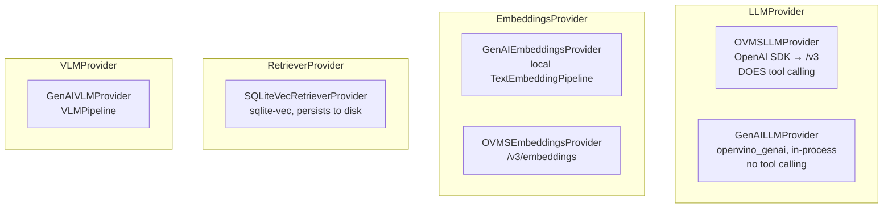

**How to add an LLM backend.** Implement `LLMProvider` (one method, `chat`),
then register it in `build_llm` behind a `model.provider` string. Nothing above
Layer 4 changes: the agent loop and all four engines only ever see the
interface.

The factory returns `LLMProvider`, never a concrete class. That is deliberate
and worth copying if you extend it — a factory whose return type names one
implementation can only ever produce that implementation, however many others
satisfy the contract.

Notes on the retriever:

- `check_same_thread=False`, because LangChain runs tools on a worker thread.
  SQLite permits threaded *reads* but not concurrent *writes*, so `add()` holds a
  `threading.Lock`, the embedding call stays outside it, since that is pure
  compute.
- Indexing a source **replaces** what that source had before, so `ovat index` is
  idempotent. It used to append, and three runs put the same chunk in three
  times, crowding out every other document.
- Deleting a source touches two tables: `chunks` has a `source` column, the
  `vec0` virtual table does not. Getting that half-right leaves orphan vectors,
  which `retrieve` matches and then silently skips, you ask for `top_k=5` and
  quietly get two results with no error anywhere.

---

## Layer 5: Tools and MCP

**Files:** `tools/search_docs.py`, `tools/transcribe.py`,
`tools/describe_image.py`, `tools/mcp_client.py`

Each built-in tool follows one pattern: a plain `*_impl()` that is unit-testable,
a co-located `SCHEMA` that is **the** contract, a FastMCP wrapper, and
`mcp.run()` under `__main__` so it also works as a standalone MCP server.

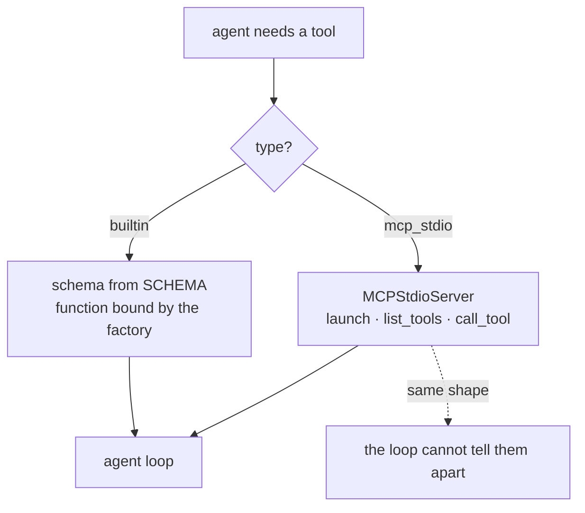

**The MCP client is sync-over-async, carefully.** The `mcp` SDK is async
(anyio); OVAT's loop is not. Each server gets one background thread running one
event loop, and one long-lived *manager* coroutine that connects, waits, and
unwinds. anyio cancel scopes must be entered and exited by the same task, so
`close()` cannot unwind the connection from outside, it sets an event and the
manager unwinds itself.

**A tool's error must match its declared shape.** `search_docs` is annotated
`-> list[dict]` and once returned a bare string on failure. The native loop hid
that, because it calls `str()` on whatever a tool returns. Over MCP it was a
crash: FastMCP validates the return against the annotation and rejected the
string with *"is not of type 'array'"*, so a locked database became a client-side
exception instead of a sentence the model could recover from.

**An MCP server needs the config, not the object.** `configure(retriever)` runs
in the parent process; `type: mcp_stdio` launches a *separate* Python, and objects
do not cross a process boundary. So an MCP-served `search_docs` was permanently
in stub mode, 104 characters of placeholder while the builtin path retrieved
1932 real ones from the same index. The server now takes `--config` and builds
its own retriever.

---

## Layer 6: Orchestration (A2A)

**Status: not implemented.** Scoped in the proposal as a stretch goal, with the
core toolkit explicitly working without it.

The intended shape is a minimal A2A server stub: an Agent Card at
`/.well-known/agent.json` and JSON-RPC 2.0 `message/send`. The privacy rule that
would govern it is already decided, only query text leaves the machine, never
retrieved documents.

---

## Layer 7: Observability

**Files:** `telemetry/base.py`, `sources.py`, `sinks.py`, `collector.py`

Sources (where numbers come from) and sinks (where they go) are separate
contracts, so any source feeds any sink.

| Source | Reports | Available on |
| --- | --- | --- |
| `AgentTraceSource` | tokens per turn, latency, tool traces | engines with a native loop |
| `SystemSource` | CPU per core, RAM, thread count | all |
| `ProcessMemorySource` | this process's resident memory | all |
| `IntelHardwareSource` | GPU/NPU utilisation and power | Windows / Linux with Intel UT |

Three rules this layer follows, because a measurement that lies is worse than a
measurement that is missing:

**Absent is not zero.** No token counts from the server means `null`, rendered as
a dash. A `0` reads as "used no tokens", and a benchmark built on that number is
quietly wrong.

**An unavailable source says why.** On macOS the Intel row reads *"Intel Unified
Telemetry does not run on macOS"* rather than showing zeros, because a missing
sensor and an idle one look identical in a graph.

**Peak RSS is sampled on a thread, during the run.** A single reading afterwards
misses the peak entirely. Python has already freed the large allocations. Note
the scope: `--trace` measures the **OVAT** process, so with OVMS serving, the
model's memory lives in `ovms.exe` and must be measured there. The trace *is* the
right number for `ovat chat`, where the model runs in-process.

One source contract worth stating: `sample()` must not raise. `Collector`
catches anyway, so one broken source cannot end the collection thread.

---

## Layer 8: Deployment and serving

**Files:** `core/ovms_installer.py`, `core/model_server.py`, `core/ovms_locator.py`,
`core/model_manager.py`

### Getting OVMS onto the machine: `ovat setup`

Installing used to be four manual steps and one judgement call: read the
README, pick one archive out of six, unpack it, then usually export
`OVAT_OVMS` because it landed somewhere the locator does not search. The
judgement call is the dangerous part - the `python_off` build cannot tool-call,
and choosing it gives an agent that answers fluently and silently never calls a
tool.

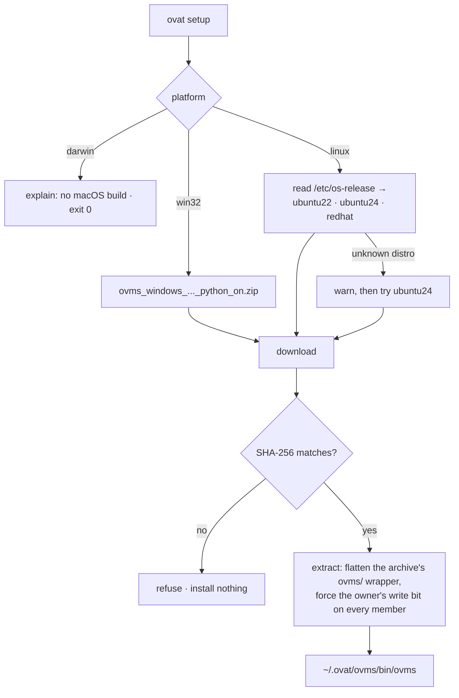

**Why this is not part of `pip install`.** The archive is 126–185 MB, Linux
needs three builds that cannot be chosen at wheel-build time, wheels have no
post-install hook, and macOS has no build at all - a bundled wheel would charge
every Mac user ~180 MB for a binary that cannot run. A subcommand that fetches
on demand is the shape `playwright install` and `python -m spacy download` use.

**Two extraction details are load-bearing.** The archive contains a single
`ovms/` directory; extracting it verbatim under `~/.ovat/ovms` would give
`~/.ovat/ovms/ovms/bin/ovms`, one level below where the locator looks, so it is
flattened. And every member's owner-write bit is forced **before** extraction
begins: OVMS ships mode `0o555`, and reopening such a file for write fails for
anyone without `CAP_DAC_OVERRIDE`. That made install fail for every non-root
Linux user while passing in Docker, in CI and in a maintainer's container - all
of which run as root.

### Starting it: `ovat serve`

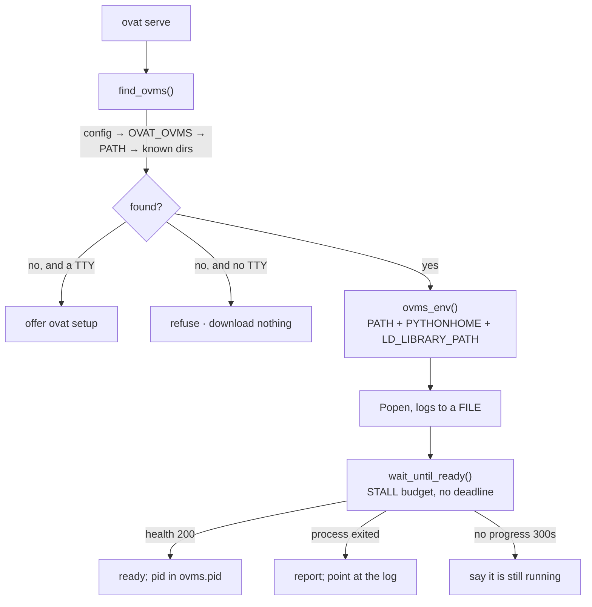

**The locator searches `./ovms` first**, because that is where the README's own
install steps unpack it. It also checks `~/.ovat/ovms` (where `ovat setup`
puts it), `~/ovms_windows`, `~/ovms`, `C:\ovms` and `PATH`. Windows installs
are essentially never on `PATH`, which is why `serve` works anyway - and why
nothing in OVAT ever edits it.

**`ovms_env()` is what setupvars would have done, and it is not cosmetic.** On
Windows the `python_on` build links `python3xx.dll` out of `<ovms>/python`, not
the folder beside `ovms.exe`, so the process dies with `0xC0000135` before
writing one byte of log. On Linux the shape is different: the binary sits at
`<root>/bin/ovms` and its shared objects at `<root>/lib`, so the root is the
directory *above* the binary, not the binary's own folder. Getting that one
level wrong is the whole bug. Proven by running the same binary twice:

| | exit | output |
| --- | --- | --- |
| bare | 127 | `libtbb.so.12: cannot open shared object file` |
| under `ovms_env()` | 0 | `OpenVINO Model Server 2026.2.1` |

It lives as a module-level function rather than inline in `start()` precisely
so it can be tested without launching a server - while it was inline, the
Linux branch had never been executed once.

**The child environment is what `setupvars.bat` would have set.** Not just the
binary's folder: the `python_on` build links `python3xx.dll` from
`<ovms>/python`, so `PYTHONHOME` and two extra `PATH` entries are required. Get
this wrong and the process dies instantly with `0xC0000135 DLL_NOT_FOUND` before
writing a single byte to the log, which reads as "OVMS had nothing to say"
rather than "OVMS never started".

**Readiness is a stall budget, not a deadline.** A first run downloads the model,
and that time is unbounded: gigabytes over whatever link the user has. Any fixed
cap is either too small for a slow connection or too large to notice a real hang.
The clock resets whenever the log file or the model repository grows, so a
download that keeps moving is never interrupted, while a wedged server still
fails in five minutes. Same reasoning behind curl's `--speed-time` and wget's
`--read-timeout`.

**Logs go to a file, never a pipe.** Piping without draining deadlocks OVMS once
its output fills the ~64 KB OS pipe buffer.

**Windows console semantics.** `serve` hands the prompt back and leaves OVMS
running, so the child gets `DETACHED_PROCESS | CREATE_NEW_PROCESS_GROUP`.
Without them, closing the window or a Ctrl-C at the parent takes the server down
too. On POSIX the value must stay exactly `0`, which `subprocess` enforces.

**`--stop` verifies identity before signalling.** A pidfile records a *number*.
Once the process it named is gone the OS may reuse it, so acting on existence
alone could kill an unrelated program. `_pid_is_our_server` confirms the process
is actually ovms; `_pid_is_running` stays a general liveness probe for its other
callers.

---

## Layer 9: OpenVINO runtime and hardware

**File:** `core/device_manager.py`

Device discovery via `openvino.Core().get_available_devices()`, then a routing
table.

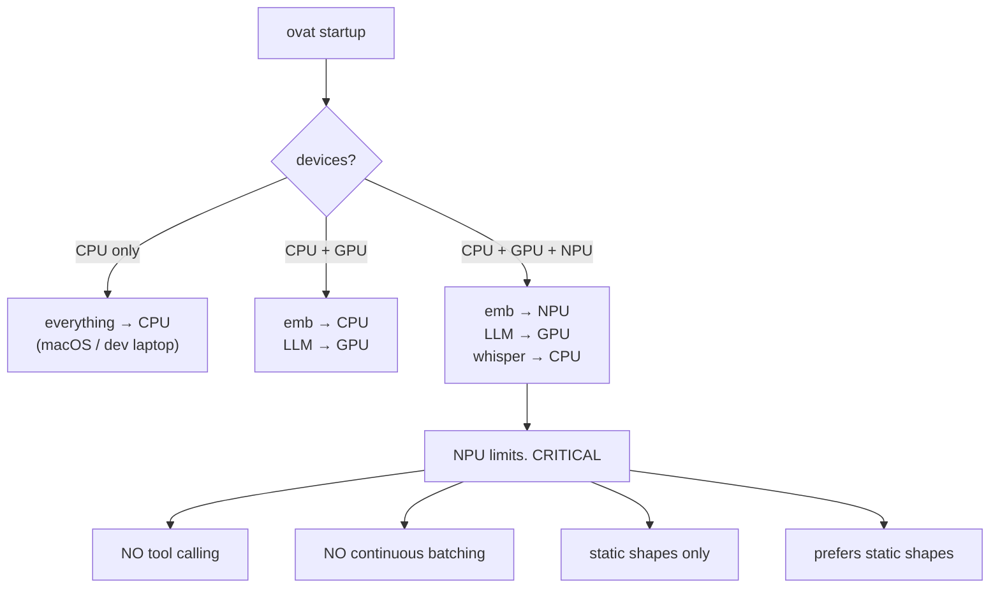

| Model type | Device | Why |
| --- | --- | --- |
| Embeddings (~130 MB) | NPU if present | static shape, small, low power |
| LLM (low-bit: INT4 / INT8) | GPU | dynamic shapes, KV cache, **tool calling** |
| Whisper (~80 MB) | CPU | small enough that CPU latency is fine |
| Anything, no accelerator | CPU | always works; low-bit weights keep it in RAM |

**`GPU` is the agent default; `NPU` works but needs a specific export.** Not because the NPU "cannot tool call" -- no accelerator executes tools. The device runs the model; the agent loop parses the tool call out of the generated text and runs the Python function itself, so tool calling is a property of the model and the parser, not the hardware. OVMS serves tool-calling LLMs on NPU and [documents the procedure](https://github.com/openvinotoolkit/model_server/blob/main/demos/llm_npu/README.md), tested on the same LunarLake silicon this project develops against.

The real constraint is the **export format**, and it is strict:

| NPU requirement | Consequence |
| --- | --- |
| INT4 exported `--sym --ratio 1.0 --group-size -1` (channel-wise, symmetric) | the stock `-int4-ov` models are group quantised and will not compile; use the [`-int4-cw-ov` family](https://huggingface.co/collections/OpenVINO/llms-optimized-for-npu) |
| Prompt capped at 1024 tokens by default | raise it with `--max_prompt_len`; an agent turn grows every round, so this is the setting that matters most |
| No request batching, no beam search, no `log_probs` | requests are processed sequentially |
| `cache_size`, `enable_prefix_caching`, `dynamic_split_fuse`, `max_num_batched_tokens` are **ignored** | NPU deployments are Stateful servables ([reference](https://github.com/openvinotoolkit/model_server/blob/main/docs/llm/reference.md)). `--enable_prefix_caching` is not dropped, though: OVMS translates it into the NPU-specific `NPUW_LLM_ENABLE_PREFIX_CACHING` plugin option |
| `finish_reason` is **always** `"stop"` (OVMS's [NPU demo](https://github.com/openvinotoolkit/model_server/blob/main/demos/llm_npu/README.md) states this) | a decoded tool call would arrive labelled as if the model had stopped |

That last row is why the native loop dispatches on **whether the reply carries tool calls**, never on `finish_reason`. See `agent/loop.py`. Note the measurement below: the documented behaviour did *not* occur on this build, so that defence is correct-by-the-docs but was not exercised here.

### Measured on this hardware, 2026-08-12

LunarLake (Arc 140V GPU + Intel AI Boost NPU), OVMS 2026.2.1.1122f03bf.

**Tool calling on NPU works.** `OpenVINO/Qwen3-8B-int4-cw-ov` compiled for NPU in 36 s and reached `AVAILABLE`; `ovat run examples/document-qa-npu.yml` returned `tool_calls: 1`, `undecoded_tool_call: false`, `failed: false` over 2 turns in 63.8 s. This retires the earlier "the NPU cannot do tool calling" claim with a run, not an argument.

**`finish_reason` was *not* always `"stop"`.** Both through OVAT and through a raw `curl`, the tool-calling turn came back `finish_reason: "tool_calls"` with the call in `message.tool_calls`. The quirk OVMS documents did not reproduce on this version.

**The stock export fails, but not for the stated reason.** `Qwen3.5-0.8B-int4-ov` on NPU fails with `vclAllocatedExecutableCreate3 result: 0x78000004 - [NPU_VCL]`, matching the code recorded earlier. The compiler's own diagnostic, however, is `StopLocationVerifierPass Pass failed : Found 8 duplicated names after full verification` -- a graph-naming complaint, not a quantisation-grouping one. OVMS also logged it as a *"Visual Language Model Legacy servable"* where the working 8B logged *"Language Model Legacy servable"*. **Channel-wise quantisation being the cause is therefore unverified**; what is verified is that the cw export compiles and the stock one does not.

**There is a hard static sequence cap, and OVMS labels it `"unknown"`.** The NPU pipeline is compiled to fixed shapes from `MAX_PROMPT_LEN` and `MIN_RESPONSE_LEN` ([OpenVINO GenAI on NPU](https://docs.openvino.ai/2026/openvino-workflow-generative/inference-with-genai/inference-with-genai-on-npu.html)). Pulled with `--max_prompt_len 2000`, this deployment stops at **exactly 2129 total tokens**, however the split falls:

| prompt | completion | total | `finish_reason` |
| --- | --- | --- | --- |
| 28 | 2101 | 2129 | `"unknown"` |
| 1529 | 600 | 2129 | `"unknown"` |

The reply is cut mid-sentence and the reason is `"unknown"` -- not `"length"`, which this server does return correctly when `max_tokens` is the binding limit. (Exceeding `MAX_PROMPT_LEN` on the prompt alone is a clean HTTP 400, `"Input length exceeds the maximum allowed length"`.) The exact arithmetic is not derived here: the documented `MIN_RESPONSE_LEN` default is 150, and 2000 + 150 is 2150, not 2129.

**This is a truncation mechanism for a fragmentary tool call.** A `<tool_call>` block still being emitted when the cap lands is cut in half, and the parser is handed a fragment -- the `undecoded_tool_call` symptom, arriving with a `finish_reason` that names no cause. It is unrelated to the KV cache, which NPU ignores entirely (row 3 above). Compare upstream [openvino.genai#3255](https://github.com/openvinotoolkit/openvino.genai/issues/3255), "NPU LLM Pipeline produces garbled output instead of error when prompt exceeds practical context limits". For an agent, whose prompt grows every round, `--max_prompt_len` is the setting that matters most.

---

## Model selection, and why "unified" is its own kind

The default model is `Qwen3.5-4B-int4-ov`: 3.5 GB, and a **unified** export, text generation, image understanding and tool calling in one set of weights. The
RAG, ReAct and audio+vision examples therefore share a single download instead of
needing a separate ~5 GB vision model.

**Why OVAT has to inspect the folder rather than trust the file layout.**
A unified export and a vision-only one are indistinguishable on disk: both
carry
`openvino_vision_embeddings_*.xml` and `openvino_language_model.xml`, and neither
has the plain `openvino_model.xml` that marks a text LLM.

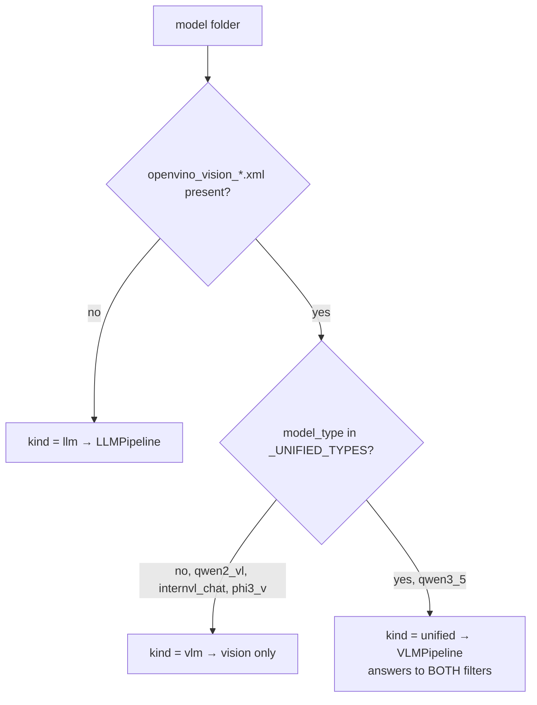

| Decision | Why |
| --- | --- |
| `config.json` is read **before** the file layout is judged | Layout used to be treated as conclusive. Unified models made it ambiguous, so layout now narrows the question rather than answering it |
| Detection is an **exact** `model_type` match, not a prefix | A prefix on `qwen3_5` would also accept a future `qwen3_5_vl`. Wrongly accepting a vision-only model gives a C++ traceback; wrongly rejecting one gives a readable sentence. Fail toward the sentence |
| A unified model answers to **both** `llm` and `vlm` filters | It genuinely is both. The alternative is two downloads for what one already does |

The failure this prevents is unusually nasty: `LLMPipeline` **constructs
successfully** on a unified export, measured at 24.6 s, and only then dies on
the first `generate()` with *"Port for tensor name input_ids was not found"*.
Constructing without error is not evidence the pipeline is right, so the choice is
made from the export's layout instead.

---

## Tool-parser selection

`tool_parser` tells OVMS how to decode the model's tool calls. The right value
differs by **family**, and getting it wrong fails silently.

| Family | Parser | Wire format |
| --- | --- | --- |
| Qwen3.5 | `qwen3coder` | `<tool_call><function=name><parameter=k>v</parameter></function></tool_call>` |
| Qwen3, Qwen2 | `hermes3` | `<tool_call>{"name": ..., "arguments": {...}}</tool_call>` |

**`auto` is not a safe default.** OVMS documents that it picks a parser from the
chat template when the flag is absent, so omitting it looked correct. Measured on
live hardware, it selected **nothing** and returned the tool call as plain text:
`finish_reason: "stop"`, zero tool calls, raw markup printed as the answer. The
reasoning was sound at every step and the conclusion was wrong, because "let it
choose" turned out to mean "choose nothing".

So OVAT **derives** the value from the model name when the field is omitted, from
data it already has, and falls back to `hermes3` for families it does not
recognise. An explicit value always wins.

---

## Failure design: three ways a tool call goes wrong

All three end with the agent answering fluently while having called nothing, which
is the hardest kind of broken to notice. Each is now detected and named.

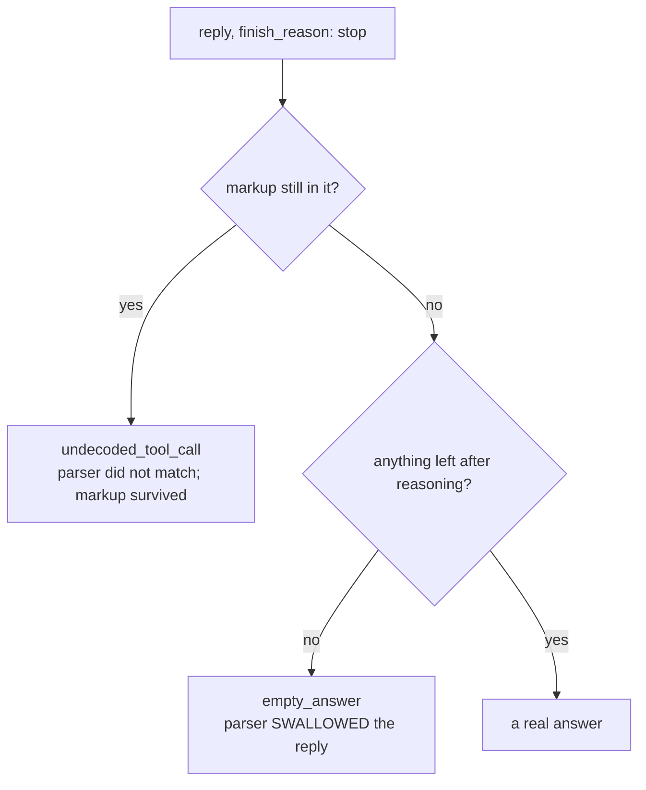

| Mode | Symptom | Detected by |
| --- | --- | --- |
| No parser selected | raw `<tool_call>` markup becomes the answer | `looks_like_undecoded_tool_call` |
| Wrong parser | reply is reasoning and nothing else | `says_nothing` |
| Malformed by the model | `<parameter=name>` where `<function=name>` belongs | the same markup check |

Both set a flag in the trace totals, so `--trace` cannot show a clean
`tool_calls: 0` that reads as "the model chose not to use a tool". `bench` reads
those flags rather than the answer text, and scores such a row **not ok**, an
earlier version tested the text and was defeated by a change in the same commit
that turned an empty reply into an `Error:` string, which is not empty.

The markup is deliberately **not** parsed into a real tool call. Guessing at
broken output trades a loud failure for a silent wrong answer.

---

## Concurrency and process boundaries

Four places where more than one thread or process is involved.

| Boundary | Mechanism | Hazard handled |
| --- | --- | --- |
| LangChain tools | worker thread → one SQLite connection | `check_same_thread=False` for reads; a lock for writes |
| TUI answer streaming | `@work(thread=True)` | lets framework engines run `asyncio.run` with no loop present; `Session` lock stops a truncated save |
| MCP stdio servers | one thread + one event loop + one manager coroutine per server | anyio cancel scopes must enter/exit in the same task |
| `bench` per engine | a fresh subprocess each | RSS is a whole-process number, so engines sharing a process inherit each other's allocations |

That last one is worth the detail: measured against live OVMS, the native engine
read **465.8 MB** running first and **1155.6 MB** running last, against an
isolated figure of 466 MB. The lightest engine was reported as the heaviest purely
by list position, and reversing the order reversed the conclusion. A benchmark
that changes its answer when you reorder the inputs is not measuring the inputs.

---

## The plano gateway

[plano](https://github.com/katanemo/plano) (formerly archgw) is an AI proxy that
turns every request into an OpenTelemetry span, **with no OTEL dependency added
to OVAT**. It is observability as configuration.

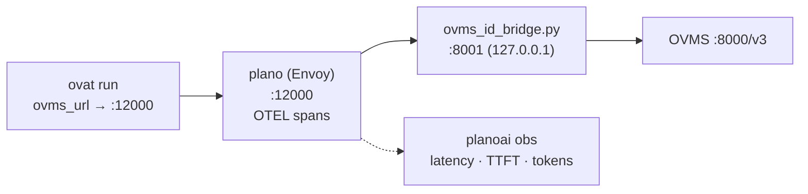

Three problems had to be solved, and each answer is recorded in the config's
comments:

| Problem | Answer |
| --- | --- |
| plano calls `/v1`, OVMS serves `/v3` | No prefix setting exists; plano parses `base_url` and lifts the path out itself. Put `/v3` in the URL |
| plano refuses to start | The model name needs a `provider/` prefix, because plano splits on `/`. Hence `ovms/Qwen3.5-4B-int4-ov` |
| plano rejects OVMS's reply | Its WASM filter requires a top-level `"id"`, which OVMS omits. `ovms_id_bridge.py` injects one |

The bridge binds `127.0.0.1` by default, nothing in it checks credentials, so a
wider bind is an open door to the GPU. `--host 0.0.0.0` exists because plano in
WSL2 or Docker must reach the host across a network namespace, and it warns when
used.

**This is not the same thing as Layer 7.** Layer 7 measures what the *agent* did, tokens per turn, which tool ran, peak RSS. plano measures what the *transport*
did, latency, TTFT, HTTP status. Neither substitutes for the other.

---

## Testing strategy

~550 tests, no server required. `pytest -q` must end green.

| Convention | Reason |
| --- | --- |
| Every fix ships with a test that **fails with the fix backed out** | Verify it; do not assume. A test that passes against broken code is worse than none |
| `live` and `rag` markers auto-skip | A fresh clone runs green with no models and no OVMS |
| Disk-scanning tests isolate with `monkeypatch.chdir` and a fake `HOME` | Otherwise they describe the developer's machine rather than the code |
| TUI tests use Textual's headless `Pilot` | No real terminal, so they run in CI |
| Mouse selection is driven via `Screen._forward_event` | Selection lives there; a test that posts events sees nothing and wrongly concludes the feature is broken |
| `monkeypatch`, never a bare attribute assignment | A bare one leaked into other tests once |

Seams built for mocking: `chat_screen._build_components`,
`chat_screen._build_engine`, `cli_main.build_agent`, `diagnostics.run_checks`,
`model_server.subprocess.Popen`, `bench.benchmark_engine`.

The recurring lesson is that **environment coupling is the main way a test lies.**
Three examples, all real: the stall-budget tests called the real health URL and so
failed on a machine where `ovat serve` happened to be running; two telemetry tests
asserted a source was unavailable, which is true on macOS and false on an AI PC;
and one config test resolved a filename against the working tree and passed while
the documented command was still broken.

---

## Layer status matrix

| Layer | Status | Notes |
| --- | --- | --- |
| 1 CLI / Config | ✅ complete | 10 commands, strict validation |
| 2 Framework integration | ✅ complete | all four engines verified live on an AI PC |
| 3 Agent core | ✅ complete | loop, session, three failure guards |
| 4 Provider abstraction | ⚠️ partial | LLM + embeddings complete; retrievers are sqlite-vec only (FAISS, USearch not built) |
| 5 Tools / MCP | ✅ complete | three built-ins, MCP client and server |
| 6 Orchestration (A2A) | ❌ not built | scoped as a stretch goal |
| 7 Observability | ✅ complete | sources, sinks, JSONL, CLI + TUI pages. NPU utilisation now reads on **Windows too** (PDH, `GPU Engine` on the AI Boost adapter) as well as Linux sysfs; macOS has no Intel NPU and says so |
| 8 Deployment / serving | ✅ complete | locator, stall budget, pidfile, identity check. `ovms_cache_size_gb` verified working on hardware (it never was before) |
| 9 Runtime / hardware | ✅ complete | device routing; **NPU tool-calling agent run on hardware**, and its static 2129-token cap measured, not just documented |

CI runs the suite on every push across ubuntu-22.04/py3.10 (the oldest
supported everything), ubuntu-24.04/py3.12, windows-latest/py3.12 and
macos-latest/py3.13, plus two jobs the suite itself cannot prove: that a BASE
install pulls in no framework or TUI dependency, and that the built wheel
installs and runs.

NPU LLM serving is no longer outstanding: `examples/document-qa-npu.yml` runs
a tool-calling agent against `Qwen3-8B-int4-cw-ov` on this machine's NPU, and
the measurements are in "Measured on this hardware" above.

Also outstanding: a VSCode extension (secondary scope), A2A orchestration
(Layer 6, a declared stretch goal), and GPU/NPU verification on Linux, which
WSL2 cannot give (no `/dev/dri`). The Windows NPU reader is no longer on this
list: `_WindowsNPUCounter` reads it through PDH, and both controls were
measured -- 93.5% under an NPU load, and 0.0% while OVMS generated on the GPU
and the GPU's own `engtype_neural` read 100.0%.

One open question is deliberately left open rather than closed on a thin
sample: whether a full **static** KV cache causes the undecoded-tool-call
failure. Three runs per arm put the failure only in the 1 GB arm at 100% and
none in the 8 GB arm, but the same 100% reading also passed, so it is not
reproducible on demand. See AGENTS.md for the table. The ~10x latency cost of
a full static cache did reproduce, and matches the preemption-and-recompute
OVMS documents.

A related reading has since been **corrected**. A KV cache growing without
bound was taken as evidence that the cache was the problem; it is the other
way round. Nothing capped a generation on any engine until 2026-08-12, so a
model that never emitted a stop token generated until the client gave up, and
the cache grew because every token needs more of it. One measured run climbed
to 13.6 GB over an hour on a single request. `model.max_tokens` now defaults
to 4096. The remaining honest statement about the cache is the latency one
above; the growth was a symptom.

---

## File map

One line each.

**Config and CLI**
- `config/workflow.py`, the pydantic schema. `StrictModel`: unknown keys are errors. New fields need schema + example + README row + a test
- `cli/main.py`, every typer command. All printing via the one themed console; `_load_config` is the only loader
- `cli/ui.py`, `PALETTE` (the single source of truth for all colours), theme, `wordmark()`
- `cli/diagnostics.py`, doctor's checks, platform-aware
- `text.py`, reasoning/markup helpers shared by the agent layer and the CLI

**Agent**
- `agent/loop.py`, the native loop and the run trace
- `agent/factory.py`, config → wired agent; the tool registry lives here
- `agent/arg_models.py`, derives per-framework argument models from each `SCHEMA`
- `agent/langchain_agent.py` · `llamaindex_agent.py` · `openai_agents_agent.py`, the three framework engines
- `agent/session.py`, conversation memory, thread-safe, with JSON save/load
- `agent/rag_chat.py`, local retrieve-then-answer, with streaming

**Providers**
- `providers/base.py`, the four ABCs
- `providers/llm_ovms.py`. OpenAI SDK → OVMS `/v3`; returns `usage`; bounded by `request_timeout`
- `providers/llm_genai.py`, local `openvino_genai`; routes unified exports through `VLMPipeline`
- `providers/embeddings_genai.py` · `embeddings_ovms.py`, text → vectors
- `providers/retriever_sqlitevec.py`, the vector store
- `providers/vlm_genai.py`, vision, reached via `describe_image`
- `providers/backend.py`, one shared description of the OVMS connection

**Core**
- `core/model_server.py`. OVMS lifecycle: start, stall-budget readiness, stop, pidfile
- `core/ovms_locator.py`, find the binary: config → env → PATH → known folders
- `core/model_scout.py`, identify local model folders; the `unified` kind lives here
- `core/device_manager.py`. CPU/GPU/NPU routing
- `core/model_manager.py`, wraps `ovms --pull` / `--list_models`

**Tools, RAG, telemetry, bench**
- `tools/search_docs.py` · `transcribe.py` · `describe_image.py`, built-ins, each also an MCP server
- `tools/mcp_client.py`. MCP stdio client
- `rag/indexer.py`, chunk and index `.txt`/`.md`
- `telemetry/`, `base` (ABCs), `sources`, `sinks`, `collector`
- `bench.py`, one question, several engines, one process each

**TUI** (the `[tui]` extra)
- `cli/tui.py`, launcher and masthead
- `cli/shell.py`, subprocess exec layer, slash templates, `\r` progress sampling
- `cli/chat_screen.py`, in-process chat: streaming, history, sessions, `/engine`
- `cli/doctor_screen.py` · `telemetry_screen.py` · `widgets.py` · `editing.py` · `theme.py` · `commands.py`

Contributor rules and the landmine list live in [`AGENTS.md`](../AGENTS.md).
