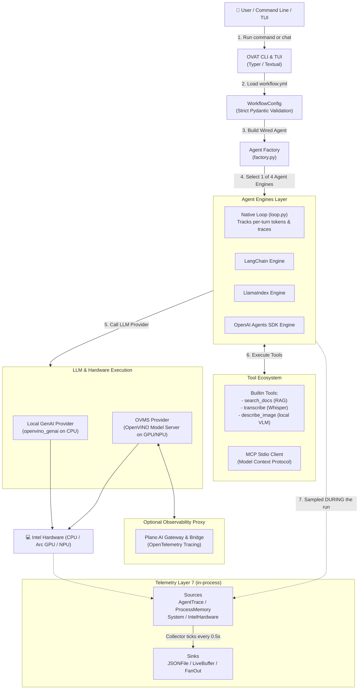
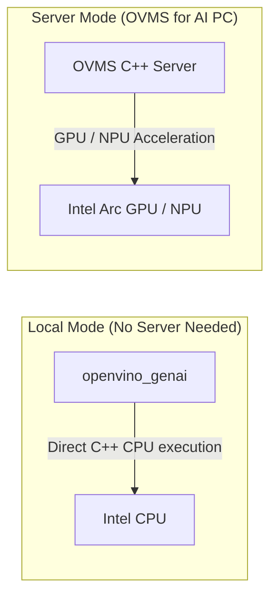
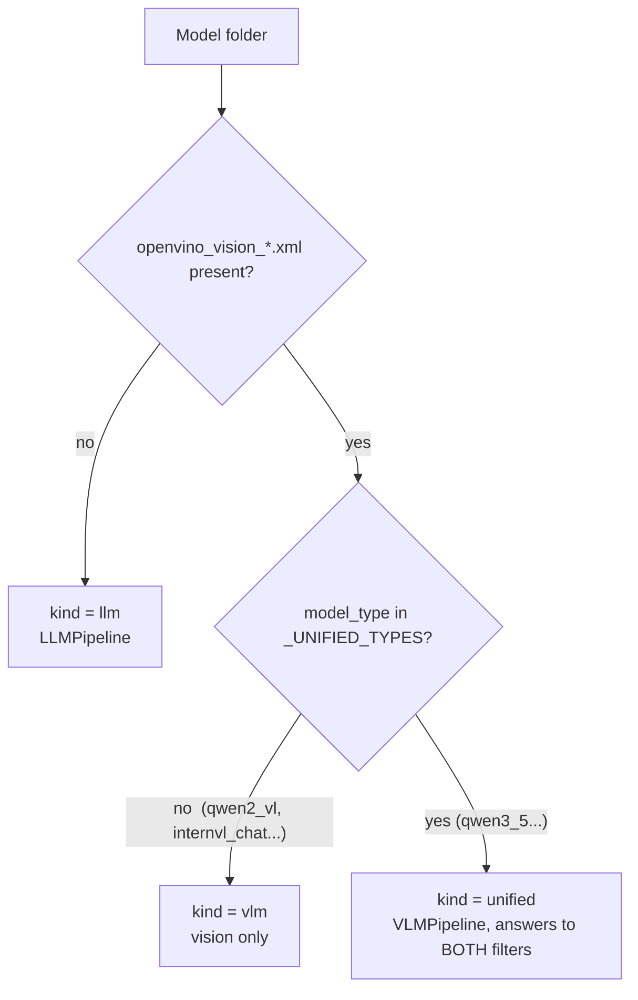
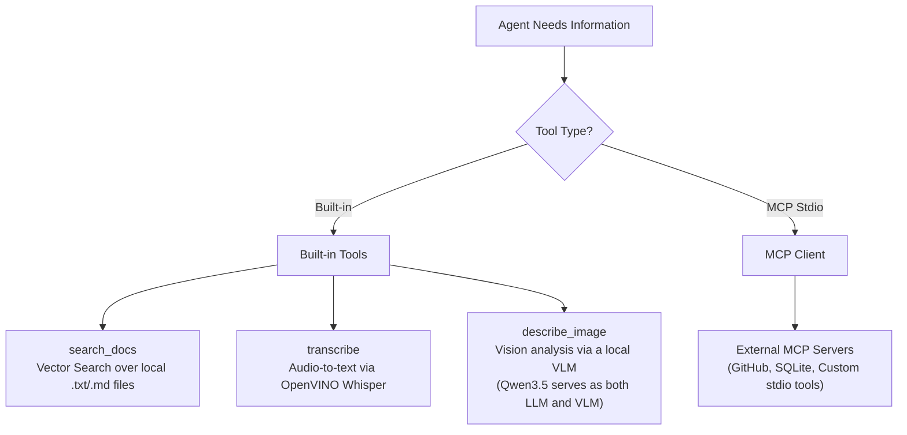
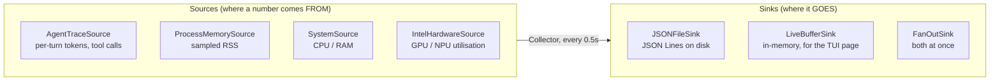
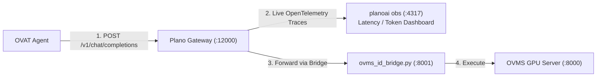

# OpenVINO Agentic Toolkit (OVAT) - Complete Architecture & Design Guide

> **Welcome!** If you are new to OVAT or AI frameworks, this document is written for you. It explains everything in simple language, with real-world analogies and clear diagrams.

---

## 🚗 What is OVAT? (The 30-Second Summary)

**OVAT = OpenVINO Agentic Toolkit.**

Imagine you want to build an AI assistant (an "Agent") that can search your personal documents, listen to audio files, and analyze images on your laptop. 
- Normally, setting this up requires writing hundreds of lines of complex Python code, configuring servers, and manually connecting tools.
- **OVAT's Mission**: "One YAML file + One Command." 

With OVAT, you write one simple configuration file (`workflow.yml`) and run:
```bash
ovat run workflow.yml --input "what tools do you have available?"
```
OVAT handles model loading, tool execution, hardware acceleration on Intel chips (CPU/GPU/NPU), and conversation history automatically.

---

## 🏛️ The Complete System Architecture (Diagram)

Here is how all the pieces of OVAT fit together from your command line down to the Intel hardware:



---

## 🧩 Key Components Explained Simply

### 1. The Core Config (`workflow.yml`)
- **What it is**: The blueprint of your AI agent.
- **What it contains**: Model name, hardware device choice (CPU/GPU/NPU), active tools, and prompt instructions.
- **Design Rule**: OVAT uses **Strict Pydantic Validation**. If there is a typo in your YAML file, OVAT stops immediately and tells you the exact line number instead of crashing halfway through.

---

### 2. The 4 Execution Engines
OVAT allows you to run your workflow through any of 4 popular agent frameworks with zero code changes:

| Engine | What it does | When to use it |
| :--- | :--- | :--- |
| **Native Loop (`loop.py`)** | OVAT's built-in tool-calling loop. | **Default & Best**: Records exact per-turn token counts, memory usage, and execution traces. |
| **LangChain** | Uses LangChain's ReAct agent implementation. | For existing LangChain ecosystem compatibility. |
| **LlamaIndex** | Uses LlamaIndex's `FunctionAgent`. | For LlamaIndex RAG workflows. |
| **OpenAI Agents SDK** | Uses OpenAI's official Agents SDK. | For OpenAI Agents SDK compatibility. |

---

### 3. The 2 Model Serving Paths

OVAT supports two ways to run OpenVINO models:



1. **Local GenAI Mode (`llm_genai.py`)**: Runs directly inside Python on CPU using `openvino_genai`. Great for dev laptops without installing external servers.
2. **OVMS Mode (`llm_ovms.py`)**: Connects to OpenVINO Model Server over HTTP on port `8000`. Harnesses maximum GPU and NPU hardware acceleration on Intel AI PCs.

---

### 3b. Model selection, and why "unified" is its own kind

The default model is `Qwen3.5-4B-int4-ov` (3.5 GB). It replaced
`Qwen3-8B-int4-ov` (4.9 GB) for two reasons: a smaller first download, and
the fact that Qwen3.5 is a **unified** export — text generation, image
understanding and tool calling in one set of weights. The RAG, ReAct and
audio+vision examples therefore share a single download rather than needing
a separate ~5 GB vision model.

That created a genuine classification problem. On disk, a unified export is
**indistinguishable from a vision-only model**: both have
`openvino_vision_embeddings_*.xml` and `openvino_language_model.xml`, and
neither has the plain `openvino_model.xml` that marks a text LLM.



Three decisions worth recording:

| Decision | Why |
| --- | --- |
| `config.json` is read **before** the file layout is judged | Layout used to be treated as conclusive ("it never lies"). Unified models made it ambiguous, so layout now narrows the question instead of answering it. |
| Detection is an **exact** `model_type` match, not a prefix | A prefix rule on `qwen3_5` would also accept a future `qwen3_5_vl`. Wrongly accepting a vision-only model produces a raw C++ traceback; wrongly rejecting one produces a readable sentence. Fail toward the readable sentence. |
| A unified model answers to **both** `llm` and `vlm` filters | It genuinely is both. The alternative is asking users to download two models to do what one already does. |

The failure this prevents is unusually nasty: `LLMPipeline` **constructs
successfully** on a unified export (measured: 24.6 s) and only then dies on
the first `generate()` with `Port for tensor name input_ids was not found`.
Constructing without error is not evidence the pipeline is the right one, so
the choice is made from the export's layout rather than from whether the
constructor raised.

**Tool parser selection** follows the same "let the authority decide"
principle. OVMS inspects a model's chat template at startup and picks a
parser itself, but only when `--tool_parser` is absent — an explicit value
always wins. OVAT therefore supports `tool_parser: auto`, which omits the
flag. This matters concretely: Qwen3.5 emits `qwen3coder`-shaped tool calls
(`<function=..><parameter=..>`), not `hermes3` JSON, and OVMS ships no
`qwen3_5` parser at all.

---

### 4. Built-in Tools & MCP (Model Context Protocol)

OVAT agents get work done using tools. Every tool defines its schema in one single source of truth:



---

### 5. Telemetry (Layer 7)

Benchmarks are only worth something if the numbers are honest, so OVAT measures
itself while it runs rather than guessing afterwards.



- **Two axes, not one.** A measurement's *source* and its *destination* vary
  independently, so any source can feed any sink. Wiring N sources to M sinks
  directly costs N×M pieces that all have to agree; through the two ABCs in
  `telemetry/base.py` it costs N+M.
- **Sampled during the run, never after.** Peak memory read once at the end is
  not a peak — Python has already freed the big allocations. `Collector` ticks
  on a clock while the agent works.
- **A telemetry source must never take the run down with it.** `sample()` is
  contractually forbidden from raising; a source that cannot read its hardware
  returns nothing and reports *why* through `unavailable`.
- **Absent is not zero.** An unknown token count stays `None` and prints as a
  dash. A `0` reads as "used no tokens", and a benchmark built on that is
  quietly wrong — the worst kind.

```bash
ovat run workflow.yml --input "..." --telemetry run.jsonl
```

JSON Lines rather than one big array, so a run that is killed halfway still
leaves a readable file and `tail -f` works while it is going.

---

## 🔭 Why Use Plano? (The AI Gateway Layer)

### What is Plano?
**Plano** (formerly **ArchGW**) is an AI Proxy Gateway built on C++ Envoy and Rust WASM. 

### Why did we integrate Plano with OVMS?
In enterprise AI deployments, you need **Observability** (tracking token costs, latency, and errors across all requests).



- **Without Plano**: emitting standards-compliant OpenTelemetry spans *per HTTP
  request* would mean pulling the OTel SDK and its dependency tree into OVAT and
  instrumenting every provider by hand.
- **With Plano**: Plano sits in front of OVMS as a proxy, so every request
  generates real-time OTel spans in `planoai obs` **with zero code changes in
  OVAT**.

### How this relates to Layer 7 (they are not the same thing)

The two observe different things and neither replaces the other:

| | Telemetry Layer 7 | Plano gateway |
| :--- | :--- | :--- |
| **Vantage point** | inside the OVAT process | on the wire, in front of OVMS |
| **Sees** | per-turn tokens, tool calls, RSS, Intel GPU/NPU | request latency, status, OTel spans |
| **Cannot see** | anything the server does internally | anything local — memory, NPU, which tool ran |
| **Needs** | nothing, always available | a running gateway (Linux/WSL2) |

Layer 7 is what makes `ovat bench` and `ovat run --trace` mean anything on a
laptop with no gateway. Plano is what makes OVAT legible to an *existing*
enterprise observability stack. The overlap is deliberate: when both are
running, request latency measured at the gateway is an independent check on the
numbers the in-process sampler reports.

---

## 🛠️ Step-by-Step Operating Guide

### Running an Agent Workflow
```bash
ovat run examples/workflow.yml --input "summarize my documents"
```

### Running side-by-side Benchmarks across all 4 Engines
```bash
ovat bench examples/workflow.yml --input "what tools do you have?"
```
*(Prints a comparison table showing execution time, peak memory RSS, and token counts across Native, LangChain, LlamaIndex, and OpenAI Agents)*

### Serving OVMS on Windows Host
```cmd
ovat serve examples\plano\workflow.yml
```

### Starting Plano Gateway with OpenTelemetry in WSL2
```bash
planoai up examples/plano/plano-config.yaml
planoai obs   # Open live OpenTelemetry dashboard
```

---

## 🎯 Summary Matrix

| Module | Location | Primary Purpose |
| :--- | :--- | :--- |
| **Config Schema** | `ovat/config/workflow.py` | Strict Pydantic model for `workflow.yml`. |
| **Native Loop** | `ovat/agent/loop.py` | Core tool loop with per-turn token tracking. |
| **Agent Factory** | `ovat/agent/factory.py` | Wires LLM providers, tools, and RAG into 1 of 4 engines. |
| **OVMS LLM** | `ovat/providers/llm_ovms.py` | OpenAI SDK client talking to OVMS `/v3`. |
| **Local GenAI** | `ovat/providers/llm_genai.py` | Direct C++ OpenVINO LLM execution. |
| **ID Bridge** | `examples/plano/ovms_id_bridge.py` | Bridge for Plano chunked encoding and schema matching. |
| **Telemetry Contracts** | `ovat/telemetry/base.py` | The `TelemetrySource` / `TelemetrySink` ABCs. |
| **Telemetry Collector** | `ovat/telemetry/collector.py` | Ticks every source into every sink on a clock. |
| **Telemetry Sources** | `ovat/telemetry/sources.py` | Agent trace, process RSS, system, Intel GPU/NPU. |
| **Telemetry Sinks** | `ovat/telemetry/sinks.py` | JSON Lines file, live buffer, fan-out. |
| **TUI Application** | `ovat/cli/tui.py` | Claude-Code-style terminal user interface. |
| **Live Telemetry Page** | `ovat/cli/telemetry_screen.py` | Renders `LiveBufferSink` inside the TUI. |
