# OVAT Architecture

How OVAT is built: the parts, what each one does, and how they connect. If you
only want to *use* OVAT, the [README](../README.md) is the shorter path. This
document is for contributors and for anyone judging the design.

The reasons behind the design, with the alternatives and measurements that
settled each choice, are in [DECISIONS.md](DECISIONS.md). This document
describes what the system is; that one records how it got that way.

> **Prefer a guided tour?** The [OVAT docs site](https://lagmator22.github.io/ovat-navigate/)
> walks through the same parts and the code behind them, one step at a time.

Written for OVAT 1.1.1, OVMS 2026.4.1 and openvino-genai 2026.4 or newer.

---

## Contents

**Start here**
- [1. Glossary](#1-glossary)
- [2. What OVAT is](#2-what-ovat-is)
- [3. The whole system, one diagram](#3-the-whole-system-one-diagram)
- [4. Design principles](#4-design-principles)
- [5. Required and optional parts](#5-required-and-optional-parts)

**How each part works**
- [Commands and configuration](#commands-and-configuration)
- [Agent engines](#agent-engines)
- [Models, embeddings and search: the providers](#models-embeddings-and-search-the-providers)
- [Tools and MCP](#tools-and-mcp)
- [Serving the model: OVMS](#serving-the-model-ovms)
- [Devices and the OpenVINO runtime](#devices-and-the-openvino-runtime)
- [Observability](#observability)
- [Multi-agent orchestration (A2A): not implemented](#multi-agent-orchestration-a2a-not-implemented)

**Cross-cutting**
- [Model selection, and why "unified" is its own kind](#model-selection-and-why-unified-is-its-own-kind)
- [Tool-parser selection](#tool-parser-selection)
- [Detecting a tool call that went wrong](#detecting-a-tool-call-that-went-wrong)
- [Concurrency and process boundaries](#concurrency-and-process-boundaries)
- [The plano gateway (optional)](#the-plano-gateway-optional)
- [Testing strategy](#testing-strategy)
- [Status](#status)
- [File map](#file-map)

**Appendix**
- [Mapping to the GSoC proposal's layers](#appendix-mapping-to-the-gsoc-proposals-layers)

---

## 1. Glossary

The terms this document uses, in plain words.

| Term | Meaning |
| --- | --- |
| **Agent** | A program where a language model can ask for your functions to be run, read the results, and then answer. |
| **Tool** | One of those functions, with a description the model reads. OVAT ships three: `search_docs`, `transcribe` and `describe_image`. |
| **Tool call** | The model's request to run a tool: a name plus JSON arguments. The model only writes the request; OVAT runs the Python function. |
| **Engine** | The code that runs the agent loop. OVAT has four: its own `native` loop, LangChain (`react`), LlamaIndex and the OpenAI Agents SDK. You pick one with `agent.type`. |
| **workflow.yml** | The one config file that describes an agent: model, device, tools, engine and prompt. |
| **OpenVINO** | Intel's toolkit for running AI models fast on Intel CPUs, GPUs and NPUs. |
| **OVMS** | OpenVINO Model Server. A separate program that loads a model and answers OpenAI-style HTTP requests on `/v3`. It is what decodes tool calls, so it is needed for agent runs. |
| **openvino_genai** | OpenVINO's Python library for running a model inside your own process, with no server. OVAT uses it for `ovat chat`, embeddings, Whisper and vision. |
| **Export** | A model already converted to OpenVINO's format, for example `Qwen3.5-4B-int4-ov`. |
| **MCP** | Model Context Protocol, a standard way to offer tools to an agent. OVAT can use any MCP server as a tool, and its own tools also run as MCP servers. |
| **RAG** | Retrieval-augmented generation: search your documents first, then give the matching passages to the model so it answers from them. |
| **NPU** | Neural processing unit, the low-power AI accelerator in Intel Core Ultra chips. |
| **Tool parser** | The OVMS setting (`--tool_parser`) that reads a tool call out of the model's text. The right one depends on the model family. |
| **KV cache** | Memory the server keeps per request so it does not recompute earlier tokens. It grows with the length of the conversation and the answer. |
| **Trace** | A JSON record of one run: each turn's latency and tokens, which tools ran, and whether the run failed. Written by `ovat run --trace`. |

---

## 2. What OVAT is

OVAT sits between a developer and
[OpenVINO Model Server](https://docs.openvino.ai/2026/model-server/ovms_what_is_openvino_model_server.html)
(OVMS). OVMS runs the model: it generates text, decodes tool calls, batches
requests and targets a device. It does not decide *which* model, *which*
device, *which* parser, *which* tools, or when to start and stop. Filling that
gap by hand is a couple of hundred lines that every project writes again.

OVAT turns that gap into a config file, the way `kubectl` wraps the Kubernetes
API rather than replacing it. One `workflow.yml` in, one wired agent out.

**Diagram: one request through OVAT.** What this shows: a request passing from
`workflow.yml` through the agent factory and one of the four engines to the
model, on OVMS or in-process, and back as an answer with its sources.

<picture>
  <source media="(prefers-color-scheme: dark)" srcset="assets/diagrams/core-flow-dark.svg">
  
</picture>

There are two ways to run the model:

- **Through OVMS** (`model.provider: ovms`, the default). This is the agent
  path: `ovat run`, `ovat bench`, the TUI's `/engine ovms`. OVMS decodes tool
  calls, so the agent can use tools. Windows and Linux only.
- **In-process, through `openvino_genai`** (`ovat chat`, the TUI's `/chat`).
  No server and no tool calls: OVAT searches your documents first, then hands
  the passages to a local model. This is the path that works on macOS.

What is in scope, and what is not:

| OVAT does | OVAT does not |
| --- | --- |
| Config → wired agent | Inference (OVMS / openvino_genai) |
| Run the tool-calling loop | Model conversion (optimum-cli) |
| Manage the OVMS process | Serve other people's traffic |
| Suggest a CPU/GPU/NPU device per model | Provide auth (it is a local dev tool) |
| Register tools, local and MCP | Host anything |

---

## 3. The whole system, one diagram

The animated diagram above follows one request. This one is the full map,
including the parts a single request does not touch.

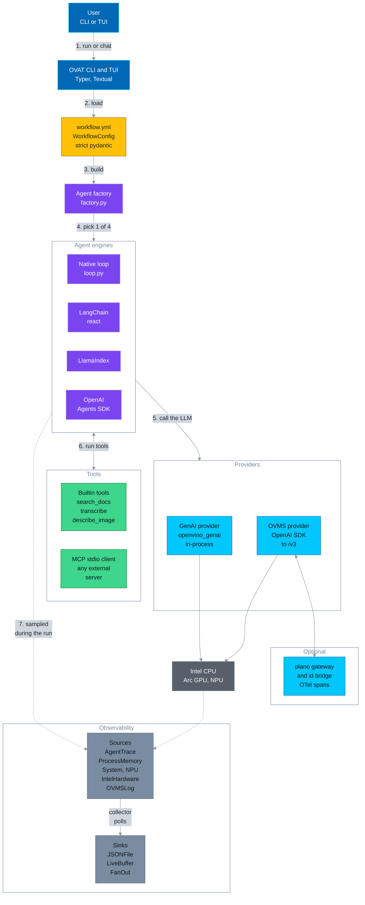
```mermaid
%%{init: {"theme": "base", "themeVariables": {"primaryColor": "#D0D7DE", "primaryTextColor": "#1F2328", "primaryBorderColor": "#8C959F", "lineColor": "#8C959F", "textColor": "#1F2328", "edgeLabelBackground": "#D0D7DE", "clusterBkg": "transparent", "clusterBorder": "#7A8CA0", "titleColor": "#7A8CA0"}}}%%
flowchart TD
    User["User<br/>CLI or TUI"] -->|"1. run or chat"| CLI["OVAT CLI and TUI<br/>Typer, Textual"]
    CLI -->|"2. load"| Config["workflow.yml<br/>WorkflowConfig<br/>strict pydantic"]
    Config -->|"3. build"| Factory["Agent factory<br/>factory.py"]
    Factory -->|"4. pick 1 of 4"| Engines

    subgraph Engines ["Agent engines"]
        Native["Native loop<br/>loop.py"]
        LangChain["LangChain<br/>react"]
        LlamaIndex["LlamaIndex"]
        OpenAIAgents["OpenAI<br/>Agents SDK"]
    end

    Engines -->|"5. call the LLM"| Providers
    Engines <-->|"6. run tools"| Tools

    subgraph Providers ["Providers"]
        GenAI["GenAI provider<br/>openvino_genai<br/>in-process"]
        OVMS["OVMS provider<br/>OpenAI SDK<br/>to /v3"]
    end

    subgraph Tools ["Tools"]
        Builtin["Builtin tools<br/>search_docs<br/>transcribe<br/>describe_image"]
        MCP["MCP stdio client<br/>any external<br/>server"]
    end

    subgraph Gateway ["Optional"]
        Plano["plano gateway<br/>and id bridge<br/>OTel spans"]
    end

    OVMS <--> Plano
    GenAI --> Hardware["Intel CPU<br/>Arc GPU, NPU"]
    OVMS --> Hardware

    subgraph Telemetry ["Observability"]
        Sources["Sources<br/>AgentTrace<br/>ProcessMemory<br/>System, NPU<br/>IntelHardware<br/>OVMSLog"]
        Sinks["Sinks<br/>JSONFile<br/>LiveBuffer<br/>FanOut"]
        Sources -->|"collector<br/>polls"| Sinks
    end

    Engines -.->|"7. sampled<br/>during the run"| Sources
    Hardware -.-> Sources

    classDef cli fill:#0068B5,stroke:#00C7FD,color:#FFFFFF
    classDef config fill:#FFC107,stroke:#9A6700,color:#1F2328
    classDef engine fill:#7A45F0,stroke:#A98BFF,color:#FFFFFF
    classDef backend fill:#00C7FD,stroke:#0068B5,color:#0F141A
    classDef tool fill:#3DD68C,stroke:#1A7F37,color:#0F141A
    classDef telemetry fill:#7A8CA0,stroke:#57606A,color:#0F141A
    classDef hw fill:#57606A,stroke:#8C959F,color:#FFFFFF
    class User,CLI cli
    class Config config
    class Factory,Native,LangChain,LlamaIndex,OpenAIAgents engine
    class GenAI,OVMS,Plano backend
    class Builtin,MCP tool
    class Sources,Sinks telemetry
    class Hardware hw
```

---

## 4. Design principles

Four principles shape the code. If you extend OVAT, work within them. The
reasons behind each one are in [DECISIONS.md](DECISIONS.md).

**Optional parts stay optional.** The core install runs every command without
the TUI or any agent framework. `textual` and `pyfiglet` come only with the
`[tui]` extra, and a module-level `import textual` appears only in the TUI's
own files (`tui.py`, `chat_screen.py`, `doctor_screen.py`,
`telemetry_screen.py`, `widgets.py`, `theme.py`, `commands.py`).
`tests/test_tui_isolation.py` checks that `main.py` and `shell.py` never import
it at module level and that every command still works with the TUI missing.
The same holds for the framework engines: importing the CLI pulls in none of
langchain, llama_index or agents. A CI job installs the base package on its
own and checks both, because the dev install has everything.

**The agent core does not depend on the UI.** `ovat/agent/` never imports from
the CLI or the TUI. Shared text helpers (reading reasoning blocks and undecoded
tool calls out of model output) live in a neutral module, `ovat/text.py`, so
neither the agent core nor the UI has to import the other to use them.

**Single source of truth.** Each fact has one owner, and everything else
derives from it:

- **Tool contracts.** Each tool's `SCHEMA` dict, next to its code, is the
  contract. Every engine derives its argument models from it through
  `agent/arg_models.py`; no engine keeps its own copy.
- **Config validity.** `config/workflow.py`, a strict pydantic schema.
- **Config loading.** `main._load_config`, the only caller of `load_workflow`.
- **Connection settings.** `LLMBackend.from_config` in `providers/backend.py`,
  read by all four engines.
- **Colours.** `ui.PALETTE`, for the CLI and the TUI alike.
- **The OVMS version.** `ovms_installer.OVMS_VERSION`.

**Errors are written for the reader.** The error contract:

- **A tool error goes back to the model as the tool result**, as text starting
  with `Error:`, so the model can read it and try again. This covers an
  unknown tool name, a tool that raises, and arguments that are not valid
  JSON. The native loop does this for all three; the OpenAI Agents engine
  wraps each tool the same way. The LangChain and LlamaIndex engines pass the
  tool function to the framework unwrapped, so there the framework's own
  handling applies.
- **A failed run exits non-zero.** `ovat run` exits with code 1 when the
  native trace says `failed`, when a framework engine sets `last_failed`, when
  the answer still contains raw tool-call markup, or when the run raises. The
  answer and any diagnostics are printed first.
- **The trace is written on every path.** With `--trace`, the trace file is
  written whether the run succeeded or not. The native loop's trace totals
  carry four flags: `failed`, `undecoded_tool_call`, `truncated` and
  `empty_answer`. A run that raised also gets an `error` field. The framework
  engines write the engine name, model, peak memory and a note that per-turn
  data is not recorded for them.
- **CLI errors are one readable sentence, not a traceback.** A missing config
  file, YAML that does not parse and a schema mismatch each get their own
  sentence from `_load_config`. A server error is reported as
  "Error talking to OVMS at ..."; anything else as "The run failed (type):
  message". A timeout also names `model.request_timeout` and how to raise it.

---

## 5. Required and optional parts

What you need depends on what you run. The Python extras come from
`pyproject.toml`.

**Python packages**

| Part | Install | What it adds |
| --- | --- | --- |
| Core | `pip install ovat` | Every command (`run`, `chat`, `index`, `init`, `doctor`, `setup`, `serve`, `models`, `bench`, `telemetry`), the `native` engine, the three built-in tools, the MCP client, RAG with sqlite-vec, and local models through `openvino` and `openvino-genai` |
| `[tui]` | `pip install "ovat[tui]"` | `textual` and `pyfiglet`: the full-screen terminal UI (`ovat` with no arguments, or `ovat tui`) |
| `[langchain]` | `pip install "ovat[langchain]"` | `langchain`, `langchain-openai`, `langgraph`: `agent.type: react` |
| `[llamaindex]` | `pip install "ovat[llamaindex]"` | `llama-index-core`, `llama-index-llms-openai-like`: `agent.type: llamaindex` |
| `[openai-agents]` | `pip install "ovat[openai-agents]"` | `openai-agents`: `agent.type: openai-agents` |
| `[convert]` | `pip install "ovat[convert]"` | `optimum-intel[openvino]`, which provides `optimum-cli` to convert a Hugging Face model (such as the bge-small embedder) to OpenVINO format. It pulls in torch, so it is not in the core |
| `[dev]` | `pip install -e ".[dev]"` | `pytest`, `pytest-cov`, `pytest-xdist`, every framework and TUI package, and `tomli` on Python 3.10: the test suite |

**Programs and services outside the Python package**

| Part | How to get it | Needed for | Not needed for |
| --- | --- | --- | --- |
| OVMS | `ovat setup` (Windows and Linux x86-64) | tool-calling runs: `ovat run`, `ovat bench`, the TUI's `/engine ovms` | `ovat chat`, `ovat index` with local embeddings, `ovat init`, `ovat doctor` |
| An LLM export | `ovat serve` pulls it, or `hf download` | anything that generates text | `ovat index`, `ovat doctor` |
| An embedding model | `optimum-cli` from `[convert]` | RAG: `ovat index`, `search_docs` and `ovat chat` | runs with no `rag:` section |
| Intel GPU and NPU drivers | Intel's driver downloads | running on GPU or NPU | CPU |
| MCP servers | any MCP stdio server | extra tools through `type: mcp_stdio` | the built-in tools |
| Intel Unified Telemetry (UT) | a separate download from Intel | the power and bandwidth rows in telemetry | every other telemetry row |
| plano gateway | a separate install, see [`examples/plano/`](../examples/plano/) | per-request OpenTelemetry spans | everything else; it runs outside OVAT |

---

## Commands and configuration

**Files:** `ovat/cli/main.py`, `ovat/config/workflow.py`, `ovat/cli/ui.py`

Typer turns each function into a subcommand from its type hints. Eleven
commands: `run`, `chat`, `index`, `init`, `doctor`, `setup`, `serve`,
`models`, `bench`, `telemetry` and `tui`, and a bare `ovat` also opens the TUI.

**Configuration is strict.** `WorkflowConfig` derives from a `StrictModel` base
with `extra="forbid"`, so an unknown key is an *error*, not a silent default.
A typo like `max_iteration` for `max_iterations` fails immediately and by name.

**Diagram: loading a workflow.** What this shows: the one path from
`workflow.yml` to `build_agent()`, and the three ways loading can fail, each
ending in one sentence.

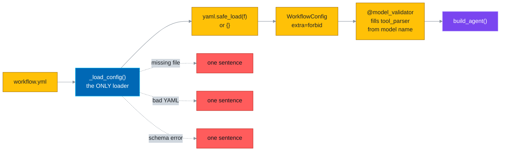
```mermaid
%%{init: {"theme": "base", "themeVariables": {"primaryColor": "#D0D7DE", "primaryTextColor": "#1F2328", "primaryBorderColor": "#8C959F", "lineColor": "#8C959F", "textColor": "#1F2328", "edgeLabelBackground": "#D0D7DE", "clusterBkg": "transparent", "clusterBorder": "#7A8CA0", "titleColor": "#7A8CA0"}}}%%
flowchart LR
    YAML["workflow.yml"] --> Load["_load_config()<br/>the ONLY loader"]
    Load --> Parse["yaml.safe_load(f)<br/>or {}"]
    Parse --> Validate["WorkflowConfig<br/>extra=forbid"]
    Validate --> Derive["@model_validator<br/>fills tool_parser<br/>from model name"]
    Derive --> Factory["build_agent()"]

    Load -.->|"missing file"| Msg1["one sentence"]
    Load -.->|"bad YAML"| Msg2["one sentence"]
    Load -.->|"schema error"| Msg3["one sentence"]

    classDef cli fill:#0068B5,stroke:#00C7FD,color:#FFFFFF
    classDef config fill:#FFC107,stroke:#9A6700,color:#1F2328
    classDef engine fill:#7A45F0,stroke:#A98BFF,color:#FFFFFF
    classDef fail fill:#FF5C5C,stroke:#B42318,color:#0F141A
    class YAML,Parse,Validate,Derive config
    class Load cli
    class Factory engine
    class Msg1,Msg2,Msg3 fail
```

Solid arrows are the normal path; dotted arrows are the failure exits.

`_load_config` is the only place allowed to call `load_workflow`. It turns
three different failures (file absent, YAML unparseable, schema mismatch) into
three different sentences. `yaml.safe_load(f) or {}` makes an empty or
comments-only file a schema error that names the missing section.

Every value that reaches the console goes through `esc()`, because rich reads
`[...]` as markup. Model output, exception text and file paths are *data*.

Why these choices: [DECISIONS.md, configuration](DECISIONS.md#configuration-and-the-cli).

---

## Agent engines

**Files:** `agent/loop.py`, `agent/session.py`, `agent/langchain_agent.py`,
`agent/llamaindex_agent.py`, `agent/openai_agents_agent.py`,
`agent/arg_models.py`, `providers/backend.py`

Four engines, selected by `agent.type`, all exposing the same
`.run(text) -> str`:

**Diagram: the four engines.** What this shows: `agent.type` picks one of four
engines, and all four use the same OVMS server, model and tools.

<picture>
  <source media="(prefers-color-scheme: dark)" srcset="assets/diagrams/engines-dark.svg">
  
</picture>

| `agent.type` | Library | Notes |
| --- | --- | --- |
| `native` | none | OVAT's own loop. Records tokens per turn in its trace |
| `react` | LangChain | `create_agent` + `ChatOpenAI` |
| `llamaindex` | LlamaIndex | `FunctionAgent` + `OpenAILike` |
| `openai-agents` | OpenAI Agents SDK | `OpenAIChatCompletionsModel` |

**Token counts.** OVMS returns token usage on every reply. The native loop
records it per turn today. The three framework engines do not read OVMS's
`usage` field yet, so their token cells show a dash; reading it is planned.

**Every engine derives its tool arguments from the same `SCHEMA`.** That is
what `arg_models.py` is for: it turns each tool's `SCHEMA` dict into the
argument model LangChain, LlamaIndex or the Agents SDK expects.

**One description of the connection.** `LLMBackend.from_config` holds the URL,
model, timeout, temperature and token cap. The three framework engines and
the native loop's OVMS provider all read it.

**The OpenAI Agents SDK is pinned to OVMS by three settings:** an explicit
`AsyncOpenAI` client on the `/v3` base URL, `OpenAIChatCompletionsModel`
rather than the default Responses model, and `set_tracing_disabled(True)`.
Without them the SDK would talk to OpenAI's servers instead of OVMS.

**The async engines own their event loop and refuse to nest.** The LlamaIndex
and OpenAI Agents engines call `asyncio.run` themselves. It cannot be
re-entered, so they check for a running loop and raise a readable error rather
than deadlocking. They work in the TUI because the chat screen runs the agent
on a worker thread, where no loop is running.

### The native loop

The native loop is four steps: ask the model, read the reply, run any tools it
asked for, report the results back, and repeat.

**Diagram: the agent loop.** What this shows: one round of the loop, from the
question to the model, through a tool run on your machine, and back, until a
reply with no tool call becomes the answer.

<picture>
  <source media="(prefers-color-scheme: dark)" srcset="assets/diagrams/agent-loop-dark.svg">
  
</picture>

**Diagram: every exit from the native loop.** What this shows: the same loop
as a decision chart, with each way a round can end, including the four error
exits.

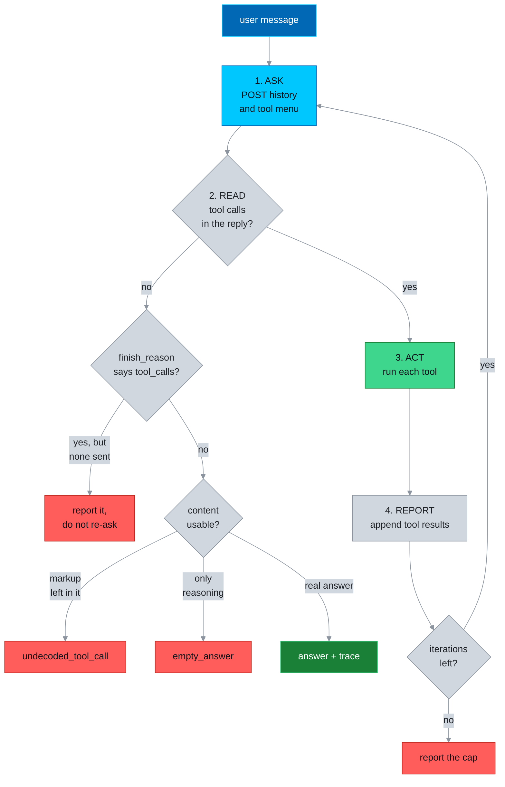
```mermaid
%%{init: {"theme": "base", "themeVariables": {"primaryColor": "#D0D7DE", "primaryTextColor": "#1F2328", "primaryBorderColor": "#8C959F", "lineColor": "#8C959F", "textColor": "#1F2328", "edgeLabelBackground": "#D0D7DE", "clusterBkg": "transparent", "clusterBorder": "#7A8CA0", "titleColor": "#7A8CA0"}}}%%
flowchart TD
    Start["user message"] --> Ask["1. ASK<br/>POST history<br/>and tool menu"]
    Ask --> Read{"2. READ<br/>tool calls<br/>in the reply?"}
    Read -->|"no"| Label{"finish_reason<br/>says tool_calls?"}
    Label -->|"yes, but<br/>none sent"| ErrA["report it,<br/>do not re-ask"]
    Label -->|"no"| Check{"content<br/>usable?"}
    Read -->|"yes"| Act["3. ACT<br/>run each tool"]
    Act --> Report["4. REPORT<br/>append tool results"]
    Report --> Cap{"iterations<br/>left?"}
    Cap -->|"yes"| Ask
    Cap -->|"no"| ErrB["report the cap"]
    Check -->|"markup<br/>left in it"| ErrC["undecoded_tool_call"]
    Check -->|"only<br/>reasoning"| ErrD["empty_answer"]
    Check -->|"real answer"| Done["answer + trace"]

    classDef cli fill:#0068B5,stroke:#00C7FD,color:#FFFFFF
    classDef backend fill:#00C7FD,stroke:#0068B5,color:#0F141A
    classDef tool fill:#3DD68C,stroke:#1A7F37,color:#0F141A
    classDef step fill:#D0D7DE,stroke:#8C959F,color:#1F2328
    classDef ok fill:#1A7F37,stroke:#3DD68C,color:#FFFFFF
    classDef fail fill:#FF5C5C,stroke:#B42318,color:#0F141A
    class Start cli
    class Ask backend
    class Read,Label,Check,Cap,Report step
    class Act tool
    class ErrA,ErrB,ErrC,ErrD fail
    class Done ok
```

Green is the answer, red the error exits, blue the model call.

The loop ends when a reply carries no tool calls. It decides on the payload,
not on `finish_reason`, because OVMS documents NPU serving labelling a decoded
tool call as `stop`. `max_iterations` guarantees the loop ends. Every exit goes
through one `_finish`, so the trace totals are always filled in.

What the loop does with each reply:

- **Tool calls are turned back into plain dicts** before going into history.
  OVMS hands over SDK objects but expects JSON dicts on the next request.
- **Broken JSON is reported to the model.** Arguments that do not parse come
  back as the tool *result*, which the model reads and can correct on its next
  turn.
- **Markdown fences are removed first.** Small models wrap arguments in
  ```` ```json ````. `strip_code_fence` lives in `ovat/text.py` and is shared
  with the OpenAI Agents engine, the only other engine that parses arguments
  itself.
- **A misspelt tool name is matched.** If the model names a tool that does not
  exist, the loop takes the closest real name (`difflib`, 60% similarity), and
  the trace records the tool that actually ran.
- **`Session` is thread-safe.** The TUI streams and saves on a worker thread
  while the main thread can `/load` or `/clear`. `save()` copies under the lock
  and writes outside it.

Why these choices: [DECISIONS.md, agent engines](DECISIONS.md#agent-engines).

---

## Models, embeddings and search: the providers

**Files:** `providers/base.py` and the concrete classes beside it

Four abstract base classes, `LLMProvider`, `EmbeddingsProvider`,
`RetrieverProvider` and `VLMProvider`, with the concrete class chosen by a
**string** in the config. Swapping a backend is a YAML edit, not a code change.

**Diagram: the provider interfaces.** What this shows: each of the four
interfaces and the classes that implement it today.

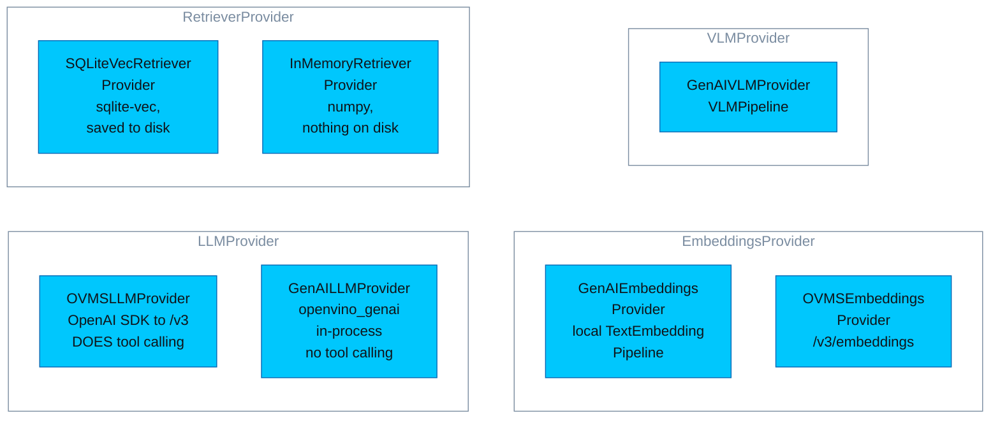
```mermaid
%%{init: {"theme": "base", "themeVariables": {"primaryColor": "#D0D7DE", "primaryTextColor": "#1F2328", "primaryBorderColor": "#8C959F", "lineColor": "#8C959F", "textColor": "#1F2328", "edgeLabelBackground": "#D0D7DE", "clusterBkg": "transparent", "clusterBorder": "#7A8CA0", "titleColor": "#7A8CA0"}}}%%
flowchart LR
    subgraph LLM ["LLMProvider"]
        OVMSLLM["OVMSLLMProvider<br/>OpenAI SDK to /v3<br/>DOES tool calling"]
        GenAILLM["GenAILLMProvider<br/>openvino_genai<br/>in-process<br/>no tool calling"]
    end
    subgraph Emb ["EmbeddingsProvider"]
        GenAIEmb["GenAIEmbeddings<br/>Provider<br/>local TextEmbedding<br/>Pipeline"]
        OVMSEmb["OVMSEmbeddings<br/>Provider<br/>/v3/embeddings"]
    end
    subgraph Ret ["RetrieverProvider"]
        SQLite["SQLiteVecRetriever<br/>Provider<br/>sqlite-vec,<br/>saved to disk"]
        Memory["InMemoryRetriever<br/>Provider<br/>numpy,<br/>nothing on disk"]
    end
    subgraph VLM ["VLMProvider"]
        GenAIVLM["GenAIVLMProvider<br/>VLMPipeline"]
    end

    LLM ~~~ Emb
    Ret ~~~ VLM

    classDef backend fill:#00C7FD,stroke:#0068B5,color:#0F141A
    class OVMSLLM,OVMSEmb backend
    class GenAILLM,GenAIEmb,GenAIVLM backend
    class SQLite,Memory backend
```

Each box is an interface, and the boxes inside it are its implementations.
There are no arrows: the interfaces do not call each other.

**How to add an LLM backend.** Implement `LLMProvider` (one method, `chat`),
then register it in `build_llm` behind a `model.provider` string. Nothing above
the providers changes: the agent loop and all four engines only ever see the
interface. `build_llm` returns `LLMProvider`, never a concrete class, so it
can return any implementation.

The retriever:

- `check_same_thread=False`, because LangChain runs tools on a worker thread.
  SQLite permits threaded *reads* but not concurrent *writes*, so `add()` holds
  a `threading.Lock`. The embedding call stays outside the lock, since it is
  pure compute.
- Indexing a source **replaces** what that source had before, so `ovat index`
  can be run again safely.
- **The index remembers when each file was read.** `ovat index` writes
  `<db>.sources.json` beside the database, with each file's path and
  modification time. `ovat run` and `ovat chat` compare it with the disk and
  name any file that changed or vanished. An index built before this existed
  has no manifest and gets no warning.
- Deleting a source touches two tables: `chunks` has a `source` column, the
  `vec0` virtual table does not, so both are cleaned.
- The nearest-neighbour query uses sqlite-vec's `k = ?` form, which works on
  every SQLite version OVAT supports.

### How RAG fits together

RAG is two separate jobs. Indexing runs once per folder. Searching runs for
every question, either as the `search_docs` tool (the agent decides to call
it) or directly in `ovat chat` (it always searches first, and has no tools).

**Diagram: RAG in two steps.** What this shows: indexing, which runs once per
folder, and searching, which runs for every question and ends in an answer
that names its source files.

<picture>
  <source media="(prefers-color-scheme: dark)" srcset="assets/diagrams/rag-dark.svg">
  
</picture>

`ovat chat` answers on a model you are watching, so it has **no answer length
cap by default**: the answer streams until the model stops, and Ctrl-C (or Esc
in the TUI) ends it. The OVMS path keeps `model.max_tokens` (4096), because a
cancelled request does not stop the generation inside the server.

Why these choices: [DECISIONS.md, providers and RAG](DECISIONS.md#providers-and-rag).

---

## Tools and MCP

**Files:** `tools/search_docs.py`, `tools/transcribe.py`,
`tools/describe_image.py`, `tools/fuzzy.py`, `tools/mcp_client.py`

Each built-in tool follows one pattern: a plain `*_impl()` that is unit-testable,
a co-located `SCHEMA` that is **the** contract, a FastMCP wrapper, and
`mcp.run()` under `__main__` so it also works as a standalone MCP server.

**Diagram: where a tool comes from.** What this shows: a built-in tool and an
MCP tool reach the agent loop by different routes but in the same shape.

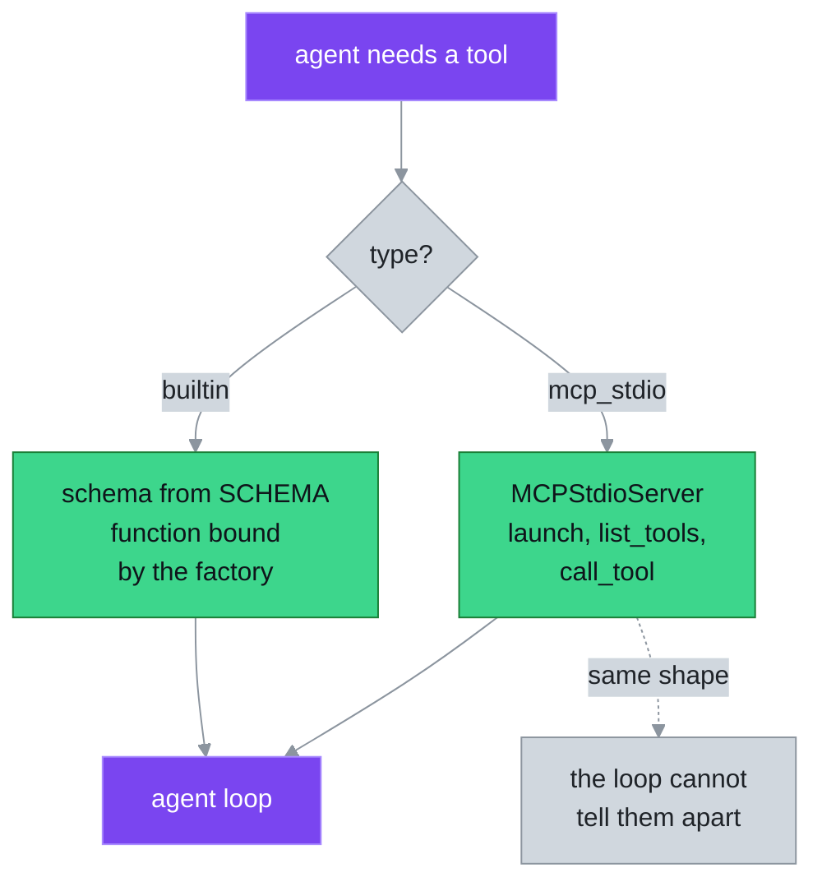
```mermaid
%%{init: {"theme": "base", "themeVariables": {"primaryColor": "#D0D7DE", "primaryTextColor": "#1F2328", "primaryBorderColor": "#8C959F", "lineColor": "#8C959F", "textColor": "#1F2328", "edgeLabelBackground": "#D0D7DE", "clusterBkg": "transparent", "clusterBorder": "#7A8CA0", "titleColor": "#7A8CA0"}}}%%
flowchart TD
    Need["agent needs a tool"] --> Type{"type?"}
    Type -->|"builtin"| B["schema from SCHEMA<br/>function bound<br/>by the factory"]
    Type -->|"mcp_stdio"| M["MCPStdioServer<br/>launch, list_tools,<br/>call_tool"]
    B --> Loop["agent loop"]
    M --> Loop
    M -.->|"same shape"| Note["the loop cannot<br/>tell them apart"]

    classDef engine fill:#7A45F0,stroke:#A98BFF,color:#FFFFFF
    classDef tool fill:#3DD68C,stroke:#1A7F37,color:#0F141A
    classDef step fill:#D0D7DE,stroke:#8C959F,color:#1F2328
    class Need,Loop engine
    class Type,Note step
    class B,M tool
```

Solid arrows are the path a tool takes; the dotted arrow is a note, not a call.

**The MCP client runs async code from a sync loop.** The `mcp` SDK is async
(anyio); OVAT's loop is not. Each server gets one background thread running
one event loop, and one long-lived *manager* coroutine that connects, waits
and unwinds. anyio cancel scopes must be entered and exited by the same task,
so `close()` sets an event and the manager unwinds itself.

**A tool's error has the same shape as its result.** `search_docs` is
annotated `-> list[dict]`, so its errors are a list too. FastMCP checks the
return value against the annotation.

**An MCP server gets only a short list of your environment.** The `mcp` SDK
starts a server with `HOME`, `LOGNAME`, `PATH`, `SHELL`, `TERM` and `USER`, so
a third-party server cannot read every secret in your shell. `tools[].env`
passes extra ones on, and `${VAR}` in a value is read from your shell, so a
secret can stay out of the YAML:

```yaml
tools:
  - name: my_server
    type: mcp_stdio
    command: ["python", "my_server.py"]
    env:
      API_TOKEN: ${MY_TOKEN}
```

**A misspelt file path is recovered, and the recovery is announced.**
`ovat/tools/fuzzy.py` swaps in the most similar existing file with the same
extension (at least 70% alike). The search is bounded: the named folder if it
exists, otherwise at most two levels under the working directory. And it is
never silent: the tool result starts with "Note: there is no file at ... used
the closest match ...", so the model and the person reading the transcript
both see which file was used.

**An MCP-served `search_docs` builds its own retriever.** `type: mcp_stdio`
starts a *separate* Python process, and objects do not cross a process
boundary, so the server takes `--config` and builds its retriever from the
workflow.

Why these choices: [DECISIONS.md, tools and MCP](DECISIONS.md#tools-and-mcp).

---

## Serving the model: OVMS

**Files:** `core/ovms_installer.py`, `core/model_server.py`, `core/ovms_locator.py`,
`core/model_manager.py`

### Which OVMS: the 2026.4.1 pin

`ovms_installer.OVMS_VERSION` is the one place the version lives, so the
installer, the docs and the tests cannot disagree. It is **2026.4.1**, chosen
by measurement (see [DECISIONS.md, D26](DECISIONS.md#serving-ovms)). `ovat
setup` and `ovat doctor` both ask the installed binary for its version
(`ovms --version`, run under `ovms_env()`) and say when it differs from the
pin. `ovat setup --force` replaces it.

### Getting OVMS onto the machine: `ovat setup`

`ovat setup` picks the right archive for the platform, checks it and unpacks
it where the locator looks. It always takes the `python_on` build, because the
`python_off` build cannot tool-call.

**Diagram: what `ovat setup` does.** What this shows: how `ovat setup` picks
an archive per platform, verifies it, and where it installs it.

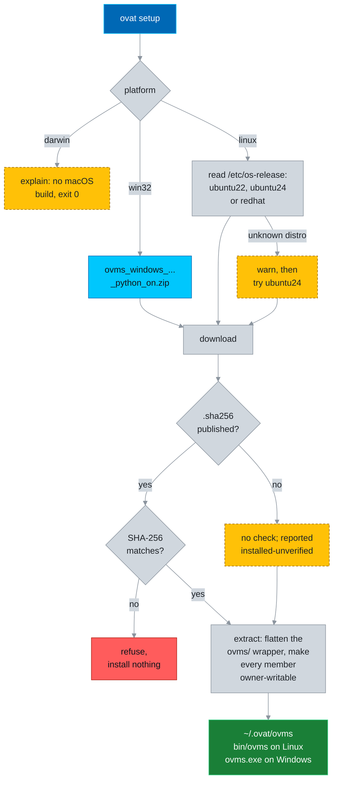
```mermaid
%%{init: {"theme": "base", "themeVariables": {"primaryColor": "#D0D7DE", "primaryTextColor": "#1F2328", "primaryBorderColor": "#8C959F", "lineColor": "#8C959F", "textColor": "#1F2328", "edgeLabelBackground": "#D0D7DE", "clusterBkg": "transparent", "clusterBorder": "#7A8CA0", "titleColor": "#7A8CA0"}}}%%
flowchart TD
    S["ovat setup"] --> P{"platform"}
    P -->|darwin| M["explain: no macOS<br/>build, exit 0"]
    P -->|win32| W["ovms_windows_...<br/>_python_on.zip"]
    P -->|linux| L["read /etc/os-release:<br/>ubuntu22, ubuntu24<br/>or redhat"]
    L -->|unknown distro| WARN["warn, then<br/>try ubuntu24"]
    W --> DL["download"]
    L --> DL
    WARN --> DL
    DL --> SUM{".sha256<br/>published?"}
    SUM -->|no| UNV["no check; reported<br/>installed-unverified"]
    SUM -->|yes| SHA{"SHA-256<br/>matches?"}
    SHA -->|no| STOP["refuse,<br/>install nothing"]
    SHA -->|yes| EX["extract: flatten the<br/>ovms/ wrapper, make<br/>every member<br/>owner-writable"]
    UNV --> EX
    EX --> R["~/.ovat/ovms<br/>bin/ovms on Linux<br/>ovms.exe on Windows"]

    classDef cli fill:#0068B5,stroke:#00C7FD,color:#FFFFFF
    classDef backend fill:#00C7FD,stroke:#0068B5,color:#0F141A
    classDef step fill:#D0D7DE,stroke:#8C959F,color:#1F2328
    classDef ok fill:#1A7F37,stroke:#3DD68C,color:#FFFFFF
    classDef fail fill:#FF5C5C,stroke:#B42318,color:#0F141A
    classDef warn fill:#FFC107,stroke:#9A6700,color:#1F2328,stroke-dasharray:4 3
    class S cli
    class P,SUM,SHA,L,DL,EX step
    class W backend
    class M,WARN,UNV warn
    class STOP fail
    class R ok
```

Green is success, red a refusal, and yellow with a dashed border a warning
that still continues.

OVMS is not part of `pip install`: the archive is 126 to 185 MB, Linux has
three builds, and macOS has none. The archive's single `ovms/` folder is
flattened into `~/.ovat/ovms`, and every member's owner-write bit is set before
extraction, because OVMS ships its files read-only.

### Installing it by hand (air-gapped machines, or a build you already have)

`ovat setup` is the supported path. When it cannot be used, these are the steps
it performs, and the one choice it makes for you.

> **Take the `python_on` build.** The `python_off` (C++ only) package **cannot
> do tool calling.** Intel's own docs state that its limited chat-template
> support means using tools is not possible. The wrong archive gives an agent
> that answers normally and silently never calls a tool.

**Windows 11**, from the folder you want OVMS in:

```bat
curl -L https://github.com/openvinotoolkit/model_server/releases/download/v2026.4.1/ovms_windows_2026.4.1_python_on.zip -o ovms.zip
tar -xf ovms.zip
```

**Ubuntu 24.04** (swap `ubuntu22` or `redhat` as needed):

```bash
wget https://github.com/openvinotoolkit/model_server/releases/download/v2026.4.1/ovms_ubuntu24_2026.4.1_python_on.tar.gz
tar -xzvf ovms_ubuntu24_2026.4.1_python_on.tar.gz
sudo apt update && sudo apt install -y libxml2 curl
```

`ovat serve` sets the library paths itself, through `model_server.ovms_env()`.
If you launch `ovms` **yourself** on Linux it needs them exported first, or it
cannot load its own `.so` files:

```bash
export LD_LIBRARY_PATH=${PWD}/ovms/lib
export PYTHONPATH=${PWD}/ovms/lib/python
```

**Where the locator looks**, in order: the config's `ovms_binary`, then
`OVAT_OVMS`, then `PATH`, then `./ovms`, `~/.ovat/ovms`, `~/ovms_windows`,
`~/ovms`, `C:\ovms`. Windows installs are never on `PATH`, which is why
`serve` works anyway, and why nothing in OVAT ever edits it. If yours lives
somewhere else:

```bash
export OVAT_OVMS=/path/to/ovms        # or set model.ovms_binary in the YAML
```

### Starting it: `ovat serve`

**Diagram: what `ovat serve` does.** What this shows: how `ovat serve` finds
the binary, starts it, and decides when the server is ready, dead or stalled.

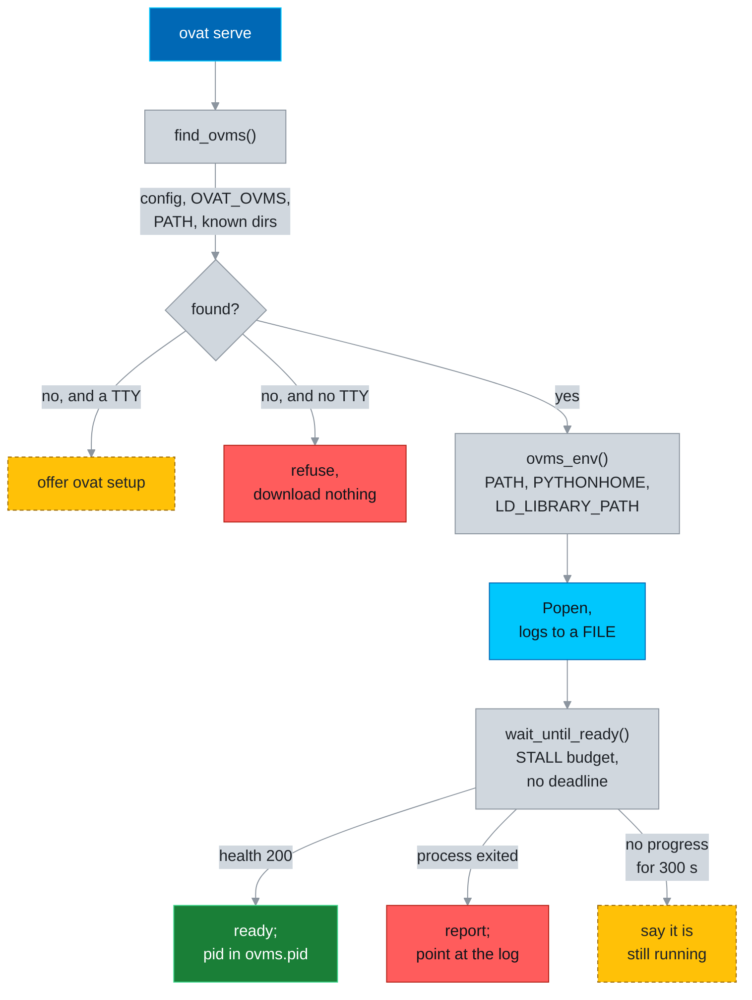
```mermaid
%%{init: {"theme": "base", "themeVariables": {"primaryColor": "#D0D7DE", "primaryTextColor": "#1F2328", "primaryBorderColor": "#8C959F", "lineColor": "#8C959F", "textColor": "#1F2328", "edgeLabelBackground": "#D0D7DE", "clusterBkg": "transparent", "clusterBorder": "#7A8CA0", "titleColor": "#7A8CA0"}}}%%
flowchart TD
    Serve["ovat serve"] --> Locate["find_ovms()"]
    Locate -->|"config, OVAT_OVMS,<br/>PATH, known dirs"| Found{"found?"}
    Found -->|"no, and a TTY"| Offer["offer ovat setup"]
    Found -->|"no, and no TTY"| Refuse["refuse,<br/>download nothing"]
    Found -->|"yes"| Env["ovms_env()<br/>PATH, PYTHONHOME,<br/>LD_LIBRARY_PATH"]
    Env --> Spawn["Popen,<br/>logs to a FILE"]
    Spawn --> Wait["wait_until_ready()<br/>STALL budget,<br/>no deadline"]
    Wait -->|"health 200"| Ready["ready;<br/>pid in ovms.pid"]
    Wait -->|"process exited"| Dead["report;<br/>point at the log"]
    Wait -->|"no progress<br/>for 300 s"| Stall["say it is<br/>still running"]

    classDef cli fill:#0068B5,stroke:#00C7FD,color:#FFFFFF
    classDef backend fill:#00C7FD,stroke:#0068B5,color:#0F141A
    classDef step fill:#D0D7DE,stroke:#8C959F,color:#1F2328
    classDef ok fill:#1A7F37,stroke:#3DD68C,color:#FFFFFF
    classDef fail fill:#FF5C5C,stroke:#B42318,color:#0F141A
    classDef warn fill:#FFC107,stroke:#9A6700,color:#1F2328,stroke-dasharray:4 3
    class Serve cli
    class Locate,Found,Env,Wait step
    class Spawn backend
    class Offer,Stall warn
    class Refuse,Dead fail
    class Ready ok
```

Green is ready, red a failure, yellow a state that needs the user.

**`ovms_env()` does what OVMS's setupvars script would do.** On Windows the
`python_on` build loads `python3xx.dll` from `<ovms>/python`, not the folder
beside `ovms.exe`. On Linux the binary sits at `<root>/bin/ovms` and its
shared objects at `<root>/lib`, so the root is the directory *above* the
binary. It is a module-level function so it can be tested without launching a
server.

**Readiness is a stall budget, not a deadline.** A first run downloads the
model, and that can take any amount of time. The clock resets whenever the log
file or the model folder grows, so a download that keeps moving is never
interrupted, while a stuck server still fails after five minutes.

**Logs go to a file, never a pipe.** A pipe that nobody reads blocks OVMS once
the OS buffer (about 64 KB) is full.

**Windows console behaviour.** `serve` hands the prompt back and leaves OVMS
running, so the child gets `DETACHED_PROCESS | CREATE_NEW_PROCESS_GROUP`.
Without them, closing the window or a Ctrl-C at the parent stops the server
too. On POSIX the value must be exactly `0`, which `subprocess` enforces.

**`--stop` checks the process before signalling it.** A pidfile records a
*number*, and the OS may reuse it once the process is gone. `_pid_is_our_server`
confirms the process is actually OVMS; `_pid_is_running` stays a general
liveness check for its other callers.

Why these choices: [DECISIONS.md, serving OVMS](DECISIONS.md#serving-ovms).

---

## Devices and the OpenVINO runtime

**File:** `core/device_manager.py`

OVAT asks OpenVINO which devices exist (`openvino.Core().get_available_devices()`)
and looks the answer up in a routing table. The result is a **suggestion**.
`ovat doctor` shows it, `ovat init` writes the suggested LLM device into the
new `workflow.yml`, and the `transcribe` and `describe_image` tools use it when
their own `device:` is not set. A device written in `workflow.yml` always
wins, and any model can be pointed at any device OpenVINO supports for it.

**Diagram: the suggested devices.** What this shows: which device the router
suggests for each kind of model, on an AI PC and on a CPU-only machine.

<picture>
  <source media="(prefers-color-scheme: dark)" srcset="assets/diagrams/devices-dark.svg">
  
</picture>

**Diagram: device routing as a decision.** What this shows: the routing table
as a chart, plus what serving an LLM on the NPU through OVMS requires.

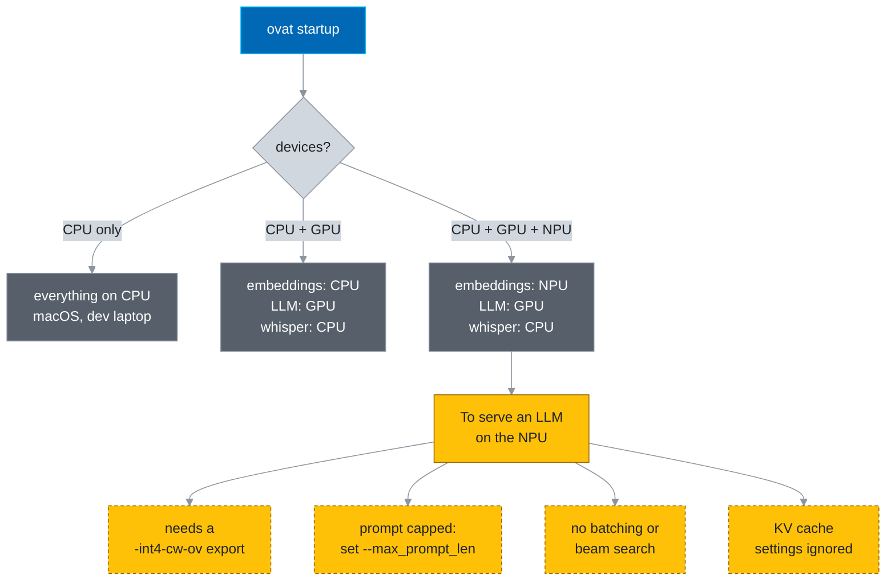
```mermaid
%%{init: {"theme": "base", "themeVariables": {"primaryColor": "#D0D7DE", "primaryTextColor": "#1F2328", "primaryBorderColor": "#8C959F", "lineColor": "#8C959F", "textColor": "#1F2328", "edgeLabelBackground": "#D0D7DE", "clusterBkg": "transparent", "clusterBorder": "#7A8CA0", "titleColor": "#7A8CA0"}}}%%
flowchart TD
    Start["ovat startup"] --> Detect{"devices?"}
    Detect -->|"CPU only"| CPUOnly["everything on CPU<br/>macOS, dev laptop"]
    Detect -->|"CPU + GPU"| NoNPU["embeddings: CPU<br/>LLM: GPU<br/>whisper: CPU"]
    Detect -->|"CPU + GPU + NPU"| Full["embeddings: NPU<br/>LLM: GPU<br/>whisper: CPU"]

    Full --> Limits["To serve an LLM<br/>on the NPU"]
    Limits --> L1["needs a<br/>-int4-cw-ov export"]
    Limits --> L2["prompt capped:<br/>set --max_prompt_len"]
    Limits --> L3["no batching or<br/>beam search"]
    Limits --> L4["KV cache<br/>settings ignored"]

    classDef cli fill:#0068B5,stroke:#00C7FD,color:#FFFFFF
    classDef config fill:#FFC107,stroke:#9A6700,color:#1F2328
    classDef hw fill:#57606A,stroke:#8C959F,color:#FFFFFF
    classDef step fill:#D0D7DE,stroke:#8C959F,color:#1F2328
    classDef warn fill:#FFC107,stroke:#9A6700,color:#1F2328,stroke-dasharray:4 3
    class Start cli
    class Detect step
    class CPUOnly,NoNPU,Full hw
    class Limits config
    class L1,L2,L3,L4 warn
```

Grey boxes are the suggested devices; the dashed yellow boxes are the NPU
serving requirements from the table below.

| Model type | Suggested device | Why |
| --- | --- | --- |
| Embeddings (~130 MB) | NPU if present (the YAML default is `CPU`; set `rag.embeddings.device`) | static shape, small, low power |
| LLM (low-bit: INT4 / INT8) | GPU if present (the YAML default is `CPU`) | works with every export; dynamic shapes, KV cache |
| Vision (`describe_image`) | same as the LLM | it is often the same unified model |
| Whisper (~80 MB) | CPU | small enough that CPU latency is fine |
| Anything, no accelerator | CPU | always works; low-bit weights keep it in RAM |

**No device runs tools.** The device runs the model. The agent loop reads the
tool call out of the generated text and runs the Python function itself, so
tool calling depends on the model and the parser, not the hardware. OVMS
serves tool-calling LLMs on NPU and
[documents the procedure](https://github.com/openvinotoolkit/model_server/blob/main/demos/llm_npu/README.md).

### Serving an LLM on the NPU

The constraint is the **export format**:

| NPU requirement | Consequence |
| --- | --- |
| INT4 exported `--sym --ratio 1.0 --group-size -1` (channel-wise, symmetric) | use the [`-int4-cw-ov` family](https://huggingface.co/collections/OpenVINO/llms-optimized-for-npu); the stock `-int4-ov` export did not compile here |
| Prompt capped at 1024 tokens by default | raise it with `--max_prompt_len`; an agent turn grows every round, so this is the setting that matters most |
| No request batching, no beam search, no `log_probs` | requests are processed one at a time |
| `cache_size`, `enable_prefix_caching`, `dynamic_split_fuse`, `max_num_batched_tokens` are **ignored** | NPU deployments are Stateful servables ([reference](https://github.com/openvinotoolkit/model_server/blob/main/docs/llm/reference.md)). `--enable_prefix_caching` is not dropped, though: OVMS translates it into the NPU-specific `NPUW_LLM_ENABLE_PREFIX_CACHING` plugin option |
| `finish_reason` is **always** `"stop"` (OVMS's [NPU demo](https://github.com/openvinotoolkit/model_server/blob/main/demos/llm_npu/README.md) states this) | a decoded tool call would arrive labelled as if the model had stopped |

That last row is why the native loop decides on **whether the reply carries
tool calls**, never on `finish_reason`.

### Measured on this hardware, 2026-08-12

LunarLake (Arc 140V GPU + Intel AI Boost NPU), OVMS 2026.2.1.1122f03bf.

- **Tool calling on NPU works.** `OpenVINO/Qwen3-8B-int4-cw-ov` compiled for
  NPU in 36 s; `ovat run examples/document-qa-npu.yml` returned
  `tool_calls: 1`, `undecoded_tool_call: false`, `failed: false` over 2 turns
  in 63.8 s.
- **`finish_reason` was not always `"stop"`.** Through OVAT and through a raw
  `curl`, the tool-calling turn came back `finish_reason: "tool_calls"`. The
  documented quirk did not occur on this version.
- **The stock export fails, for a reason that is not verified.**
  `Qwen3.5-0.8B-int4-ov` on NPU fails with `0x78000004 - [NPU_VCL]`. The
  compiler's own message is `Found 8 duplicated names`, a graph-naming
  complaint, so group quantisation as the cause is not verified. What is
  verified is that the channel-wise export compiles and the stock one does not.
- **There is a fixed total-length cap, and OVMS labels it `"unknown"`.** The
  NPU pipeline is compiled to fixed shapes from `MAX_PROMPT_LEN` and
  `MIN_RESPONSE_LEN` ([OpenVINO GenAI on NPU](https://docs.openvino.ai/2026/openvino-workflow-generative/inference-with-genai/inference-with-genai-on-npu.html)).
  Pulled with `--max_prompt_len 2000`, this deployment stopped at **exactly
  2129 total tokens**, however the split fell:

  | prompt | completion | total | `finish_reason` |
  | --- | --- | --- | --- |
  | 28 | 2101 | 2129 | `"unknown"` |
  | 1529 | 600 | 2129 | `"unknown"` |

  The reply is cut mid-sentence and the reason is `"unknown"`, not `"length"`.
  (A prompt over `MAX_PROMPT_LEN` alone is a clean HTTP 400.) The exact
  arithmetic is not derived here: the documented `MIN_RESPONSE_LEN` default is
  150, and 2000 + 150 is 2150, not 2129. A `<tool_call>` block still being
  written when the cap lands is cut in half, which shows up as
  `undecoded_tool_call`. Compare upstream
  [openvino.genai#3255](https://github.com/openvinotoolkit/openvino.genai/issues/3255).

Why these choices: [DECISIONS.md, models and devices](DECISIONS.md#models-and-devices).

---

## Observability

**Files:** `telemetry/base.py`, `sources.py`, `sinks.py`, `collector.py`

Sources (where numbers come from) and sinks (where they go) are separate
contracts, so any source feeds any sink.

| Source | Reports | Available on |
| --- | --- | --- |
| `AgentTraceSource` | tokens per turn, latency, tool traces | the native loop today; the framework engines do not read OVMS's `usage` field yet |
| `SystemSource` | CPU per core, RAM, thread count | all |
| `ProcessMemorySource` | this process's resident memory | all |
| `IntelHardwareSource` | GPU/NPU utilisation and power | Windows / Linux with Intel UT |
| `NPUSource` | NPU utilisation | Linux (driver sysfs), Windows (PDH `GPU Engine`) |
| `OVMSLogSource` | KV cache usage and type | wherever `ovat serve` writes `ovms.log` |

Three rules this layer follows, because a measurement that lies is worse than a
measurement that is missing:

**Absent is not zero.** No token counts from the server means `null`, rendered as
a dash. A `0` reads as "used no tokens", and a benchmark built on that number is
quietly wrong.

**An unavailable source says why.** On macOS the Intel row reads *"Intel Unified
Telemetry does not run on macOS"* rather than showing zeros, because a missing
sensor and an idle one look identical in a graph.

**Peak RSS is sampled on a thread, during the run.** A single reading afterwards
misses the peak entirely. Python has already freed the large allocations. Note
the scope: `--trace` measures the **OVAT** process, so with OVMS serving, the
model's memory lives in `ovms.exe` and must be measured there. The trace *is* the
right number for `ovat chat`, where the model runs in-process.

One source contract worth stating: `sample()` must not raise. `Collector`
catches anyway, so one broken source cannot end the collection thread.

**Where to see it.** `ovat telemetry` prints a live table (`--once` for one
snapshot, `--out` to save JSON Lines) and says first which sources are not
available here and why. The TUI's `/telemetry` page has two tabs. **Live**
holds number cards, a table with each metric's current, minimum, maximum and
average, and a status line naming every source as live, silent, or not
available (with the first clause of the reason). **Help** explains the
numbers. The status line refreshes every tick; it used to be a separate tab
filled once at start, which on the AI PC said "intel live" while Intel UT was
producing nothing.

---

## Multi-agent orchestration (A2A): not implemented

**Status: not implemented, and out of scope for this project.** The GSoC
proposal listed agent-to-agent (A2A) orchestration as a stretch goal, and the
core toolkit works without it. There is no A2A code in OVAT.

The shape the proposal sketched was a minimal A2A server: an Agent Card at
`/.well-known/agent.json` and JSON-RPC 2.0 `message/send`, sharing only query
text with other agents, never retrieved documents.

---

## Model selection, and why "unified" is its own kind

The default model is `Qwen3.5-4B-int4-ov`: 3.5 GB, and a **unified** export,
text generation, image understanding and tool calling in one set of weights.
The RAG, ReAct and audio and vision examples therefore share a single download.

A unified export and a vision-only one look the same on disk: both carry
`openvino_vision_embeddings_*.xml` and `openvino_language_model.xml`, and
neither has the plain `openvino_model.xml` that marks a text LLM. So OVAT reads
`config.json` as well as the file layout.

**Diagram: how a model folder is classified.** What this shows: how
`model_scout` tells a text LLM, a vision-only model and a unified model apart.

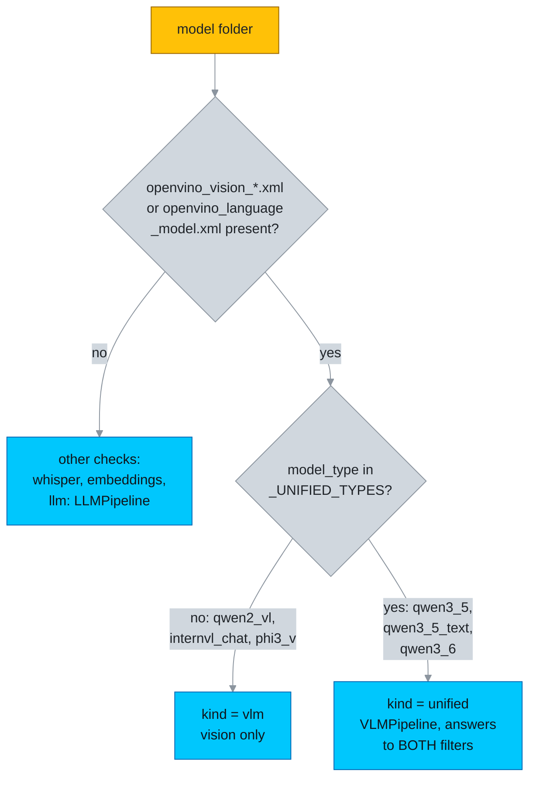
```mermaid
%%{init: {"theme": "base", "themeVariables": {"primaryColor": "#D0D7DE", "primaryTextColor": "#1F2328", "primaryBorderColor": "#8C959F", "lineColor": "#8C959F", "textColor": "#1F2328", "edgeLabelBackground": "#D0D7DE", "clusterBkg": "transparent", "clusterBorder": "#7A8CA0", "titleColor": "#7A8CA0"}}}%%
flowchart TD
    F["model folder"] --> C{"openvino_vision_*.xml<br/>or openvino_language<br/>_model.xml present?"}
    C -->|"no"| L["other checks:<br/>whisper, embeddings,<br/>llm: LLMPipeline"]
    C -->|"yes"| M{"model_type in<br/>_UNIFIED_TYPES?"}
    M -->|"no: qwen2_vl,<br/>internvl_chat, phi3_v"| V["kind = vlm<br/>vision only"]
    M -->|"yes: qwen3_5,<br/>qwen3_5_text,<br/>qwen3_6"| U["kind = unified<br/>VLMPipeline, answers<br/>to BOTH filters"]

    classDef config fill:#FFC107,stroke:#9A6700,color:#1F2328
    classDef backend fill:#00C7FD,stroke:#0068B5,color:#0F141A
    classDef step fill:#D0D7DE,stroke:#8C959F,color:#1F2328
    class F config
    class C,M step
    class L,V,U backend
```

Grey diamonds are questions; blue boxes are the resulting kind of model.

| Rule | Effect |
| --- | --- |
| `config.json` is read **before** the file layout is judged | layout narrows the question; `model_type` answers it |
| Detection is an **exact** `model_type` match, not a prefix | a future vision-only `qwen3_5_vl` is not mistaken for a unified model |
| A unified model answers to **both** `llm` and `vlm` filters | one download serves as the agent model and the vision model |
| A unified model always loads through `VLMPipeline` | `LLMPipeline` builds on a unified export but fails on the first `generate()` |

Why these choices: [DECISIONS.md, D37 and D38](DECISIONS.md#models-and-devices).

---

## Tool-parser selection

`tool_parser` tells OVMS how to decode the model's tool calls. The right value
differs by **family**, and the wrong one fails silently: the agent answers
fluently and never calls a tool.

| Family | Parser | Wire format |
| --- | --- | --- |
| Qwen3.5 | `qwen3coder` | `<tool_call><function=name><parameter=k>v</parameter></function></tool_call>` |
| Qwen3, Qwen2 | `hermes3` | `<tool_call>{"name": ..., "arguments": {...}}</tool_call>` |

When the field is omitted, OVAT **derives** the value from the model name, and
falls back to `hermes3` for families it does not recognise. An explicit value
always wins. Besides the two measured families, the table maps Qwen3.6 and
Qwen3-Coder to `qwen3coder`, Phi-4-mini to `phi4`, Llama-3.2 to `llama3`,
gpt-oss to `gptoss` and Devstral to `devstral`; those come from OVMS's own
demos and were not measured here.

On OVMS 2026.4.1, OVMS's own `auto` detection also picks `qwen3coder` for
Qwen3.5. OVAT still names the parser, because a named parser also works on an
older OVMS. The measurements are in
[DECISIONS.md, D39](DECISIONS.md#models-and-devices).

---

## Detecting a tool call that went wrong

Each of these ends with the agent answering fluently while having called
nothing. Each is detected and named in the trace.

**Diagram: classifying a reply with no tool calls.** What this shows: how the
native loop decides whether a reply with no decoded tool call is a real
answer, a truncated reply, an undecoded tool call, or an empty answer.

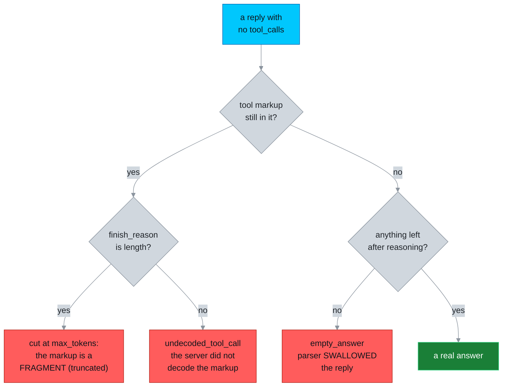
```mermaid
%%{init: {"theme": "base", "themeVariables": {"primaryColor": "#D0D7DE", "primaryTextColor": "#1F2328", "primaryBorderColor": "#8C959F", "lineColor": "#8C959F", "textColor": "#1F2328", "edgeLabelBackground": "#D0D7DE", "clusterBkg": "transparent", "clusterBorder": "#7A8CA0", "titleColor": "#7A8CA0"}}}%%
flowchart TD
    Reply["a reply with<br/>no tool_calls"] --> Q1{"tool markup<br/>still in it?"}
    Q1 -->|"yes"| Q0{"finish_reason<br/>is length?"}
    Q0 -->|"yes"| T["cut at max_tokens:<br/>the markup is a<br/>FRAGMENT (truncated)"]
    Q0 -->|"no"| A["undecoded_tool_call<br/>the server did not<br/>decode the markup"]
    Q1 -->|"no"| Q2{"anything left<br/>after reasoning?"}
    Q2 -->|"no"| B["empty_answer<br/>parser SWALLOWED<br/>the reply"]
    Q2 -->|"yes"| C["a real answer"]

    classDef backend fill:#00C7FD,stroke:#0068B5,color:#0F141A
    classDef step fill:#D0D7DE,stroke:#8C959F,color:#1F2328
    classDef ok fill:#1A7F37,stroke:#3DD68C,color:#FFFFFF
    classDef fail fill:#FF5C5C,stroke:#B42318,color:#0F141A
    class Reply backend
    class Q0,Q1,Q2 step
    class T,A,B fail
    class C ok
```

Red boxes set a flag in the trace; green is a normal answer.

| Mode | Symptom | Detected by |
| --- | --- | --- |
| No parser selected | raw `<tool_call>` markup becomes the answer | `looks_like_undecoded_tool_call` |
| Wrong parser | reply is reasoning and nothing else | `says_nothing` |
| Malformed by the model | `<parameter=name>` where `<function=name>` belongs | the same markup check |
| Cut at the token ceiling | a fragment, indistinguishable from row 1 by eye | `finish_reason: length` -> `truncated` |

Each sets a flag in the trace totals, so `--trace` cannot show a clean
`tool_calls: 0` that reads as "the model chose not to use a tool". `bench`
reads those flags rather than the answer text, and scores such a row
**not ok**. `ovat run` also checks the final answer for markup on every
engine, so a framework engine that returns raw markup exits non-zero too.

The markup is deliberately **not** parsed into a real tool call. Guessing at
broken output trades a loud failure for a silent wrong answer.

---

## Concurrency and process boundaries

Four places where more than one thread or process is involved.

| Boundary | Mechanism | Hazard handled |
| --- | --- | --- |
| LangChain tools | worker thread → one SQLite connection | `check_same_thread=False` for reads; a lock for writes |
| TUI answer streaming | `@work(thread=True)` | lets the async engines run `asyncio.run` with no loop present; `Session` lock stops a truncated save |
| MCP stdio servers | one thread + one event loop + one manager coroutine per server | anyio cancel scopes must enter/exit in the same task |
| `bench` per engine | a fresh subprocess each | memory is a whole-process number, so engines sharing a process would inherit each other's allocations |

---

## The plano gateway (optional)

[plano](https://github.com/katanemo/plano) (formerly archgw) is an AI proxy
that turns every request into an OpenTelemetry span. It is optional, it runs
outside OVAT, and OVAT has no OpenTelemetry dependency of its own.

**Diagram: the plano request path.** What this shows: where plano and the id
bridge sit between `ovat run` and OVMS, and where its spans go.

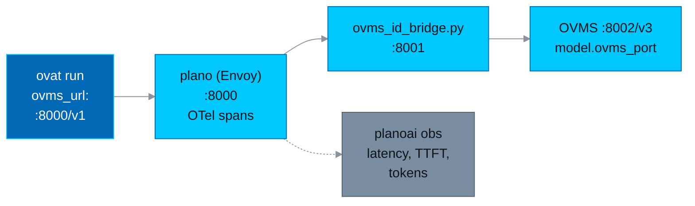
```mermaid
%%{init: {"theme": "base", "themeVariables": {"primaryColor": "#D0D7DE", "primaryTextColor": "#1F2328", "primaryBorderColor": "#8C959F", "lineColor": "#8C959F", "textColor": "#1F2328", "edgeLabelBackground": "#D0D7DE", "clusterBkg": "transparent", "clusterBorder": "#7A8CA0", "titleColor": "#7A8CA0"}}}%%
flowchart LR
    OVAT["ovat run<br/>ovms_url:<br/>:8000/v1"] --> Plano["plano (Envoy)<br/>:8000<br/>OTel spans"]
    Plano --> Bridge["ovms_id_bridge.py<br/>:8001"]
    Bridge --> OVMS["OVMS :8002/v3<br/>model.ovms_port"]
    Plano -.-> Obs["planoai obs<br/>latency, TTFT,<br/>tokens"]

    classDef cli fill:#0068B5,stroke:#00C7FD,color:#FFFFFF
    classDef backend fill:#00C7FD,stroke:#0068B5,color:#0F141A
    classDef telemetry fill:#7A8CA0,stroke:#57606A,color:#0F141A
    class OVAT cli
    class Plano,Bridge,OVMS backend
    class Obs telemetry
```

Solid arrows carry each request; the dotted arrow is the trace data plano
reports on the side.

Three problems are solved in the example config, and each answer is recorded
in its comments:

| Problem | Answer |
| --- | --- |
| plano calls `/v1`, OVMS serves `/v3` | No prefix setting exists; plano parses `base_url` and lifts the path out itself. Put `/v3` in the URL |
| plano refuses to start | The model name needs a `provider/` prefix, because plano splits on `/`. Hence `ovms/Qwen3.5-4B-int4-ov` |
| plano rejects OVMS's reply | Its WASM filter requires a top-level `"id"`, which OVMS omits. `ovms_id_bridge.py` injects one |

The bridge binds `127.0.0.1` by default. Nothing in it checks credentials, so a
wider bind is an open door to the GPU. `--host 0.0.0.0` exists because plano in
WSL2 or Docker must reach the host across a network namespace, and it warns
when used.

**This is not the same thing as OVAT's own telemetry.** OVAT measures what the
*agent* did: tokens per turn, which tool ran, peak memory. plano measures what
the *transport* did: latency, time to first token, HTTP status. Neither
replaces the other.

---

## Testing strategy

About 800 tests, no server required. `pytest -q` must end green.

| Convention | Reason |
| --- | --- |
| Every fix ships with a test that **fails with the fix backed out** | a test that passes against broken code proves nothing |
| `live` and `rag` markers auto-skip | a fresh clone runs green with no models and no OVMS |
| Disk-scanning tests isolate with `monkeypatch.chdir` and a fake `HOME` | otherwise they describe the developer's machine rather than the code |
| TUI tests use Textual's headless `Pilot` | no real terminal, so they run in CI |
| Mouse selection is driven via `Screen._forward_event` | selection lives there; a test that posts events sees nothing |
| `monkeypatch`, never a bare attribute assignment | a bare assignment can leak into other tests |

Seams built for mocking: `chat_screen._build_components`,
`chat_screen._build_engine`, `cli_main.build_agent`, `diagnostics.run_checks`,
`model_server.subprocess.Popen`, `bench.benchmark_engine`.

CI runs the suite on every push across ubuntu-22.04/py3.10 (the oldest
supported everything), ubuntu-24.04/py3.12, windows-latest/py3.12 and
macos-latest/py3.13, plus two jobs the suite itself cannot prove: that a base
install pulls in no framework or TUI dependency, and that the built wheel
installs and runs.

---

## Status

| Part | Status | Notes |
| --- | --- | --- |
| Commands and configuration | ✅ complete | 11 commands, strict validation |
| Agent engines | ✅ complete | all four engines verified live on an AI PC; native loop with session and three failure checks |
| Providers | ✅ complete | LLM, embeddings and retrievers each have two implementations behind one interface; sqlite-vec persists, `memory` does not |
| Tools and MCP | ✅ complete | three built-ins, MCP client (with `tools[].env`) and server, announced fuzzy paths |
| Serving | ✅ complete | `ovat setup` pinned to OVMS 2026.4.1 and version-aware, locator, stall budget, pidfile, identity check |
| Devices | ✅ complete | device routing; a tool-calling agent run on the NPU, and its 2129-token cap measured |
| Observability | ✅ complete | sources, sinks, JSON Lines, CLI and TUI pages. NPU utilisation reads on Windows (PDH) and Linux (sysfs) |
| Multi-agent orchestration (A2A) | ❌ not implemented | out of scope |

**Planned or open:**

- Token counts for the three framework engines (reading OVMS's `usage` field).
- OVMS 2026.4.1 measured on Linux, and GPU/NPU verification on Linux, which
  WSL2 cannot give (no `/dev/dri`).
- GPU utilisation without Intel UT.
- Stress tests and an API reference.
- One question is left open on purpose: whether a full **static** KV cache
  causes the undecoded-tool-call failure. Three runs per arm put the failure
  only in a 1 GB cache at 100% and none in an 8 GB cache, but the same 100%
  reading also passed once, so it is not reproducible on demand. The ~10x
  latency cost of a full static cache did reproduce, and matches the
  preemption-and-recompute OVMS documents. See AGENTS.md for the table.

---

## File map

One line each.

**Config and CLI**
- `config/workflow.py`, the pydantic schema. `StrictModel`: unknown keys are errors. New fields need schema + example + README row + a test
- `cli/main.py`, every typer command. All printing via the one themed console; `_load_config` is the only loader
- `cli/ui.py`, `PALETTE` (the single source of truth for all colours), theme, `wordmark()`
- `cli/diagnostics.py`, doctor's checks, platform-aware
- `text.py`, reasoning/markup helpers shared by the agent core and the CLI/TUI

**Agent**
- `agent/loop.py`, the native loop and the run trace
- `agent/factory.py`, config → wired agent; the tool registry lives here
- `agent/arg_models.py`, derives per-framework argument models from each `SCHEMA`
- `agent/langchain_agent.py`, `llamaindex_agent.py`, `openai_agents_agent.py`, the three framework engines
- `agent/session.py`, conversation memory, thread-safe, with JSON save/load
- `agent/rag_chat.py`, local retrieve-then-answer, with streaming and no default answer cap

**Providers**
- `providers/base.py`, the four ABCs
- `providers/llm_ovms.py`, OpenAI SDK → OVMS `/v3`; returns `usage`; bounded by `request_timeout`
- `providers/llm_genai.py`, local `openvino_genai`; routes unified exports through `VLMPipeline`
- `providers/embeddings_genai.py`, `embeddings_ovms.py`, text → vectors
- `providers/retriever_sqlitevec.py`, the vector store
- `providers/vlm_genai.py`, vision, reached via `describe_image`
- `providers/backend.py`, one shared description of the OVMS connection

**Core**
- `core/ovms_installer.py`, `ovat setup`: picks, verifies and unpacks the pinned OVMS (2026.4.1), and reads an installed binary's version
- `core/model_server.py`, OVMS lifecycle: start, stall-budget readiness, stop, pidfile
- `core/ovms_locator.py`, find the binary: config → env → PATH → known folders
- `core/model_scout.py`, identify local model folders; the `unified` kind lives here
- `core/device_manager.py`, CPU/GPU/NPU routing suggestions
- `core/model_manager.py`, wraps `ovms --pull` / `--list_models`

**Tools, RAG, telemetry, bench**
- `tools/search_docs.py`, `transcribe.py`, `describe_image.py`, built-ins, each also an MCP server
- `tools/fuzzy.py`, bounded, announced recovery of a misspelt file path
- `tools/mcp_client.py`, MCP stdio client; `tools[].env` adds environment variables
- `rag/indexer.py`, chunk and index `.txt`/`.md`; writes the `<db>.sources.json` manifest behind the stale-index warning
- `telemetry/`, `base` (ABCs), `sources`, `sinks`, `collector`
- `bench.py`, one question, several engines, one process each

**TUI** (the `[tui]` extra)
- `cli/tui.py`, launcher and masthead
- `cli/shell.py`, subprocess exec layer, slash templates, `\r` progress sampling
- `cli/chat_screen.py`, in-process chat: streaming, history, sessions, `/engine`
- `cli/doctor_screen.py`, `telemetry_screen.py` (Live and Help tabs), `widgets.py`, `editing.py`, `theme.py`, `commands.py`

Contributor rules live in [`AGENTS.md`](../AGENTS.md), and the reasons behind
the design in [`DECISIONS.md`](DECISIONS.md). For a guided walk through this
code, see the [OVAT docs site](https://lagmator22.github.io/ovat-navigate/).

---

## Appendix: mapping to the GSoC proposal's layers

The GSoC proposal described OVAT as nine layers. This document is organised by
what each part does instead; this table maps one to the other.

| Proposal layer | Section here |
| --- | --- |
| Layer 1: CLI and configuration | [Commands and configuration](#commands-and-configuration) |
| Layer 2: Framework integration | [Agent engines](#agent-engines) (LangChain, LlamaIndex, OpenAI Agents SDK) |
| Layer 3: Agent core | [Agent engines, the native loop](#the-native-loop) |
| Layer 4: Provider abstraction | [Models, embeddings and search: the providers](#models-embeddings-and-search-the-providers) |
| Layer 5: Tools and MCP | [Tools and MCP](#tools-and-mcp) |
| Layer 6: Orchestration (A2A) | [Not implemented, out of scope](#multi-agent-orchestration-a2a-not-implemented) |
| Layer 7: Observability | [Observability](#observability) |
| Layer 8: Deployment and serving | [Serving the model: OVMS](#serving-the-model-ovms) |
| Layer 9: OpenVINO runtime and hardware | [Devices and the OpenVINO runtime](#devices-and-the-openvino-runtime) |
