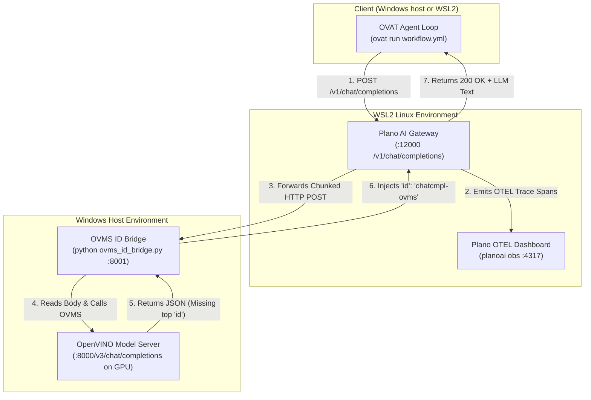

# Example: Fronting OVMS with Plano AI Gateway & OpenTelemetry

This guide explains how **Plano** (formerly called **ArchGW**) sits in front of **OpenVINO Model Server (OVMS)** as an intelligent AI Proxy Gateway.

It resolves the complete integration pipeline for GSoC Project #18 (Intel / OpenVINO):
- **Zero-Code Observability**: Capturing real-time OpenTelemetry (OTEL) traces, token counts, and latency breakdowns in `planoai obs`.
- **Cross-OS Gateway**: Seamlessly bridging Windows Host (OVMS on Intel Arc GPU) and WSL2 (Linux Plano proxy).
- **JSON Schema Bridge**: Handling Plano's strict WASM response requirements via `ovms_id_bridge.py`.

---

## 💡 What is Plano (Explained for Beginners)

Imagine you are running an AI model on your computer:
- **OVMS (OpenVINO Model Server)** is like the **Engine** inside a sports car. It turns input text into LLM tokens directly on your Intel Arc GPU or NPU as fast as possible.
- **Plano** is like the **Dashboard and Safety System**. It sits between your application (`ovat`) and the Engine (OVMS).

Plano measures how fast the engine runs, records every request (telemetry), and provides a central gateway for routing traffic and enforcing safety rules.

---

## 🏗️ Architecture & Request Flow

Below is the complete request flow when running `ovat run` through Plano and OVMS:



---

## 🛠️ The 3 Key Technical Challenges Solved

### 1. Endpoint Prefix Matching (`/v1` vs `/v3`)
Plano expects upstreams to speak standard OpenAI `/v1` paths, whereas OVMS serves OpenAI endpoints under `/v3`. 
- **Solution**: Setting `base_url: http://<WSL_GATEWAY_IP>:8001/v3` in `plano-config.yaml` tells Plano to automatically construct `/v3/chat/completions` upstream paths.

### 2. Cross-OS Networking (Windows Host + WSL2)
Plano publishes binaries for Linux and macOS, but has no native Windows build (running `planoai up` directly on Windows CMD raises `Error: Unsupported platform windows/amd64`). Therefore, Plano runs inside WSL2 or Docker (`--docker`), while OVMS runs natively on the Windows host to access Intel Arc GPU hardware.
- **Solution**: Inside WSL2, the Windows Host is reached via the gateway IP found by `ip route | grep default | awk '{print $3}'` (e.g. `172.22.64.1`). Windows Defender Firewall port 8000 is opened via `netsh advfirewall`.

### 3. Response Schema Matching (`ovms_id_bridge.py`)
Plano's Envoy WASM filter (`llm_gateway`) strictly requires a top-level `"id"` string field in JSON responses. OVMS returns valid OpenAI JSON but omits the top-level `"id"` string, and Plano sends chunked HTTP requests (`Transfer-Encoding: chunked`).
- **Solution**: `examples/plano/ovms_id_bridge.py` is a 30-line Python bridge that handles chunked HTTP bodies from Plano, forwards to OVMS (`:8000`), injects `"id": "chatcmpl-ovms"`, and returns the clean JSON to Plano.

---

## 🚀 Step-by-Step Setup Guide

Follow these 3 easy steps to run the complete pipeline on your AI PC:

### Step 1: Start OVMS on Windows Host (`cmd.exe`)

Open **Command Prompt (`cmd.exe`)** on Windows:

```cmd
cd C:\Users\devcloud\ovat
ovat serve examples\plano\workflow.yml
```
*(Wait until it prints `OVMS is ready at http://localhost:8000/v3`)*

---

### Step 2: Start the ID Bridge on Windows Host (`cmd.exe`)

In a second **Command Prompt (`cmd.exe`)** tab on Windows:

```cmd
cd C:\Users\devcloud\ovat
python examples\plano\ovms_id_bridge.py

The bridge binds `127.0.0.1` by default, so only this machine can reach it.
Nothing in it checks credentials, so a wider bind is a door to your GPU. When
plano runs in **WSL2 or Docker** it has to cross a network namespace and
loopback will not do; pass `--host 0.0.0.0` for exactly that case, and firewall
the port.
```
*(Leave this running. It prints `OVMS ID Bridge listening on http://0.0.0.0:8001...`)*

---

### Step 3: Start Plano & Run `ovat` in WSL2 Terminal

Open your **WSL2 (Linux)** terminal:

```bash
cd /mnt/c/Users/devcloud/ovat
planoai up examples/plano/plano-config.yaml
ovat run examples/plano/workflow.yml --input "what tools do you have available?"
```

---

## 📊 Live OpenTelemetry Dashboard (`planoai obs`)

To view real-time request metrics, latency distribution, and token counts, open another **WSL2** terminal and run:

```bash
planoai obs
```

Outputs live aggregate telemetry:
- **Status**: 🟢 `200 OK`
- **Latency (p50 / p95 / p99)**: e.g. `12.2s`
- **TTFT (Time To First Token)**: e.g. `101ms`
- **Request Log & Errors**: Zero code modification in `ovat`.

---

## 📌 Design Choices & Summary Table

| Choice | Reason |
| :--- | :--- |
| **`ovms_id_bridge.py`** | Decouples OVMS from Plano schema differences without patching binary WASM filters. |
| **Zero-Code OTEL** | Eliminates 3,900+ lines of complex Python tracing code inside `ovat`. |
| **`listeners: type: model`** | Configures Plano as a fast OpenAI proxy data plane while keeping OVAT's native agent loop in charge. |
