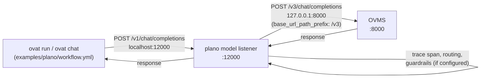

# Example: fronting OVMS with plano

This example puts [plano](https://github.com/katanemo/plano) (the project
formerly called archgw) in between OVAT and OVMS, as an optional gateway. It
answers mentor Ravi's request to review plano and assess an OVMS
integration, and it resolves the specific spike question he raised: does
plano's hardcoded `/v1` upstream path break OVMS, which serves its
OpenAI-compatible API under `/v3`? Short answer: no, it is one config line,
see "The /v1 vs /v3 spike question" below.

## What is plano

Plano is a small, model-agnostic AI gateway. You point your OpenAI-style
client at plano instead of at your LLM backend directly, and plano sits in
the middle and forwards the call on. It is written in Rust for the actual
request path (a component called `brightstaff`) plus a thin Python CLI
(`planoai`) that renders your config and starts everything up.

## Why front OVMS with it

OVAT already talks straight to OVMS today, and that keeps working with no
code change: `model.ovms_url` is just a plain URL, and plano's whole job is
to look exactly like the same OpenAI-compatible URL. What plano adds in that
one extra hop:

- **Telemetry**: every request becomes an OpenTelemetry (OTEL) trace, with
  per-call latency and token counts, without OVAT doing anything extra.
- **Model aliases / routing**: today we have one backend (OVMS), so routing
  is a no-op. If a second backend is added later to `plano-config.yaml`,
  plano can pick between them (cheapest, fastest, or by name) while OVAT
  keeps pointing at the same one URL.
- **Guardrails**: plano can screen prompts or responses (for example, a
  jailbreak check) before they reach OVMS or the user.
- **Agent orchestration (future)**: plano has its own agent-orchestration
  listener type. Not used in this example (OVAT already has its own agent
  loop), but it exists if OVAT ever wants to hand off routing between
  multiple agents to plano instead.

## The /v1 vs /v3 spike question

Plano's default assumption is that every upstream speaks the standard OpenAI
paths (`/v1/chat/completions`, ...). OVMS's OpenAI-compatible endpoint lives
under `/v3` instead. That looked like it might need a plano source patch.

It does not. Plano's `LlmProvider` config accepts a per-provider
`base_url_path_prefix` field that REPLACES the default prefix when plano
builds the upstream request path. Setting it to `/v3` in
`plano-config.yaml` is the entire fix:

```yaml
model_providers:
  - name: ovms-qwen3-8b
    provider_interface: openai
    base_url_path_prefix: /v3   # <- this line is the fix
    ...
```

Source: `crates/hermesllm/src/clients/endpoints.rs` in the plano repo, inside
`SupportedAPIsFromClient::target_endpoint_for_provider`. The relevant closure:

```rust
let build_endpoint = |provider_prefix: &str, suffix: &str| -> String {
    let prefix = base_url_path_prefix
        .map(|p| p.trim_matches('/'))
        .filter(|p| !p.is_empty())
        .unwrap_or(provider_prefix.trim_matches('/'));
    let suffix = suffix.trim_start_matches('/');
    if prefix.is_empty() {
        format!("/{}", suffix)
    } else {
        format!("/{}/{}", prefix, suffix)
    }
};
```

When `base_url_path_prefix` is set, it wins over the provider's normal
default prefix (`/v1`). That is exactly what makes plano call
`/v3/chat/completions` on OVMS instead of `/v1/chat/completions`.

The `endpoint` / `port` / `protocol` fields (the actual network address)
are handled by a different part of plano, the Python CLI's config renderer
(`cli/planoai/config_generator.py`, function `get_endpoint_and_port`), which
turns them into a local proxy route to OVMS at plain HTTP. Both pieces
together are what let `plano-config.yaml` reach OVMS with no plano code
changes at all.

## Request path



## Run it

This runs on the **AI PC** (or any Linux/Windows box), the same place OVMS
runs, because plano is a proxy in front of OVMS, not a replacement for it.
Plano itself runs as its own process, separate from `ovat serve`.

**1. Install the plano CLI** (one time; plano runs natively by default, no
Docker or Rust toolchain needed):

```bash
uv tool install planoai==0.4.27
# or: pip install planoai==0.4.27
```

**2. Start OVMS** (unchanged, this is exactly today's `ovat serve`):

```bash
ovat serve examples/plano/workflow.yml
```

**3. Start plano**, pointed at this example's config:

```bash
planoai up examples/plano/plano-config.yaml
```

On first run this downloads Envoy, its WASM plugins, and `brightstaff`, and
caches them under `~/.plano/`. If you would rather run plano inside Docker
instead of natively, add `--docker` to both `up` and `down`.

**4. Run the OVAT agent**, now pointed at plano instead of OVMS directly:

```bash
ovat run examples/plano/workflow.yml --input "hello, which model am I talking to?"
```

(`search_docs` in this workflow starts empty since there is no corpus here.
Run `ovat index <a folder of your docs> examples/plano/workflow.yml` first
if you want it to have something to search, exactly like the base
`examples/workflow.yml`.)

**5. Stop plano** when done:

```bash
planoai down
# or: planoai down --docker
```

## Seeing traces

`plano-config.yaml` here is intentionally minimal and does not turn tracing
on. To see per-request traces, add this block to it:

```yaml
tracing:
  random_sampling: 100
  opentracing_grpc_endpoint: http://localhost:4317
```

Then, in one terminal, run a live view while you drive traffic:

```bash
planoai obs
```

Or, to inspect one specific request after the fact:

```bash
planoai trace listen     # start listening for traces (once)
# ...drive a request through ovat run...
planoai trace            # show the most recent trace
```

Both commands read the same OTEL span stream plano's `brightstaff` process
exports; `obs` is a live aggregate view, `trace` is a single-request deep
dive (routing decision, upstream call, latency, status).

## Honest caveats

- **This whole pipeline needs OVMS, so it needs the AI PC.** OVMS does not
  run on macOS at all (see the main README/AGENTS.md). Plano's own binaries
  do support macOS on Apple Silicon and Linux (x86_64 and aarch64), but that
  is moot here: without OVMS there is nothing for plano to front.
- **Extra hop, extra latency.** Every request now goes OVAT to plano to
  OVMS and back, instead of OVAT to OVMS directly. Expect a small added
  latency per call (connection handling plus plano's own routing/guardrail
  processing) on top of whatever OVMS itself takes. Not benchmarked yet;
  use `ovat run --trace` on both setups if you need real numbers.
- **`base_url_path_prefix` is per provider, not global.** If more backends
  are added to `model_providers` later, each one needs its own correct
  prefix set explicitly. Nothing infers OVMS's `/v3` automatically.
- **Docker vs native.** Plano runs natively by default (`planoai up`
  downloads and runs Envoy plus `brightstaff` as local processes, no
  container). Docker mode exists too (`--docker`) for anyone who would
  rather isolate it or who is on a platform where the native binaries are
  not available; it is not required.
- **No auth in this example.** OVMS does not require an API key, so
  `plano-config.yaml` has no `access_key` for the OVMS provider. If a
  cloud-hosted plano deployment is ever exposed beyond localhost, add
  proper auth in front of it; this example assumes a local, trusted setup.
