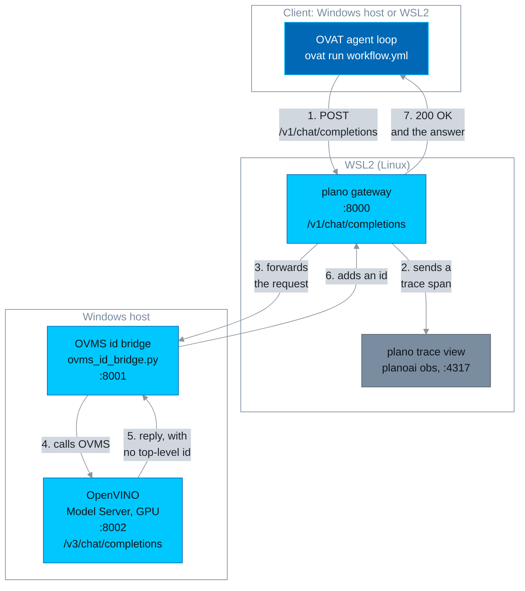

# plano in front of OVMS: request traces with no code

[plano](https://github.com/katanemo/plano) (it used to be called archgw) is an
AI gateway: a proxy that sits between OVAT and OVMS. Every request that passes
through it becomes an **OpenTelemetry span**, a standard trace record with the
request's latency and token counts. OVAT gains that without adding any tracing
code or dependency of its own.

Think of OVMS as the engine and plano as the dashboard. OVAT still talks to
"a model server at a URL". It just happens to be plano's URL now.

This example covers three problems that had to be solved to make the two
work together, and the exact steps to run it on a Windows AI PC.

---

## How a request travels


```mermaid
%%{init: {"theme": "base", "themeVariables": {"primaryColor": "#D0D7DE", "primaryTextColor": "#1F2328", "primaryBorderColor": "#8C959F", "lineColor": "#8C959F", "textColor": "#1F2328", "edgeLabelBackground": "#D0D7DE", "clusterBkg": "transparent", "clusterBorder": "#7A8CA0", "titleColor": "#7A8CA0"}}}%%
flowchart TD
    subgraph Client ["Client: Windows host or WSL2"]
        OVAT["OVAT agent loop<br/>ovat run workflow.yml"]
    end

    subgraph WSL2 ["WSL2 (Linux)"]
        Plano["plano gateway<br/>:8000<br/>/v1/chat/completions"]
        Obs["plano trace view<br/>planoai obs, :4317"]
    end

    subgraph WinHost ["Windows host"]
        Bridge["OVMS id bridge<br/>ovms_id_bridge.py<br/>:8001"]
        OVMS["OpenVINO<br/>Model Server, GPU<br/>:8002<br/>/v3/chat/completions"]
    end

    OVAT -->|"1. POST<br/>/v1/chat/completions"| Plano
    Plano -->|"2. sends a<br/>trace span"| Obs
    Plano -->|"3. forwards<br/>the request"| Bridge
    Bridge -->|"4. calls OVMS"| OVMS
    OVMS -->|"5. reply, with<br/>no top-level id"| Bridge
    Bridge -->|"6. adds an id"| Plano
    Plano -->|"7. 200 OK<br/>and the answer"| OVAT

    classDef cli fill:#0068B5,stroke:#00C7FD,color:#FFFFFF
    classDef backend fill:#00C7FD,stroke:#0068B5,color:#0F141A
    classDef telemetry fill:#7A8CA0,stroke:#57606A,color:#0F141A
    class OVAT cli
    class Plano,Bridge,OVMS backend
    class Obs telemetry
```

The ports, and why each hop has the one it has:

| Hop | Port | Why |
| --- | --- | --- |
| OVAT to plano | 8000 | the port OVAT already used for OVMS, so nothing else changes |
| plano to the bridge | 8001 | the bridge fixes OVMS's reply for plano (problem 3 below) |
| the bridge to OVMS | 8002 | set by `model.ovms_port: 8002` in [`workflow.yml`](workflow.yml) |

---

## The three problems, and how each is solved

### 1. plano calls `/v1`, OVMS serves `/v3`

plano expects an upstream server to use the usual OpenAI paths under `/v1`.
OVMS serves them under `/v3`. There is no separate prefix setting: plano reads
the path out of `base_url` itself. So the whole fix is putting `/v3` in the
URL in [`plano-config.yaml`](plano-config.yaml):

```yaml
base_url: http://<host>:8001/v3
```

The model name also needs a `provider/` prefix, `ovms/Qwen3.5-4B-int4-ov`,
because plano splits the name on the `/` and refuses to start without one. It
removes the prefix again before calling OVMS.

### 2. plano has no Windows build

plano publishes builds for Linux and macOS. On Windows, `planoai up` stops
with `Error: Unsupported platform windows/amd64`. So plano runs in WSL2 (or
Docker, with `--docker`), while OVMS runs on Windows itself, where it can use
the Intel GPU.

From inside WSL2, the Windows host is the default gateway:

```bash
ip route | grep default | awk '{print $3}'      # e.g. 172.22.64.1
```

That address changes when WSL restarts. On Windows 11 22H2 or newer,
`networkingMode=mirrored` in `.wslconfig` lets you use `127.0.0.1` instead.
`plano-config.yaml` lists the right host for every setup (same machine, WSL2,
Docker, another machine).

### 3. plano rejects OVMS's reply

plano requires a top-level `"id"` field in every chat reply. OVMS's reply is
valid OpenAI JSON but has no top-level `"id"`. plano also sends its requests
in chunks (`Transfer-Encoding: chunked`).

[`ovms_id_bridge.py`](ovms_id_bridge.py) is a small Python proxy that fixes
both: it reads plano's chunked request, forwards it to OVMS on port 8002, adds
`"id": "chatcmpl-ovms-bridge"` when the reply has none, and hands the reply
back to plano.

---

## Run it

This was run on a Windows AI PC with plano in WSL2. Run the Windows steps
from your clone of this repo.

### Step 1: start OVMS (Windows, `cmd.exe`)

```cmd
ovat serve examples\plano\workflow.yml
```

Wait until it prints `OVMS is ready at http://localhost:8002/v3`.

### Step 2: start the bridge (Windows, a second `cmd.exe`)

```cmd
python examples\plano\ovms_id_bridge.py --host 0.0.0.0
```

Leave it running. It prints `OVMS ID Bridge listening on http://0.0.0.0:8001`.

The bridge listens only on `127.0.0.1` unless told otherwise, so only this
machine can reach it. It does not check credentials, so opening it wider
opens your GPU to the network too. plano in WSL2 or Docker sits in a separate
network, which is why the command above passes `--host 0.0.0.0`. Firewall the
port. If plano runs on the same machine as OVMS, leave the flag out.

Check that plano will be able to reach it. This must print JSON, not hang:

```bash
curl -s http://<host>:8001/v3/models
```

### Step 3: start plano and ask (WSL2)

Put your host address in `base_url` in `plano-config.yaml`, then, from the
same repo folder seen from WSL2 (for example `/mnt/c/Users/<you>/ovat`):

```bash
planoai up examples/plano/plano-config.yaml
ovat run examples/plano/workflow.yml --input "what tools do you have available?"
```

---

## Watch the traces

In another WSL2 terminal:

```bash
planoai obs        # live view of every request
planoai trace      # one request in detail
```

You see each request's status, latency (p50, p95, p99), time to first token
and token counts, with no change to OVAT.

This is not the same thing as OVAT's own telemetry. `ovat run --trace`
measures what the **agent** did: tokens per turn, which tool ran, peak memory.
plano measures what the **network hop** did: latency, time to first token,
HTTP status. Each answers questions the other cannot.

---

## Design choices

| Choice | Reason |
| --- | --- |
| A separate `ovms_id_bridge.py` | Fixes the missing `id` without patching plano or OVMS |
| Tracing in plano, not in OVAT | plano already emits OpenTelemetry spans, so OVAT carries no tracing code |
| `listeners: type: model` | plano acts as a plain OpenAI-compatible proxy, one call in and one call out, and OVAT's own agent loop stays in charge |

`plano-config.yaml` was checked against planoai 0.4.27's own config schema.
